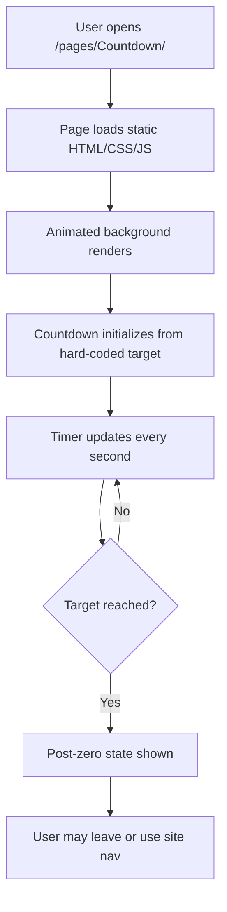

# Countdown — Feature Brief

**Feature cycle:** 2026-06-26  
**Repo path:** `pages/Countdown/`  
**Expected live URL:** `https://xanderwiles.com/pages/Countdown/`  
**Status:** Planning (no implementation yet)

---

## Summary

Build a beautiful, full-screen countdown web page that ticks toward a **hard-coded mystery date at least ten years in the future**. The page should feel cinematic and intentional — stunning animation and atmosphere despite doing only one thing: showing time remaining.

This is a **client-only, static page** within the existing xander-wiles-website monorepo. No backend, database, or authentication.

---

## User problem being solved

Visitors (and the site owner) want a **dedicated, shareable moment** — a single URL that communicates anticipation toward an unknown future event without explaining what that event is. The page should:

- Create emotional impact through design, not feature complexity
- Work instantly on any device with no setup or login
- Remain correct over long durations (10+ years) without maintenance beyond occasional deploys if the target date changes

---

## Target audience

| Audience | Need |
|----------|------|
| **Casual visitors** | A visually striking page they land on from a link or homepage |
| **Site owner (Xander)** | A personal artifact — mysterious, hard-coded, low-maintenance |
| **Mobile users** | Full-screen experience that still reads clearly on small screens |

---

## Goals

1. **Full viewport immersion** — countdown dominates the screen; background animation adds depth without distraction
2. **Mystery preserved** — the target event is not explained on the page (wording and UX TBD in Q&A)
3. **Accurate countdown** — correct remaining time using the visitor's local clock, with a defined timezone strategy for the target instant
4. **Site consistency** — favicons, fonts, and deployment patterns match sibling pages (`Hypnagogia`, `Sensory-Experience`, `Balanced-Life`)
5. **Accessible baseline** — readable numbers, reduced-motion support, semantic structure

---

## Non-goals (v1)

- User-configurable target date (hard-coded only)
- Backend, APIs, or database
- Authentication or admin UI to change the date
- Countdown sharing widgets, embed codes, or social OG image generation (unless added later)
- Audio / ambient sound (unless requested in Q&A)
- Reveal or post-zero experience beyond a minimal fallback (TBD in Q&A)
- Analytics integration
- Build tooling beyond the existing `build.js` copy pipeline

---

## Expected user flow

### Step-by-step

1. User navigates to `/pages/Countdown/` (direct link, homepage card, hidden test section, or nav — **discovery TBD**).
2. Browser loads `index.html`, global `style.css` (optional), page CSS, and `script.js`.
3. Full-screen layout appears: animated background + prominent time-remaining display.
4. JavaScript computes delta between **now** and the hard-coded `TARGET_ISO` (or equivalent constant).
5. Display updates every second (or at a throttled interval if performance requires — default: 1s).
6. On reaching zero, a defined end state is shown (copy and animation TBD).
7. User can use injected site navigation (`nav-loader.js`) to return elsewhere, unless we choose a nav-less immersive mode.

---

## Success criteria

- Page loads in under ~2s on a typical connection (no heavy assets; CSS animations only)
- Countdown digits are legible at a glance on phone and desktop
- Remaining time is mathematically correct for the chosen timezone strategy
- `prefers-reduced-motion: reduce` disables non-essential animation
- Deploys through existing Vercel pipeline with no `build.js` changes required
- Lighthouse accessibility score ≥ 90 on the countdown page (manual spot-check)

---

## Reference pages in this repo

| Page | Relevant pattern |
|------|------------------|
| `pages/Hypnagogia/` | Atmospheric full-page CSS (blobs, gradients, glass) |
| `pages/Sensory-Experience/` | Full-screen canvas / immersive layout |
| `pages/Balanced-Life/` | Decorative CSS animation centerpiece |
| `pages/Siewli/` | Emotional tone, `prefers-reduced-motion` handling |
| `pages/life-counter-extension/` | Time-based visualization, shared site chrome |

---

## Open items

All product decisions requiring your input are captured in [`01-questions-and-decisions.md`](./01-questions-and-decisions.md). **Implementation must not begin until those are answered.**

---

## Related documents

| Doc | Purpose |
|-----|---------|
| [01-questions-and-decisions.md](./01-questions-and-decisions.md) | Decisions and blanks for your answers |
| [02-technical-plan.md](./02-technical-plan.md) | Architecture, files, and approach |
| [03-risk-and-safety-review.md](./03-risk-and-safety-review.md) | Security, privacy, performance risks |
| [04-test-plan.md](./04-test-plan.md) | Manual and automated tests |
| [05-release-checklist.md](./05-release-checklist.md) | Ship and rollback steps |
