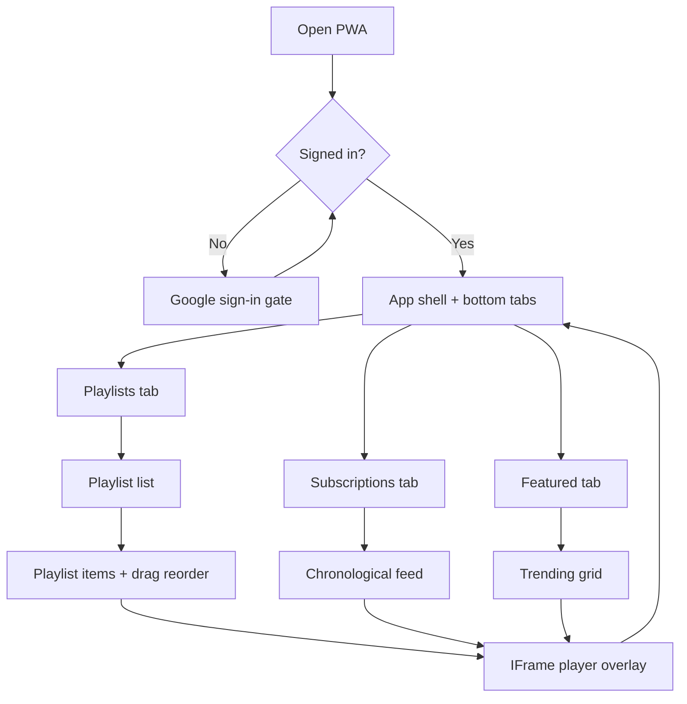
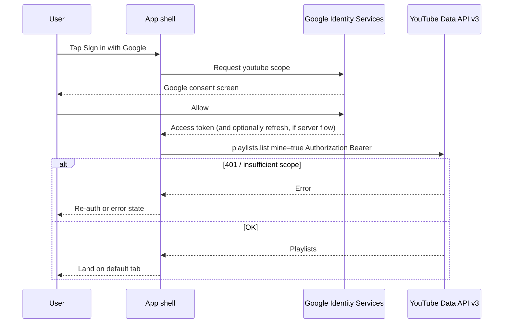
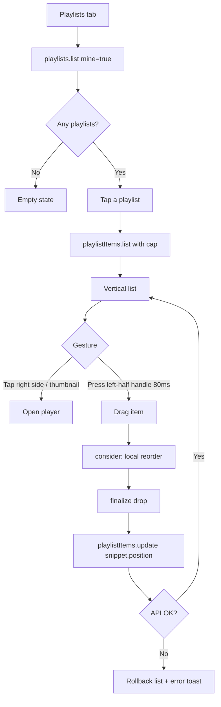
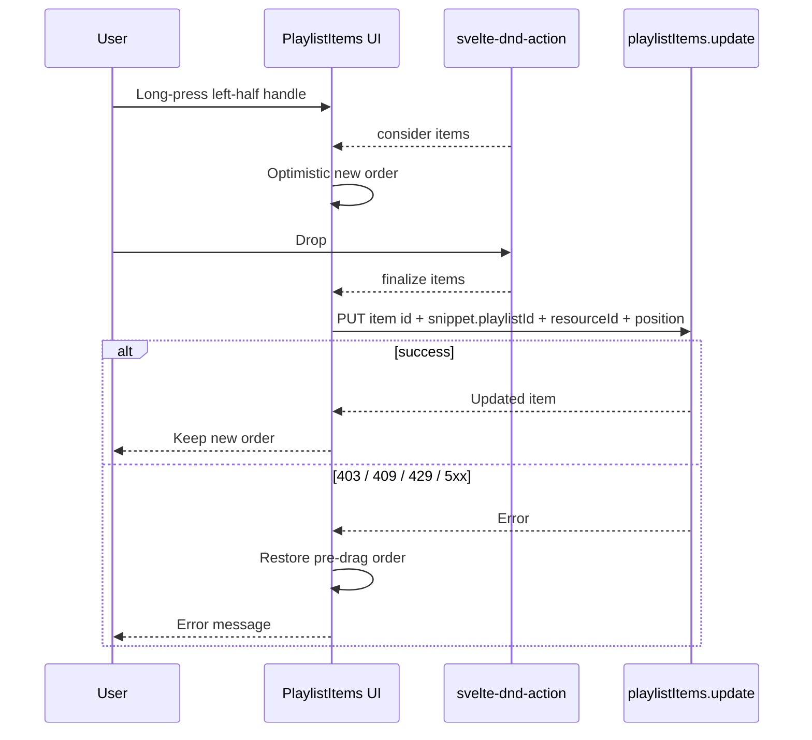
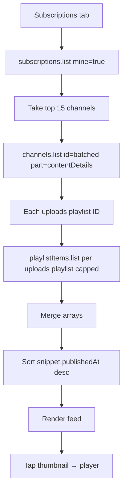
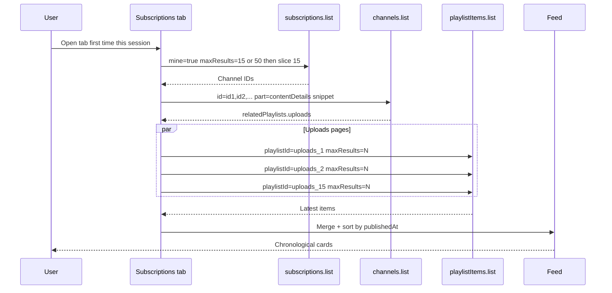
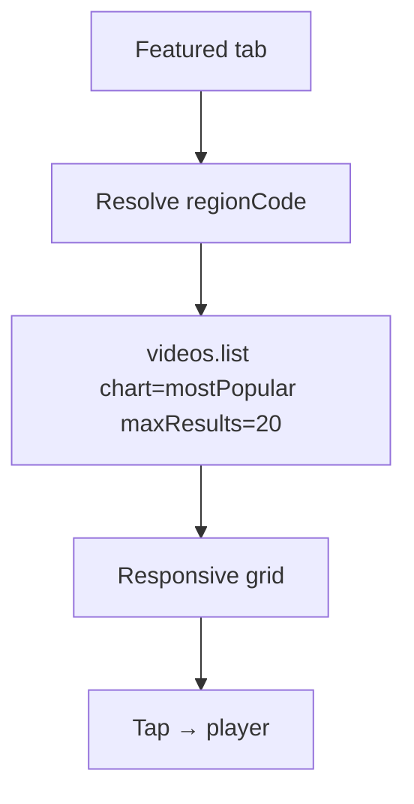
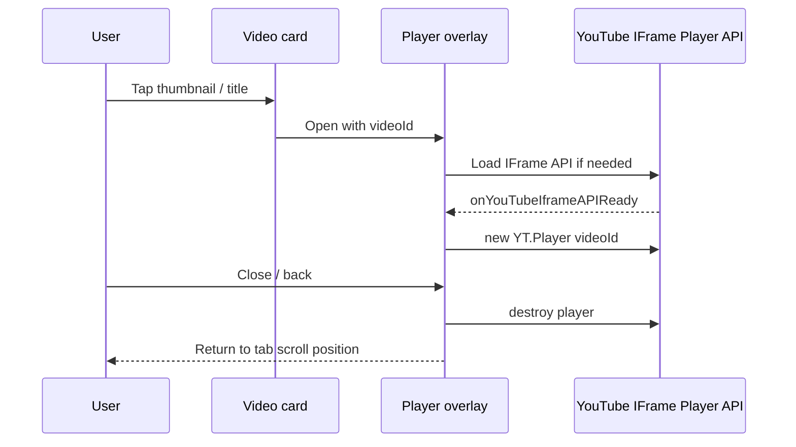
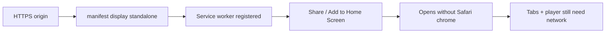

# Custom YouTube App — Feature Brief

**Feature cycle:** 2026-08-23  
**Repo path:** `pages/Custom-YouTube-App/`  
**Expected live URL:** `https://youtube.xanderwiles.com/` (separate Vercel project; source stays in this monorepo). **Not** injected into the main-site `build.js` pipeline.  
**Status:** Decisions locked (see [`01-questions-and-decisions.md`](./01-questions-and-decisions.md)). Technical plan updated. **No implementation until you approve the summary in chat.**

**Related:** [`01-questions-and-decisions.md`](./01-questions-and-decisions.md) · [`02-technical-plan.md`](./02-technical-plan.md)

---

## Summary

Build a **touch-first, iPad-native-feeling custom YouTube client** as a **SvelteKit PWA**: Google sign-in, a bottom tab bar (Playlists / Subscriptions / Featured), drag-and-drop playlist reordering that writes back to YouTube, a chronological subscriptions feed, a regional trending grid, and in-app playback via the official YouTube IFrame Player API.

This cycle is **greenfield**. `pages/Custom-YouTube-App/` currently contains **no application code** — only this feature-plan folder after these docs are written.

The product is a **personal media client**, not a public YouTube clone. That distinction matters for Google OAuth verification, API quota, and YouTube API Services terms.

---

## User problem being solved

The official YouTube iPad experience is poor for a few jobs this user actually has:

| Pain today | Impact |
|------------|--------|
| Playlist order is awkward to change on a tablet | Reordering a long playlist requires fiddly handles, hover-oriented UI, or desktop |
| Subscriptions are algorithmically mixed, not a clean “latest from people I follow” | Hard to see what just dropped, in time order |
| Trending / discovery is buried in Home | No one-tap “what’s popular in my country” surface |
| Browser YouTube chrome (recs, shorts, comments) fights lean-back watching | Extra taps and visual noise on a tablet held in the lap |
| Existing site tools are adjacent, not a client | Watch Later is a **local** list; YouTube Link Extractor is **public playlist scrape** with an API key — neither signs into the user’s YouTube account |

This app solves that by:

1. Signing in with Google using the YouTube Data API scope  
2. Showing **the user’s own playlists** and letting them **drag to reorder** on a large touch surface  
3. Building a **chronological feed** from the latest uploads of the top 15 subscriptions  
4. Showing **regional trending** videos  
5. Playing a tapped video in a **large / full-screen official YouTube iframe** (so Premium entitlements can apply *when the browser allows YouTube cookies*)  
6. Being **installable on iPadOS** (`display: standalone` + a service worker)

---

## Target audience

| Audience | Need |
|----------|------|
| **Primary: you (site owner), on iPad** | A home-screen PWA that is fast to open, thumb/finger friendly, and talks to *your* YouTube account |
| **Who can sign in** | **Hard email allowlist** (“my emails only”) plus Google OAuth **Testing** test users. Not a public product. |
| **Not in scope as a public product** | No nav/homepage link. Anonymous visitors see a sign-in gate, then denial if their email is not allowlisted. |

---

## Goals (v1)

1. **Google OAuth** — Sign in requesting `https://www.googleapis.com/auth/youtube`  
2. **iPad-style shell** — Bottom tab bar: Playlists, Subscriptions, Featured; large hit targets; safe-area insets  
3. **Playlists** — List mine; tap to load items; vertical `svelte-dnd-action` list with `delayTouchStart: 80` and `useCursorForDetection: true`; oversized invisible **left-half** `dragHandle` overlay; on drop, `playlistItems.update` with new `snippet.position`  
4. **Subscriptions feed** — `subscriptions.list` (`mine=true`) → top 15 channels → each channel’s **uploads** playlist → merge/sort by `snippet.publishedAt` descending  
5. **Featured** — `videos.list` `chart=mostPopular`, `maxResults=20`, default `regionCode=GB` plus a persisted region picker; responsive grid  
6. **Player** — Thumbnail tap opens a large modal / full-screen official IFrame Player  
7. **PWA** — `manifest.webmanifest` with `"display": "standalone"`; basic service worker for iPadOS installability  
8. **Quota hygiene** — Hard limits, batched IDs, no unbounded pagination on first load (default daily quota is **10,000 units**)  
9. **Ops** — `.env.example` with OAuth Client ID; README for Google Cloud + YouTube Data API enablement  
10. **Quality** — Loading / empty / error / signed-out states; a11y for tabs, lists, and the player dialog; tests for pure logic (feed merge, reorder payload, quota caps)

---

## Non-goals (v1)

- Native App Store / Play Store apps  
- Comments, likes, subscriptions mutate (subscribe/unsubscribe), uploads, live chat  
- YouTube Search (`search.list` is expensive / separately capped — do not use it for Featured)  
- Shorts-specific UI, YouTube Music, or downloading video  
- A custom video decoder or any player other than the **official IFrame Player API**  
- Replacing YouTube.com for the general public (ToS / OAuth verification risk)  
- Unbounded “load every playlist item / every subscription” on launch  
- Sharing playlists with other people inside this app  
- Background playback beyond what the IFrame + iPadOS allow  
- Using the existing `PUBLIC_YOUTUBE_API_KEY` as the **only** auth for private playlists (OAuth is required for `mine` resources)

---

## Product pillars

1. **Touch-first on iPad** — Drag vs scroll must be distinguishable; targets ≥ 44px; bottom tabs sit above the home indicator  
2. **Honest YouTube data** — The app is a client of the official Data API, not a scraped mirror  
3. **Quota as a product constraint** — Every screen has a known unit budget  
4. **Official playback only** — IFrame Player; no third-party extractors  
5. **Installable, not offline-first** — PWA for chrome-less use; API data still needs the network  
6. **Personal tool quality** — Calm, custom UI (not a YouTube skin-clone, not generic AI purple-gradient)

---

## Expected user flows

### High-level product map

### Authentication

### Playlists: browse, drag, persist

### Playlists reorder (API)

### Subscriptions chronological feed

### Featured trending

### Video playback

### PWA install (iPadOS)

---

## Screens (minimum)

| Surface | Purpose |
|---------|---------|
| Sign-in gate | Google button; short explanation of YouTube access; error if Client ID missing |
| Shell | Top context (account / sign out); **bottom tab bar** |
| Playlists | User playlist cards/list |
| Playlist detail | Ordered videos; left-half drag overlay; tap to play |
| Subscriptions | Unified newest-first feed |
| Featured | Trending grid |
| Player overlay | Official YouTube iframe; close control; title |
| Quota / API error | Friendly copy when 403 quotaExceeded or auth failure |
| PWA chrome | Standalone title; apple-touch-icon |

Routing: single `/` shell with client tabs; player overlay via shallow `?v=` (Q14-B). PWA name still TBD (Q21).

---

## Success criteria (product)

- On an iPad, the bottom tabs feel like a small native app, not a desktop website with a footer  
- Playlist reorder is usable with a finger: scroll still works; drag starts after ~80ms on the **left half** only  
- A completed drop is visible on YouTube.com / YouTube iOS after refresh (same account)  
- Subscriptions feed is **time-sorted**, not YouTube Home ranking  
- Featured shows 20 trending videos for a sensible region  
- Tapping a video always opens the **official** player, never a hotlink-only workaround as the only path  
- Add to Home Screen on iPadOS is possible (manifest + SW)  
- First load of all three tabs stays well under a few hundred quota units, not thousands  
- Signed-out users cannot hit `mine` endpoints  

---

## Constraints discovered in this repo (do not ignore)

| Constraint | Why it matters |
|------------|----------------|
| `pages/Custom-YouTube-App/` is **empty** | Full scaffold required (`sv create` / SvelteKit + Tailwind) |
| Root Vercel project is **`framework: null`**, `build.js` → `deploy_out` | Other SvelteKit apps (**Routine**, **Tax-Helper**, **Fighter-Jet**) use **`adapter-static`** and are **injected** as static files. **`googleapis` cannot run in the browser.** Server-side `googleapis` needs **Node** (`adapter-vercel` or a **separate Vercel project**). |
| Requested live target: **custom subdomain** | Existing apps live at `https://xanderwiles.com/pages/<Name>/`. A subdomain is a **different product/ops choice** (DNS, OAuth origins, PWA scope at `/`). |
| Markdown Editor OAuth | Proven **Google Identity Services** pattern: **Client ID only**, token in the browser, no client secret. Closest auth analogue. |
| `.env.example` already has `PUBLIC_YOUTUBE_API_KEY` | Used by **YouTube Link Extractor** (public playlist reads). Private `mine` data still needs OAuth. |
| YouTube Link Extractor | Client-side `playlistItems` + API **key**; **do not copy** the hardcoded key pattern. |
| Watch Later | Unrelated local watch list — not YouTube Watch Later. |
| Routine PWA | `site.webmanifest` `display: standalone`, `viewport-fit=cover` — **no service worker yet**. Time Pass **does** ship `sw.js`. |
| No Tailwind in existing SvelteKit apps | This would be the **first** SvelteKit + Tailwind app in the monorepo (Journal uses Tailwind but is React). |
| YouTube Data API default quota | **10,000 units/day**. `playlistItems.update` = **50 units each**. Reads are typically **1 unit**. `search.list` is the trap — Featured must use `videos.list` + `chart=mostPopular`. |
| OAuth scope `.../auth/youtube` | Sensitive; production use by third parties usually needs Google verification. Testing mode + test users is the realistic v1. |
| IFrame + iPadOS standalone | YouTube **login cookies may not be shared** with a home-screen PWA. Premium-in-iframe is **best-effort**, not guaranteed. |
| YouTube API Services ToS | Apps that **replace the core YouTube experience** for the public are restricted. Treat v1 as a **personal / testing** client. |

---

## Codebase context (current state)

| Item | Finding |
|------|---------|
| `pages/Custom-YouTube-App/` | Empty except this docs tree |
| Closest SvelteKit SPA | `pages/Routine/` — Svelte 5 runes, `adapter-static`, `ssr = false`, `paths.base = '/pages/Routine'`, `fallback: '200.html'`, Vercel rewrite |
| Closest Google OAuth | `pages/Markdown-Editor/` — GIS `initTokenClient`, Client ID env, Testing consent screen |
| Closest YouTube HTTP | `pages/Youtube-Link-Extractor/script.js` — `playlistItems` + `playlists` with API key |
| Closest PWA SW | `pages/Time-Pass/sw.js` — cache app shell, do not cache Google API hosts |
| Deploy | Root `build.js` + `vercel.json`; **or** a **new** Vercel project for a subdomain |
| Nav / homepage | Not wired for this app |

---

## Related documents

- Decisions / open questions: [`01-questions-and-decisions.md`](./01-questions-and-decisions.md)  
- Technical plan: [`02-technical-plan.md`](./02-technical-plan.md)

---

## Next step

Approve the locked technical plan in chat. Optional: PWA name (Q21) and exact allowlist emails. **Do not start scaffolding or application code** until that approval.
