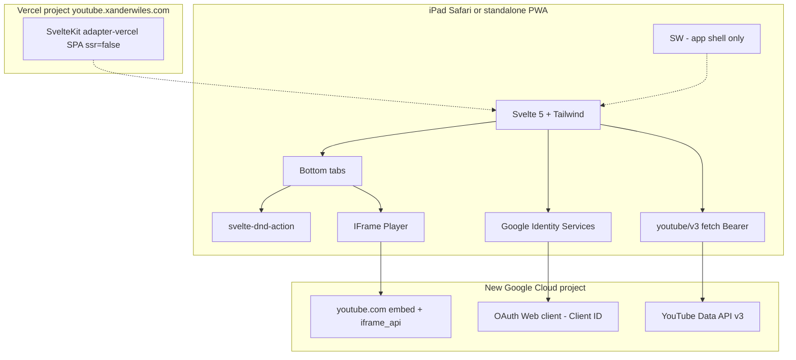
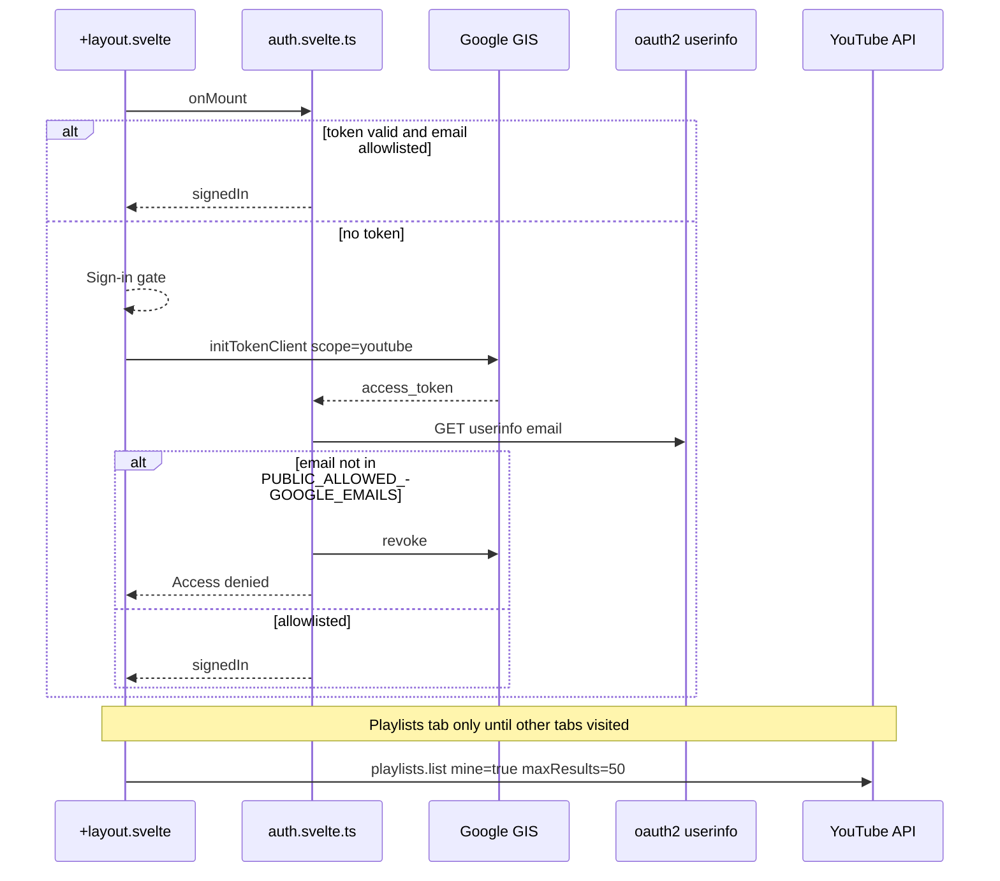
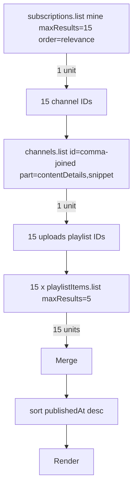
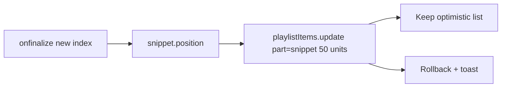

# Custom YouTube App — Technical Plan

**Feature cycle:** 2026-08-23  
**Status:** **Locked to your answers** (see [`01-questions-and-decisions.md`](./01-questions-and-decisions.md)). **No implementation until you approve the chat summary.**  
**Brief:** [`00-brief.md`](./00-brief.md)

This is the production plan for v1. Dual-architecture language is removed: you chose a **separate Vercel project**, **browser GIS + `fetch`**, and **no runtime `googleapis`**.

---

## Locked decisions (from Q1–Q22 + D1–D12)

| Topic | Locked choice |
|-------|----------------|
| Hosting | Source in `pages/Custom-YouTube-App/`. **Separate Vercel project.** **Not** in root `build.js`. |
| Production URL | `https://youtube.xanderwiles.com/` (PWA `scope` / `start_url` = `/`) |
| Local | `http://localhost:5173` |
| YouTube I/O | **Google Identity Services token client** + `fetch` to `https://www.googleapis.com/youtube/v3/...` |
| `googleapis` npm | **Do not add** to `package.json` / browser bundle |
| Secrets | **OAuth Client ID only** (plus public allowlist). **No client secret.** |
| Who | Hard **email allowlist** + OAuth **Testing** test users |
| Google Cloud | **New dedicated project**; enable YouTube Data API v3; Web OAuth client |
| Scope | `https://www.googleapis.com/auth/youtube` only |
| Signed-out | **All tabs gated.** No public API key for Featured. |
| Subscriptions | First **15**, `order=relevance`, one page; **5** uploads each; one batched `channels.list` |
| Featured | `videos.list` `chart=mostPopular` `maxResults=20`; default **`regionCode=GB`** + picker in `localStorage` |
| Playlist load | First **100** items (2×50); Load more; drag only among loaded rows |
| Reorder write | **One** `playlistItems.update` on `finalize`; optimistic; rollback on error |
| Player | Full-screen overlay + shallow `?v=`; embed `https://www.youtube.com` (not nocookie) |
| Premium | **Best-effort**; document Safari vs standalone cookie jar |
| Discoverability | **No** `nav.html` / `index.html` links |
| UI | Dark media, amber/gold accent (**not** YouTube red), Outfit, bottom tabs |
| Default tab | **Playlists**; remember last tab; lazy-load other tabs |
| WL / Likes | Show if API returns; play; **no drag** if update forbidden |
| Mutations | **Reorder only** |
| PWA name | **Pending Q21.** Fallback if you do not specify: **Playlist Deck** / **Deck** |
| Tests | Vitest + mocked Playwright; no live YouTube in CI |
| Adapter | `@sveltejs/adapter-vercel` (dedicated project; SPA, `ssr = false`). No `+server.ts` YouTube routes. |
| DnD | `svelte-dnd-action`: `delayTouchStart: 80`, `useCursorForDetection: true`; left-half `dragHandle` |
| Forbidden API | `search.list` |

---

## Why this architecture (locked)

- **Q3-B** matches Markdown Editor: Client ID in `PUBLIC_*`, access token in the **browser**, no secret to leak.  
- **Q1-C** still uses a **separate Vercel project** so the PWA lives at `/` on `youtube.xanderwiles.com` (root scope, clean OAuth origins). The main site stays a static `build.js` export.  
- **No Node YouTube proxy** means visitors cannot spend *your* quota through `/api`. Each user spends **their** YouTube quota under **your** Cloud project’s 10,000 units — mitigated by Testing + **email allowlist**.  
- **`adapter-vercel`** is for hosting/routing on the dedicated project, not for `googleapis`. UI remains `ssr = false`.

### System context (locked)



There is **no** `/api/youtube` and **no** `googleapis` box.

### Session start



### Subscriptions feed (quota)



**Budget:** 1 + 1 + 15 = **17 units** per Subscriptions refresh.

### Playlist reorder



`onconsider` never hits the network.

---

## Quota budget (non-negotiable)

| Action | Method | Units | v1 cap |
|--------|--------|-------|--------|
| List my playlists | `playlists.list` `mine=true` | 1 / page | `maxResults=50`; further pages only on Load more |
| List playlist items | `playlistItems.list` | 1 / page | 50/page; first load **2 pages (100)**; Load more = +1 page |
| Move one video | `playlistItems.update` | **50** | **1 call per drop**, moved item only |
| List subscriptions | `subscriptions.list` | 1 | `maxResults=15`, `order=relevance`, no extra pages |
| Uploads playlist IDs | `channels.list` | 1 / up to 50 IDs | **one** batched call |
| Latest uploads | `playlistItems.list` | 1 × 15 | `maxResults=5`, no extra pages |
| Trending | `videos.list` `chart=mostPopular` | 1 | `maxResults=20`, `regionCode` from picker (default `GB`) |
| Search | `search.list` | expensive | **forbidden** |

**Cold open (Playlists only):** ~1–2 units.  
**All three tabs once:** ~20 units.  
**20 successful drops:** 1,000 units.

On `quotaExceeded`: freeze writes, show a calm message, **no retry loop**.

---

## Stack and deploy (locked)

| Piece | Choice |
|-------|--------|
| App | SvelteKit, Svelte 5 **runes**, TypeScript |
| CSS | Tailwind CSS **v4** |
| DnD | `svelte-dnd-action` |
| Auth | GIS (`accounts.google.com/gsi/client`) token client |
| HTTP | `fetch` + `Authorization: Bearer` |
| Adapter | `@sveltejs/adapter-vercel` |
| SSR | `ssr = false` in `+layout.ts` |
| Paths | `paths.base = ''` (app at domain root) |
| Main site | **Do not** change `build.js`, root `vercel.json` rewrites, `nav.html`, or `index.html` |
| Env (app) | `PUBLIC_GOOGLE_CLIENT_ID`, `PUBLIC_ALLOWED_GOOGLE_EMAILS` (comma-separated) |
| Env (Vercel) | Same publics; **no** client secret |

OAuth console origins (must match exactly):

- `http://localhost:5173`  
- `https://youtube.xanderwiles.com`  
- Vercel preview origins only if you add them later (not in v1 unless you ask)

---

## Proposed application structure (new)

`pages/Custom-YouTube-App/` is empty except docs. After approval, scaffold **inside that folder**.

```text
pages/Custom-YouTube-App/
  package.json                 # no googleapis
  svelte.config.js             # adapter-vercel
  vite.config.ts
  tsconfig.json
  .env.example
  README.md                    # Cloud, origins, Testing, Premium/PWA caveat, quota
  static/
    manifest.webmanifest
    apple-touch-icon.png
    icons 192 / 512
  src/
    app.html
    app.css
    app.d.ts
    service-worker.ts
    lib/
      types/youtube.ts
      youtube/
        quota.ts
        client.ts              # fetch wrapper
        playlists.ts
        subscriptions-feed.ts
        trending.ts
        playlist-reorder.ts
      auth/
        google-gis.ts
        allowlist.ts
      components/
        AppShell.svelte
        BottomTabBar.svelte
        SignInGate.svelte
        AccessDenied.svelte
        PlaylistList.svelte
        PlaylistItems.svelte
        DragHandleOverlay.svelte
        VideoCard.svelte
        SubscriptionsFeed.svelte
        FeaturedGrid.svelte
        RegionPicker.svelte
        PlayerModal.svelte
        EmptyState.svelte
        ErrorBanner.svelte
      state/
        auth.svelte.ts
        tabs.svelte.ts
        player.svelte.ts
    routes/
      +layout.svelte
      +layout.ts               # ssr = false
      +page.svelte             # shell + tabs
  tests/
    unit/subscriptions-feed.test.ts
    unit/playlist-reorder.test.ts
    unit/quota.test.ts
    unit/allowlist.test.ts
    e2e/app.spec.ts
  docs/2026/08-23/feature-plan/
```

**No** `src/routes/api/**`, **no** `hooks.server.ts` YouTube session, **no** OAuth callback route.

Service worker: cache **static app assets only**. Bypass `googleapis.com`, `accounts.google.com`, `youtube.com`, `ytimg.com`.

---

## Existing files likely to change

| File | Change |
|------|--------|
| Root `build.js` | **No change** |
| Root `vercel.json` | **No change** |
| `nav.html` / `index.html` | **No change** (Q16-C) |
| Root `.env.example` | Optional one-line pointer; **canonical env is app-local** `.env.example` |
| Google Cloud / Vercel / DNS | Outside git: project, OAuth client, domain, env |

**No database.** Source of truth is YouTube.

---

## Relevant existing code (do not copy blindly)

| Path | Use |
|------|-----|
| `pages/Markdown-Editor/` | GIS `initTokenClient`, Client ID env, Testing consent |
| `pages/Routine/` | Svelte 5 Kit SPA, PWA manifest, `viewport-fit=cover`, Vitest + Playwright layout |
| `pages/Youtube-Link-Extractor/` | `playlistItems.list` shape only — **not** the API-key-in-source pattern |
| `pages/Watch-Later/` | Unrelated local list — do not merge |
| `pages/Time-Pass/sw.js` | Precache shell; skip Google hosts |

---

## Data model

```ts
interface YtPlaylist {
  id: string;
  title: string;
  itemCount?: number;
  thumbnailUrl?: string;
  reorderable: boolean; // false for WL/LL or after 403
}

interface YtPlaylistItem {
  id: string; // playlistItem id — list key and update id
  videoId: string;
  title: string;
  thumbnailUrl?: string;
  channelTitle?: string;
  position: number;
  publishedAt?: string;
}

interface FeedItem {
  videoId: string;
  title: string;
  channelId: string;
  channelTitle: string;
  publishedAt: string;
  thumbnailUrl?: string;
}

interface TrendingVideo {
  videoId: string;
  title: string;
  channelTitle: string;
  thumbnailUrl?: string;
  viewCount?: string;
}
```

**Auth session:** GIS access token, `expires_at`, allowlisted `email`. Store in **memory + `sessionStorage`** (not `localStorage`) to reduce XSS persistence. Token expiry (~1h): silent `requestAccessToken` or re-prompt.

**Allowlist:** `PUBLIC_ALLOWED_GOOGLE_EMAILS` — comma-separated, compared case-insensitively to GIS/userinfo email. Non-match: revoke token, show Access denied (do not call YouTube `mine` endpoints).

---

## API usage (YouTube Data API v3)

| Feature | Endpoint | Parameters |
|---------|----------|------------|
| Playlists tab | `GET playlists` | `part=snippet,contentDetails`, `mine=true`, `maxResults=50` |
| Items | `GET playlistItems` | `part=snippet,contentDetails`, `playlistId`, `maxResults=50`, optional `pageToken` (max 2 pages first; then Load more) |
| Reorder | `PUT playlistItems` | `part=snippet`; `id`; `snippet.playlistId`; `snippet.resourceId`; `snippet.position` |
| Subscriptions | `GET subscriptions` | `part=snippet,contentDetails`, `mine=true`, `maxResults=15`, `order=relevance` |
| Uploads IDs | `GET channels` | `part=contentDetails,snippet`, `id=id1,id2,...` (one call) |
| Channel latest | `GET playlistItems` | uploads playlist, `maxResults=5` |
| Featured | `GET videos` | `part=snippet,statistics`, `chart=mostPopular`, `maxResults=20`, `regionCode` |

**Player:** `https://www.youtube.com/iframe_api` → `new YT.Player`. Embed host `https://www.youtube.com` (not youtube-nocookie). Pass `origin` = page origin.

**Pagination:** never walk `nextPageToken` in an unbounded `while`.

---

## Routing plan

| Route | Notes |
|-------|--------|
| `/` | App shell; tabs client-side: `playlists` \| `subscriptions` \| `featured` |
| `/?v=VIDEO_ID` | Shallow history for player overlay; Back closes player |
| Playlist detail | Client state on Playlists tab (selected playlist id), not a required extra URL in v1 |

No `/login` or `/auth/callback` (GIS popup/token client).

---

## Authentication and authorization

| Topic | Plan |
|-------|------|
| Provider | Google Identity Services token client |
| Scope | `https://www.googleapis.com/auth/youtube` |
| Who | OAuth Testing test users **and** `PUBLIC_ALLOWED_GOOGLE_EMAILS` |
| Client type | Web application, Client ID only |
| Origins | localhost:5173, `https://youtube.xanderwiles.com` |
| Token | Memory + sessionStorage; revoke on sign-out and on allowlist fail |
| API key | **Not used** |
| Sign out | `google.accounts.oauth2.revoke` + clear session + destroy IFrame |

---

## Security and privacy

| Risk | Mitigation |
|------|------------|
| Client secret in SPA | **None shipped** (Q3-B) |
| XSS stealing access token | No `{@html}` for titles; Svelte escaping; sessionStorage not long-lived localStorage; short-lived tokens |
| Open YouTube proxy as you | **No server proxy** |
| Quota theft | Testing + email allowlist; still one Cloud quota pool — README must say so |
| `playlistItems.update` wiping snippet | Always send `playlistId` + `resourceId` + `position` together |
| ToS “replacement client” | Personal/testing; **no public nav**; no downloaders |
| Trademark | Do not use YouTube logo as app icon; Q21 name should avoid “YouTube” if possible |
| PII | Playlists/subs stay in browser memory; do not log tokens; no third-party analytics in v1 |
| IFrame `origin` | Explicit match to `youtube.xanderwiles.com` / localhost |

---

## Performance

| Risk | Mitigation |
|------|------------|
| Subscriptions fan-out | Parallel `playlistItems.list` with concurrency cap (~5); skeletons |
| Huge playlists | 100-item first window; Load more; virtualize only if iPad jank at 100 |
| DnD vs scroll | `delayTouchStart: 80`; handle **left 50%** only |
| IFrame | Create on open; `destroy()` on close |
| Thumbnails | `snippet.thumbnails.medium` |
| SW | Do not cache YouTube JSON |

---

## Edge cases

- Zero playlists / zero subscriptions / empty trending for a region  
- Private/deleted videos — skip or unavailable card  
- Watch Later / Likes: 403 on update → `reorderable=false`  
- Duplicate videos in one playlist — key by **playlistItem `id`**  
- Token expiry mid-drag — re-auth then retry or rollback  
- `quotaExceeded` / `rateLimitExceeded`  
- Missing scope / insufficient permissions  
- Concurrent edits on another device — reload items after failed update  
- iPad split view / landscape — tab bar + overlay  
- `prefers-reduced-motion` — `flipDurationMs: 0`  
- GIS popup blocked — copy + retry tap  
- Offline — honest error, not a SW fake feed  
- Unsupported `regionCode` — fall back to `GB` or show error  
- ≫15 subscriptions — copy: “YouTube relevance, first 15”  
- Email on allowlist but not an OAuth test user (or vice versa) — both must pass  

---

## Accessibility

- Tabs: `role="tablist"` / `tab`, arrows, `aria-selected`  
- Drag: **visible** grab icon + large invisible left overlay; `aria-label="Reorder"`  
- **Move up / Move down** (or Alt+Arrow) — overlay is not the only method  
- Player: `role="dialog"`, modal, focus trap, Escape, restore focus  
- Real `<button>` for sign-in  
- Dark UI contrast ≥ WCAG AA  
- 44px targets; `touch-action: manipulation` on primaries  
- Live region for saved / error  
- Safe area: `env(safe-area-inset-bottom)` on tab bar  

---

## UI / components

| Component | Responsibility |
|-----------|----------------|
| `SignInGate` | GIS button; missing Client ID; errors |
| `AccessDenied` | Email not allowlisted |
| `AppShell` | Safe areas, title, email chip, sign out |
| `BottomTabBar` | Three tabs, iPad-like |
| `PlaylistList` | Mine playlists; tap → detail |
| `PlaylistItems` | `dragHandleZone`, left-half handle, consider/finalize, up/down |
| `VideoCard` | Thumb, title, channel; tap → player |
| `SubscriptionsFeed` | Merged chronological list |
| `FeaturedGrid` | Trending grid + `RegionPicker` |
| `PlayerModal` | IFrame lifecycle; `?v=` shallow |
| `ErrorBanner` / `EmptyState` | Quota, auth, empty |

**Playlist row hit-testing:**

```text
┌──────────────────────────────────────────┐
│ [########## invisible dragHandle ####]   │
│ [ left 50%                           ] thumb  title  channel
│ [ scroll still possible after 80ms   ]   │
│                      right 50% tap=play  │
└──────────────────────────────────────────┘
```

**Visual tokens (Q17-A):** near-black canvas, one amber/gold accent, Outfit, large rounded tiles, short motion.

---

## PWA

`static/manifest.webmanifest`:

- `"display": "standalone"`  
- `"start_url": "/"`, `"scope": "/"`  
- icons 192 / 512; `apple-touch-icon` 180  
- `theme_color` / `background_color` = dark shell  
- `name` / `short_name` from Q21 or fallback **Playlist Deck** / **Deck**  

`src/app.html`: `viewport-fit=cover`; apple-mobile-web-app-capable; apple-mobile-web-app-title.

README: **Safari vs home-screen cookies** for Premium; no fake Premium badge.

---

## Manual tests

1. Sign in with an allowlisted test account; deny a Google account not on the allowlist (revoke, no `mine` calls).  
2. Playlists list / empty state.  
3. Open playlist; iPad **scroll** on the right half.  
4. Drag **left half** after ~80ms; drop; confirm order on YouTube.com.  
5. Offline drop: rollback + error.  
6. Subscriptions: 15 channels; newest-first; interleaved by time.  
7. Featured: 20 videos; change region; persist picker; iPad portrait + landscape.  
8. Player overlay from each tab; close; scroll kept; Back closes overlay.  
9. Add to Home Screen; standalone tabs.  
10. Document Premium behaviour **Safari vs PWA**.  
11. Sign out; `mine` stops.  
12. Missing Client ID: setup message.  
13. `consider` does not `update`.  
14. Playlist >100 items: Load more; drag only loaded window.  
15. VoiceOver: tabs, handle, dialog, up/down.  
16. WL/Likes: play; drag disabled if 403.

---

## Automated tests

**Vitest:** feed merge/sort; top-15 slice; reorder payload (moved item only); quota helper rejects unbounded pagination; allowlist email match (case/whitespace).

**Playwright:** mock `fetch` YouTube JSON; tab nav; playlist open; overlay open/close; **no** live OAuth/API in CI.

```bash
cd pages/Custom-YouTube-App
npm run check && npm run lint && npm run test:unit && npm run test:e2e
```

---

## Rollback

1. Do not touch main-site `build.js` / `vercel.json` / nav — rollback is **delete/stop the dedicated Vercel project**, remove DNS, revert `pages/Custom-YouTube-App/` (except you may keep docs), revoke OAuth client.  
2. Revoke app access in Google Account → Third-party apps.  
3. YouTube data stays on YouTube.  
4. If a bug loops `playlistItems.update`, take the Vercel project offline immediately.

---

## Implementation phases (after approval only)

1. `sv create` in `pages/Custom-YouTube-App/` (Svelte 5, TS, Tailwind v4, adapter-vercel) + `.env.example` + README  
2. GIS auth + allowlist gate  
3. YouTube `fetch` client + quota module + Vitest  
4. Shell + tabs + Playlists list/detail  
5. DnD + single `playlistItems.update`  
6. Subscriptions feed  
7. Featured + region picker  
8. IFrame overlay + shallow `?v=`  
9. Manifest + service worker  
10. Vercel project + DNS + OAuth origins (ops, not main-site git)  
11. Mocked Playwright + iPad manual pass  

---

## Definition of done

- [ ] This plan approved in chat  
- [ ] GIS sign-in on localhost and `youtube.xanderwiles.com`  
- [ ] Non-allowlisted emails denied  
- [ ] Tabs: Playlists, Subscriptions, Featured  
- [ ] Left-half drag `delayTouchStart: 80`, `useCursorForDetection: true`  
- [ ] One `playlistItems.update` per drop with `snippet.position`  
- [ ] Subscriptions: 15 × relevance × 5 uploads, merge by `publishedAt`  
- [ ] Featured: `mostPopular` 20, default GB + picker  
- [ ] Official IFrame overlay + shallow history  
- [ ] PWA `display: standalone` + app-shell SW  
- [ ] `.env.example`: Client ID + allowlist; **no secret**; **no `googleapis`**  
- [ ] Quota caps; loading/empty/error/denied/quota states  
- [ ] A11y: tabs, dialog, labelled handle, up/down  
- [ ] Vitest + mocked Playwright; `svelte-check` / lint  
- [ ] README: Cloud, Testing, origins, iPad install, Premium caveat, quota  
- [ ] No secrets committed; **not** on main-site nav  
- [ ] Deployed to `https://youtube.xanderwiles.com/`  

---

## Remaining assumptions (not silently treated as product decisions)

| ID | Assumption | If wrong |
|----|------------|----------|
| A1 | Q21 name fallback **Playlist Deck** / **Deck** | Change manifest/`apple-mobile-web-app-title` |
| A2 | Allowlist emails supplied at env-setup (you said “my emails only” but did not list them) | Gate stays closed for everyone until env is set |
| A3 | Google Cloud **project id** chosen when you create the project | README uses a placeholder |
| A4 | `adapter-vercel` even with no server routes (SPA on dedicated project) | Could switch to `adapter-static` + Vercel rewrites if you prefer |
| A5 | Playlist detail is in-shell state, not `/playlist/[id]` | Extra routes can be added later |
| A6 | GIS `prompt` / popup on iPad Safari is acceptable | May need extra tap-to-retry UX |
| A7 | Vercel preview URLs are **not** OAuth origins in v1 | Preview sign-in will fail until added |
| A8 | You will create DNS `youtube.xanderwiles.com` → the new Vercel project | App cannot go live without that |

---

## First files to create after approval (not now)

Scaffolding only — **no edits to `build.js`, `vercel.json`, `nav.html`, or `index.html`.**

1. `pages/Custom-YouTube-App/package.json` (and lockfile) — SvelteKit, Tailwind, `svelte-dnd-action`; **not** `googleapis`  
2. `pages/Custom-YouTube-App/svelte.config.js` — `adapter-vercel`  
3. `pages/Custom-YouTube-App/vite.config.ts`  
4. `pages/Custom-YouTube-App/.env.example` — `PUBLIC_GOOGLE_CLIENT_ID`, `PUBLIC_ALLOWED_GOOGLE_EMAILS`  
5. `pages/Custom-YouTube-App/src/routes/+layout.ts` — `ssr = false`  
6. `pages/Custom-YouTube-App/src/lib/youtube/quota.ts` + `tests/unit/quota.test.ts`  
7. `pages/Custom-YouTube-App/src/lib/auth/google-gis.ts` + `allowlist.ts`  

**Do not scaffold until you approve this plan in chat.**
