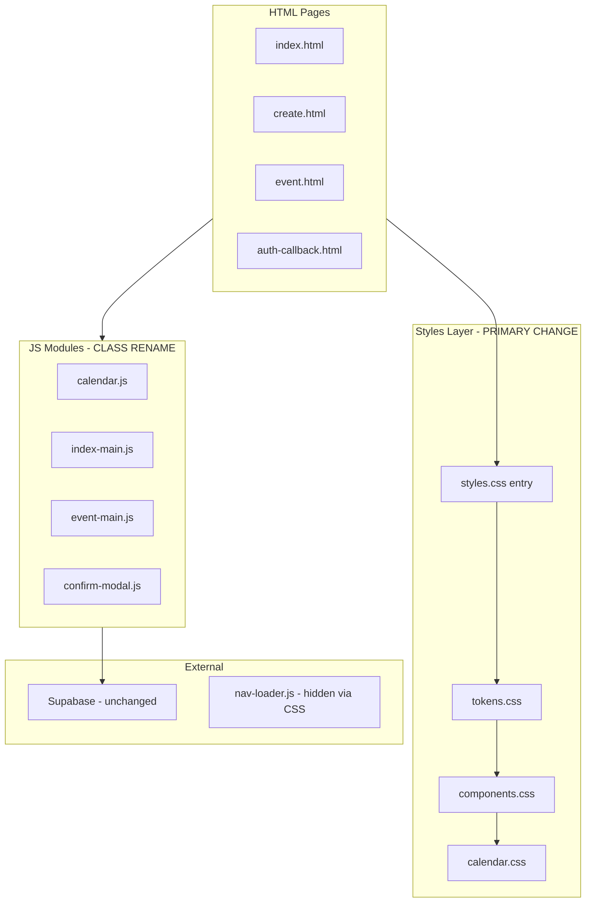

# Technical Plan — Skeuomorphic UI Redesign

**Feature cycle:** 2026-06-30  
**Status:** Decisions locked — ready for implementation (pending step approval)

---

## Locked decisions (summary)

See `01-questions-and-decisions.md` for full log. Key choices affecting implementation:

| Area | Decision |
|------|----------|
| Theme | Light craft paper — kraft desk, stamped labels, dark ink |
| Luminance | Fully light (no dark environment) |
| Font | Source Sans 3 (Google Fonts) |
| Accent | Brass/copper hardware (replaces cyan for UI chrome) |
| Textures | CSS-only (gradients, grain, repeating patterns) |
| CSS split | `styles/tokens.css`, `styles/components.css`, `styles/calendar.css` |
| Class rename | `.glass-card` → `.panel` in one pass (HTML + JS) |
| Site nav | **Hidden** on all app pages (`#main-nav-placeholder`) |
| Day cells | Embossed paper tiles |
| Heatmap | JS colors unchanged; CSS chrome only |
| Modal | Opaque dark overlay (~85–92%), no blur |
| Time inputs | Native `type=time`, skeuomorphic styling |
| Brand | Update `theme-color`, manifest, favicon |
| Motion | Full `prefers-reduced-motion` support |
| Contrast | WCAG 2.1 AA minimum |

---

## Main technical approach

This redesign is **CSS-first** with coordinated HTML/JS class renames. No backend, API, or data model changes.

### Strategy

1. **Split stylesheets** per Q6 — `styles.css` becomes a thin entry file that `@import`s the three modules in order.
2. **Define tokens** in `styles/tokens.css` — kraft paper palette, brass/copper accent, ink text, bevels, shadows, semantic greens/yellows.
3. **Remove glassmorphism** — delete `.background-orbs`, all `backdrop-filter`, translucent panel fills, gradient clipped title text.
4. **Introduce skeuomorphic primitives** in `styles/components.css`:
   - `.panel` — opaque paper card with bevel + outer shadow
   - `.panel--inset` — recessed wells (form fields, calendar tray)
   - `.btn` variants — raised default; `:active` pressed (inset, no lift)
   - `.material-bg` — body-level kraft paper background (CSS texture)
5. **Calendar + heatmap** in `styles/calendar.css` — embossed paper day cells, heatmap chrome, paint toolbar, mobile tray.
6. **Hide site nav** — `#main-nav-placeholder { display: none !important; }` in app CSS (Q8). Optionally remove nav `<script>`/placeholder from HTML in same pass for cleaner DOM (implementation choice).
7. **Rename classes** — `.glass-card` → `.panel` in all HTML and JS templates (Q7).
8. **Update brand assets** — favicon (paper calendar + brass frame), manifest `theme_color`/`background_color`, `<meta name="theme-color">` on kraft tone.
9. **Verify** against manual test plan; rollback via git revert of `styles/` + HTML/JS.

### Non-goals

- PostCSS/build step for CSS
- Supabase, RLS, or API changes
- Custom range sliders (Q12)
- Main site `/assets/css/style.css` global redesign
- Image texture assets (Q5 = CSS-only)

---

## Architecture diagram



---

## Proposed design tokens (`styles/tokens.css`)

Engineering defaults — refine during Phase 1, must pass AA contrast audit:

```css
:root {
  /* Kraft paper atmosphere */
  --bg-kraft: #c9b896;
  --bg-kraft-deep: #b8a682;
  --surface-paper: #f4efe4;
  --surface-paper-raised: #faf7f0;
  --surface-paper-inset: #e8e0d0;

  /* Ink typography (Q2: dark ink everywhere) */
  --text-ink: #2c2416;
  --text-ink-muted: #5c4f3a;
  --text-on-accent: #1a1208;

  /* Brass / copper hardware (Q4) */
  --accent-brass: #b8860b;
  --accent-brass-light: #d4a84b;
  --accent-brass-dark: #8b6914;
  --accent-copper: #a0622a;

  /* Semantic availability (unchanged meaning) */
  --color-likely: #22c55e;
  --color-maybe: #eab308;
  --color-danger: #b91c1c;

  /* Depth */
  --shadow-raised: 0 1px 0 rgba(255,255,255,0.7) inset, 0 2px 4px rgba(44,36,22,0.12), 0 4px 12px rgba(44,36,22,0.08);
  --shadow-pressed: inset 0 2px 4px rgba(44,36,22,0.18), inset 0 1px 0 rgba(44,36,22,0.08);
  --bevel-light: rgba(255, 255, 255, 0.65);
  --bevel-dark: rgba(44, 36, 22, 0.15);

  /* Typography (Q3) */
  --font-ui: 'Source Sans 3', system-ui, sans-serif;

  /* Borders */
  --border-paper: #c4b89a;
  --border-ink: #8a7b62;
}
```

**Note:** `PLAN.md` / `DECISIONS.md` still reference cyan `#38bdf8` as product accent. This redesign **supersedes that for UI chrome** per Q4. Semantic green/yellow for availability unchanged.

---

## Existing files (relevant)

### HTML routes

| File | Role |
|------|------|
| `index.html` | Landing, Google sign-in, dashboard |
| `create.html` | Event creation form |
| `event.html` | Main app — paint, overlap, heatmap, organizer |
| `auth-callback.html` | OAuth redirect handler |

### Styles (post-split)

| File | Role |
|------|------|
| `styles.css` | **Entry** — `@import` chain only (or minimal globals) |
| `styles/tokens.css` | **New** — `:root`, reset, body, kraft background |
| `styles/components.css` | **New** — panels, buttons, forms, modal, toast, dashboard |
| `styles/calendar.css` | **New** — calendar, heatmap, toolbar, mobile |
| `/assets/css/style.css` | Site nav — **not edited**; nav hidden on app pages |

### JavaScript (class rename required)

| File | Change |
|------|--------|
| `js/calendar.js` | `glass-card` → `panel` on month containers |
| `js/index-main.js` | Dashboard template `glass-card` → `panel` |
| `js/event-main.js` | Overlap item template `glass-card` → `panel` |
| `js/confirm-modal.js` | Modal dialog `glass-card` → `panel` |

### Backend / config (unchanged)

`supabase/schema.sql`, `js/api.js`, `js/auth.js`, `js/supabase-client.js`, `js/realtime.js`, `supabase-config.js`

### Brand / PWA (update per Q13)

| File | Change |
|------|--------|
| `favicon-dark.svg` | Kraft paper + brass calendar frame (rename optional later) |
| `site.webmanifest` | `theme_color`, `background_color` → kraft tones |
| HTML `<meta name="theme-color">` | Match `--bg-kraft` |

---

## Files to change

| File | Change type |
|------|-------------|
| `styles/tokens.css` | **New** |
| `styles/components.css` | **New** (migrate from current `styles.css`) |
| `styles/calendar.css` | **New** (migrate from current `styles.css`) |
| `styles.css` | **Replace** with import entry + site-wide overrides |
| `index.html` | Font link, class renames, remove orbs, hide nav, theme-color |
| `create.html` | Same |
| `event.html` | Same |
| `auth-callback.html` | Font + styles + background |
| `js/confirm-modal.js` | `.panel` class |
| `js/index-main.js` | `.panel` class |
| `js/event-main.js` | `.panel` class |
| `js/calendar.js` | `.panel` class |
| `favicon-dark.svg` | Kraft/brass redesign |
| `site.webmanifest` | Theme colors |

**Optional same pass:** Remove `#main-nav-placeholder` + `nav-loader.js` from HTML since nav is hidden (cleaner than CSS-only hide).

---

## Data model / API changes

**None.**

---

## Authentication and authorization

Unchanged. Nav hiding does not affect OAuth callbacks or session handling.

---

## CSS implementation details

### Remove entirely

- `.background-orbs`, `.orb`, `@keyframes drift`
- All `backdrop-filter` / `-webkit-backdrop-filter`
- `--glass-bg`, `--glass-border`, `.glass-card` (replaced by `.panel`)
- Dark-theme text vars (`--text: #f3f4f6`) — replaced with ink on paper
- `#main-nav-placeholder` nav override block (replaced with `display: none`)
- Cyan accent usage in UI chrome (links, badges, scores → brass)

### Kraft paper background (CSS-only, Q5)

Layered opaque gradients on `body`:

- Base `--bg-kraft`
- `repeating-linear-gradient` for subtle fiber grain
- Optional fixed pseudo-element for vignette (opaque, not transparent overlay)

### Button interaction (required)

- Raised: top highlight, bottom shadow (`--shadow-raised`)
- Hover: `filter: brightness()` or shadow shift — **no `translateY`**
- Active: `--shadow-pressed`, reduced highlight
- Primary buttons: brass gradient fill, dark ink label

### Calendar day cells (Q9)

- Empty in-range: inset/debossed paper tile
- Likely/maybe: raised stamp with inner shadow + semantic fill
- Out-of-range: faded ink, debossed, still distinguishable from empty

### Modal (Q11)

- Overlay: `background: #2c2416` at ~88% opacity (opaque-enough; no blur)
- Dialog: `.panel` on cream paper with strong drop shadow

### Site nav (Q8)

```css
#main-nav-placeholder {
  display: none !important;
}
```

Add in `styles/tokens.css` or `styles/components.css`. Verify layout does not reserve empty nav space.

### Mobile paint toolbar

- Restyle as paper tray with inset top edge + brass lip
- Preserve fixed bottom layout and safe-area padding from current `@media (max-width: 768px)` block

### `prefers-reduced-motion` (Q14)

```css
@media (prefers-reduced-motion: reduce) {
  *, *::before, *::after {
    animation-duration: 0.01ms !important;
    transition-duration: 0.01ms !important;
  }
}
```

Disable modal slide-in; keep instant opacity for toast.

---

## Implementation phases

### Phase 1 — Foundation (recommended first PR)

- [x] Decisions locked
- [ ] Create `styles/tokens.css` with kraft/brass/ink tokens + body background
- [ ] Create `styles.css` import entry
- [ ] Update HTML: Source Sans 3, theme-color, hide nav
- [ ] Stub `styles/components.css` and `styles/calendar.css` (can import existing rules temporarily)

### Phase 2 — Components

- [ ] Migrate buttons, forms, `.panel`, alerts, badges to `components.css`
- [ ] Rename `.glass-card` → `.panel` in HTML + JS
- [ ] Remove `.background-orbs` from HTML
- [ ] Modal + toast (opaque)

### Phase 3 — Calendar & data viz

- [ ] Embossed paper day cells
- [ ] Paint toolbar + brush states (brass active ring)
- [ ] Heatmap legend + cell chrome (JS colors unchanged)
- [ ] Multi-grid, time range panel, native time inputs

### Phase 4 — Mobile & polish

- [ ] Mobile toolbar tray
- [ ] Loading / not-found states
- [ ] `prefers-reduced-motion`
- [ ] Favicon + manifest
- [ ] Remove dead glass overrides at end of old `styles.css`

### Phase 5 — QA & ship

- [ ] WCAG AA contrast audit on kraft + cream + brass
- [ ] Manual test plan
- [ ] Cross-browser (Safari iOS, Chrome Android, Firefox)

**Estimated total:** 5–7 days

---

## Build & deploy

- Static app — `npm run build` → verify `deploy_out/pages/Group-Availability/styles/` includes new CSS files
- Confirm HTML `<link rel="stylesheet" href="styles.css">` resolves all imports in deploy output
- No new npm dependencies

---

## Rollback plan

1. `git revert` commits touching `styles/`, HTML, JS class names, favicon
2. Restore single `styles.css` from previous commit if split causes deploy issues
3. No DB rollback

---

## Definition of done (technical)

- [ ] Three-module CSS split deployed and loading
- [ ] Zero `backdrop-filter` in `pages/Group-Availability/styles/`
- [ ] No `.background-orbs`; kraft CSS background only
- [ ] All `.panel` surfaces opaque paper
- [ ] `.glass-card` fully removed (no alias)
- [ ] Site nav not visible on app pages
- [ ] Brass/copper accent on interactive chrome; green/yellow on availability
- [ ] Source Sans 3 loaded
- [ ] Buttons: hover lighting + active press, no lift
- [ ] WCAG 2.1 AA contrast verified
- [ ] Manual test plan passed
