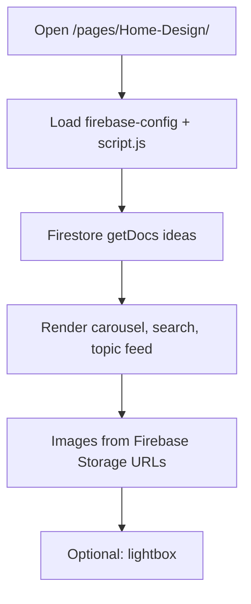
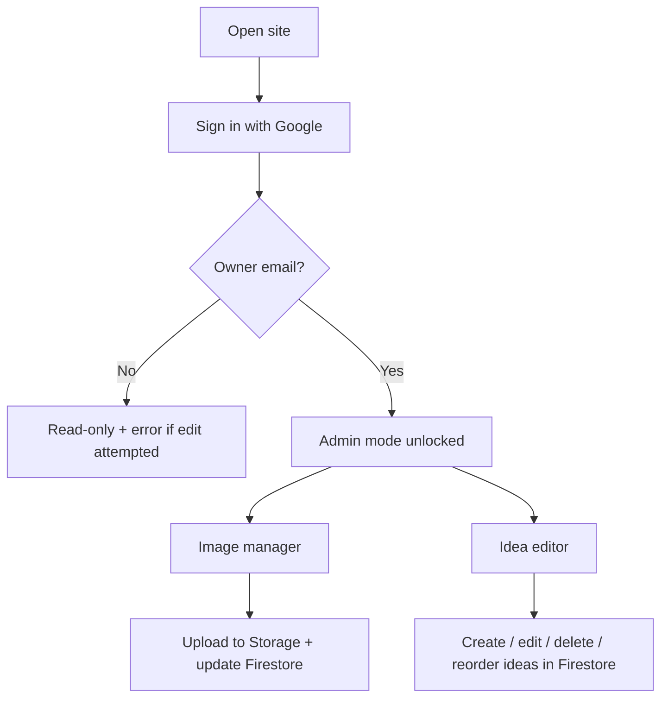

# Beutifully Living (Home-Design) — Firebase Migration Brief

**Feature cycle:** 2026-07-02  
**Repo path:** `pages/Home-Design/`  
**Expected live URL:** `https://xanderwiles.com/pages/Home-Design/`  
**Status:** Planning complete — all decisions locked; ready for implementation.

---

## Summary

Migrate **Beutifully Living** from a **local-file data model** (CSV + JSON manifest + repo-stored images, edited via the File System Access API) to a **dedicated Firebase backend** with **Google Authentication** for a single admin (you). Public visitors browse without logging in; you sign in to manage the full content library — ideas, hierarchy, order, and images.

This is a static vanilla JS page inside the existing `xander-wiles-website` monorepo, deployed via `build.js` → `deploy_out/` → Vercel. It uses a **new, separate Firebase project** with env prefix `PUBLIC_HOME_DESIGN_FIREBASE_*` — not shared with To-Do List, Work Tracker, Journal, or other sibling apps.

---

## Locked product decisions

| Area | Decision |
|------|----------|
| **Public access** | Anyone can read ideas and images without login |
| **Admin access** | Google sign-in; writes gated by owner email in security rules |
| **Data model** | One Firestore doc per idea (`ideas/{ideaId}`) |
| **Images** | Firebase Storage only; migrate 14 existing WebPs; no new image git commits |
| **Admin scope (v1)** | **Full CMS** — add, delete, edit all fields, reorder, manage parent/child hierarchy |
| **Migration** | One-time seed from CSV + manifest + images; Firestore becomes source of truth |
| **Image manager** | Firebase-only; remove folder picker / File System Access API |
| **Config** | `firebase-config.js` + `PUBLIC_HOME_DESIGN_FIREBASE_*` (build.js injection) |
| **Backup** | Keep CSV/JSON in repo as export snapshot; optional export from admin |
| **App Check** | Skipped v1 |
| **Pending setup** | None — owner `xanderwiles@gmail.com`, project `beautifully-living-xander` |

Full decision log: [`01-questions-and-decisions.md`](./01-questions-and-decisions.md).

---

## User problem being solved

Today, managing ideas and images requires:

1. Editing `Home Design Bullets.csv` and `idea-images.json` on disk (or via **Image manager**, which needs Chrome/Edge, localhost, and a connected project folder).
2. Committing image files into `pages/Home-Design/images/` and redeploying to publish changes.
3. No cloud source of truth — data lives in git and local folders.

After migration:

- **Firestore** holds all idea text, hierarchy, and sort order
- **Firebase Storage** holds all images
- **You** edit everything from the browser after Google sign-in — on localhost or `xanderwiles.com`
- **Visitors** see the same public blog with no login

---

## Target audience

| Audience | Need |
|----------|------|
| **Public visitors** | Browse, search, and view design ideas without logging in |
| **Site owner (Xander)** | Full content admin — ideas, structure, images — from any device |
| **Future you** | No manual CSV/git workflow for routine updates |

---

## Goals

1. **New dedicated Firebase project** for Home-Design (separate from six existing site Firebase projects)
2. **Google Authentication** — single-user admin via email in security rules
3. **Full admin UI** — CRUD on ideas, reorder, hierarchy edits, image attach/remove
4. **Firestore reads** replace CSV/JSON fetch for all visitors
5. **Firebase Storage** replaces repo images and File System Access writes
6. **Env-safe config** — `PUBLIC_HOME_DESIGN_FIREBASE_*` injected by `build.js`; `.env.local` for local dev
7. **Production-mode Firestore** with strict rules from day one
8. **Authorized domains** — `localhost`, `xanderwiles.com`, Vercel preview URLs as needed

---

## Non-goals (v1)

- Multi-user collaboration or roles beyond single admin
- Public user accounts or comments
- Real-time collaborative editing (multi-tab last-write-wins is acceptable)
- CMS for static marketing copy (hero, about panel) unless added later
- Firebase Cloud Functions
- Firebase App Check
- Deleting CSV/JSON from git (kept as backup per Q13)
- Mobile native apps

---

## Expected user flow

### Public visitor

### Admin — sign in

### Admin — full content management (v1 scope)

1. Sign in with Google (owner account).
2. **Add idea** — new Firestore doc with auto-generated `ideaId`, section, title, etc.
3. **Edit idea** — inline or modal edit of title, description, section, subsection, parent, level.
4. **Delete idea** — remove doc; optionally clean Storage images.
5. **Reorder** — update `sortIndex` within section/subsection (drag or move controls).
6. **Images** — open Image manager: upload WebP to Storage, attach/detach URLs on idea doc.
7. Changes appear immediately in the public feed (via snapshot listener while editing, or refresh).

---

## Current state (codebase snapshot)

| Asset | Role | Approx. size |
|-------|------|----------------|
| `Home Design Bullets.csv` | Canonical idea rows (seed source) | ~371 lines |
| `idea-images.json` | Image manifest (seed source) | 16 ideas |
| `images/**/*.webp` | Static assets (migrate to Storage) | 14 files |
| `script.js` | Parse, render, `window.AtHome` API | ~1,420 lines |
| `image-manager.js` | Local FS / IndexedDB editor | ~860 lines |
| `index.html` | Shell + image manager modal | Static |

**Auth today:** None.  
**Backend today:** Static `fetch()` of CSV/JSON.  
**Sibling Firebase apps:** To-Do, Work-Tracker, Story, Prompt, Social, Journal — **none shared with Home-Design**.

---

## Definition of done (high level)

- [ ] New **dedicated** Firebase project created (`PUBLIC_HOME_DESIGN_FIREBASE_*` in `.env.local` + Vercel)
- [ ] One-time seed: ~371 ideas + 16 image mappings + 14 Storage uploads
- [ ] Public visitors browse without login
- [ ] Owner can add, edit, delete, reorder ideas and manage images
- [ ] Image manager works on production without folder picker
- [ ] Firestore + Storage rules deployed (production mode) with owner email
- [ ] Manual test plan passed
- [ ] CSV/JSON retained in repo as backup only

Full checklist: [`05-release-checklist.md`](./05-release-checklist.md).

---

## Next step

Create the Firebase project in Console with ID **`beautifully-living-xander`**, sign in with **`xanderwiles@gmail.com`**, then begin implementation per [`02-technical-plan.md`](./02-technical-plan.md).
