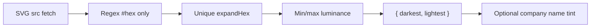
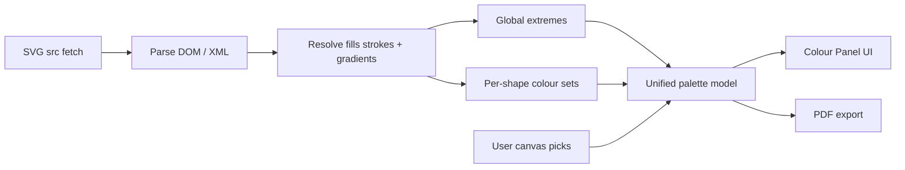
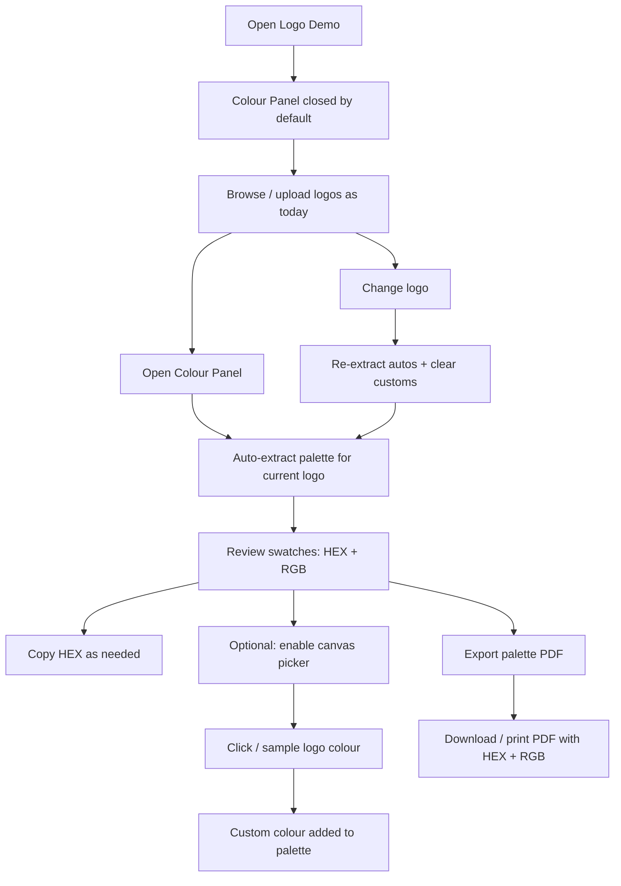
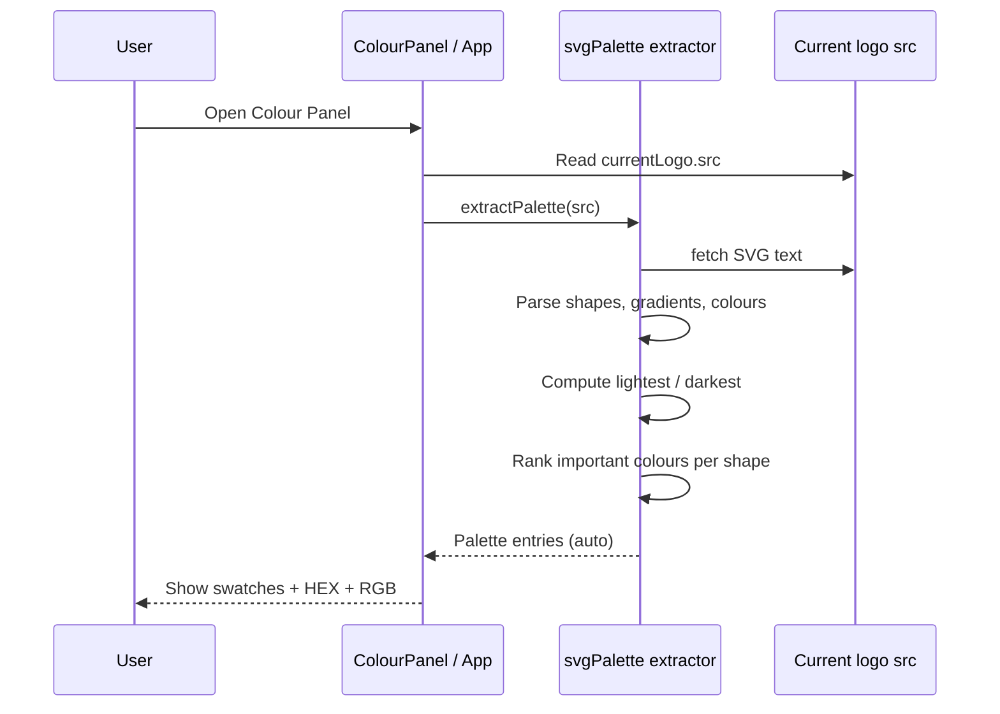
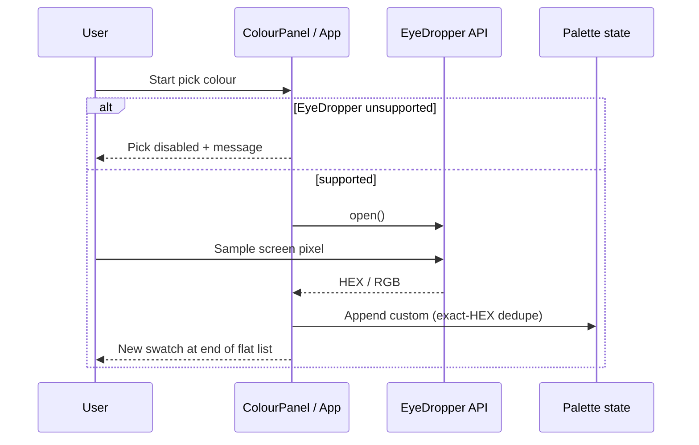
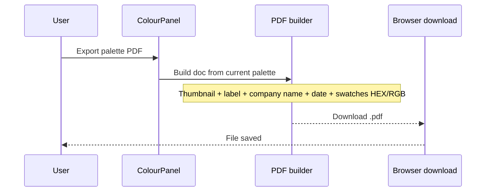

# Logo Demo — Colour Panel Brief

**Feature cycle:** 2026-08-07  
**Repo path:** `pages/Logo-Demo/`  
**Expected live URL:** `https://xanderwiles.com/pages/Logo-Demo/`  
**Status:** Implemented — Colour Panel shipped in `pages/Logo-Demo/`. Decisions locked; see technical plan for details.

**Related docs:**

- [`01-questions-and-decisions.md`](./01-questions-and-decisions.md) — locked product/tech decisions
- [`02-technical-plan.md`](./02-technical-plan.md) — locked technical plan

---

## Summary

Add a **Colour Panel** to Logo Demo: a collapsible UI (closed by default) that automatically extracts a colour palette from the currently displayed SVG logo, shows **HEX + RGB** for each colour with **copy-to-clipboard**, lets the user **eyedrop / pick colours from the main canvas** to add custom swatches, and **exports the full palette to PDF** (including HEX and RGB).

Extraction must go beyond today’s lightest/darkest-only helper: pull global lightest & darkest first, then separate shapes and extract the most important colours per shape, including colours defined inside **SVG gradients**.

---

## User problem being solved

Logo Demo already helps compare logo marks on black/white backgrounds and (optionally) tint company name text from SVG extremes. It does **not** answer:

- **“What are the brand colours in this logo?”**
- **“What HEX / RGB should I hand to a designer, printer, or brand sheet?”**
- **“Can I sample a colour that the auto-extractor missed (e.g. a mid-gradient shade)?”**
- **“Can I leave with a shareable palette PDF?”**

Without a colour panel, users must open SVGs in other tools, guess from screenshots, or manually re-type values. The existing `extractSvgColors` path only returns two extremes for name colouring — useful for contrast, not for a brand palette.

---

## Target audience

| Audience | Need |
|----------|------|
| **Primary (you / brand work)** | Quickly inspect logo colour systems while flipping demos |
| **Design / brand handoff** | Copy HEX/RGB and export a simple palette PDF |
| **Custom SVG uploaders** | Same extraction + picker for client-uploaded marks |

---

## Goals

1. **Collapsible Colour Panel** — closed by default; open/close without leaving the logo canvas.
2. **Automatic palette extraction** for the current logo:
   - Global **lightest** and **darkest** colours.
   - Per-**shape** important colours (including gradient stops / gradient-referenced fills).
3. **Panel list UI** — swatch + HEX + RGB + **Copy HEX** per colour.
4. **Canvas colour picker** — sample a colour from the main logo display and add it to the palette as a custom entry.
5. **PDF export** of the whole palette with HEX and RGB included.
6. Stay client-side within the existing Svelte 5 + Vite app (no backend required for v1).

---

## Non-goals (v1)

- Server-side colour extraction or cloud storage of palettes
- Authentication / multi-user shared palettes
- Editing the SVG itself (recolouring paths)
- Full brand-kit CMS (fonts, spacing, usage rules)
- CMYK / Pantone conversion
- Accessibility contrast-checker as a product feature (may reuse luminance helpers internally)
- Replacing the existing footer **“SVG colors”** company-name toggle (relationship is a decision — see Qs)

---

## Current state (codebase snapshot)

| Area | Today |
|------|--------|
| **Stack** | Svelte 5 + TypeScript + Vite (`base: '/pages/Logo-Demo/'`) |
| **Entry** | `src/main.ts` → `src/App.svelte` (single-page; no router) |
| **Logos** | Built-in catalog in `src/lib/logos.ts`; custom upload via `src/lib/customLogos.ts` (blob URLs) |
| **Display** | Dual black/white panels; logos rendered as `` (not inline SVG) |
| **Existing colour logic** | `src/lib/svgColors.ts` — regex `#RGB`/`#RRGGBB` over raw SVG text; returns `{ darkest, lightest }` via WCAG relative luminance; **no per-shape model**, **no `rgb()`/`hsl()`**, gradients only if stops happen to contain hex literals in source |
| **Demo SVG reality** | Most assets under `public/logos/` use `<linearGradient>` + `stop-color="#…"` and CSS classes with `fill: url(#…)` — gradient support is mandatory for this catalog |
| **Panel UX precedent** | `src/lib/ReorderMenu.svelte` — slide-over sheet, focus management, Escape/close patterns |
| **Persistence** | Logo order in `localStorage` (`logo-demo-order`); custom logos session-only |
| **Auth / DB / APIs** | None |
| **Tests** | No unit/e2e test harness yet (`package.json` has `dev` / `build` / `check` only) |
| **Deps** | No PDF, canvas sampling, or colour libraries installed |

### Critical constraint: logos are ``, not inline SVG

The picker cannot walk DOM paths under the logo image. **Locked (Q8):** use the **EyeDropper API only**. Browsers without EyeDropper get a disabled Pick control and a short unsupported message (no canvas sampling fallback in v1).

### Existing extraction gap

Needed for Colour Panel:

---

## Expected user flow

### High-level journey

### Open panel & extract

### Canvas pick custom colour

### Export PDF

---

## Success criteria (product)

- Panel is **closed by default** and can be opened/closed without breaking logo navigation.
- Opening the panel for a demo logo that uses gradients yields **more than** the two extreme colours when the file contains more stops/shapes.
- Each listed colour shows **HEX** and **RGB**, and **Copy HEX** puts the HEX string on the clipboard.
- User can add at least one **custom** colour sampled from the logo display.
- **Export PDF** produces a file listing every palette colour with HEX and RGB.
- Works for **built-in** and **custom-uploaded** SVGs (blob URLs).
- Keyboard and screen-reader basics match existing Reorder sheet quality (details in technical plan).

---

## Decisions

All product/technical decisions are **locked** in [`01-questions-and-decisions.md`](./01-questions-and-decisions.md). See [`02-technical-plan.md`](./02-technical-plan.md) for the implementation plan.

---

## Definition of done (planning phase)

- [x] Codebase reviewed for relevant files and constraints
- [x] Brief written (`00-brief.md`)
- [x] Questions file with answer inputs (`01-questions-and-decisions.md`)
- [x] Draft technical plan with Mermaid diagrams (`02-technical-plan.md`)
- [x] User answers recorded / decisions locked
- [x] Technical plan updated to match locked decisions
- [ ] Explicit go-ahead to implement
