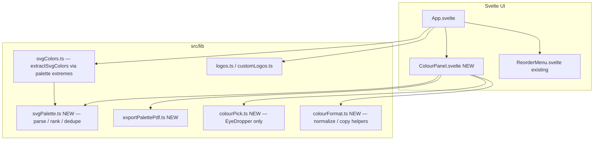
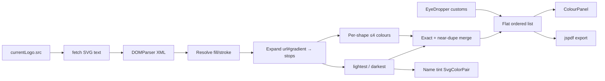
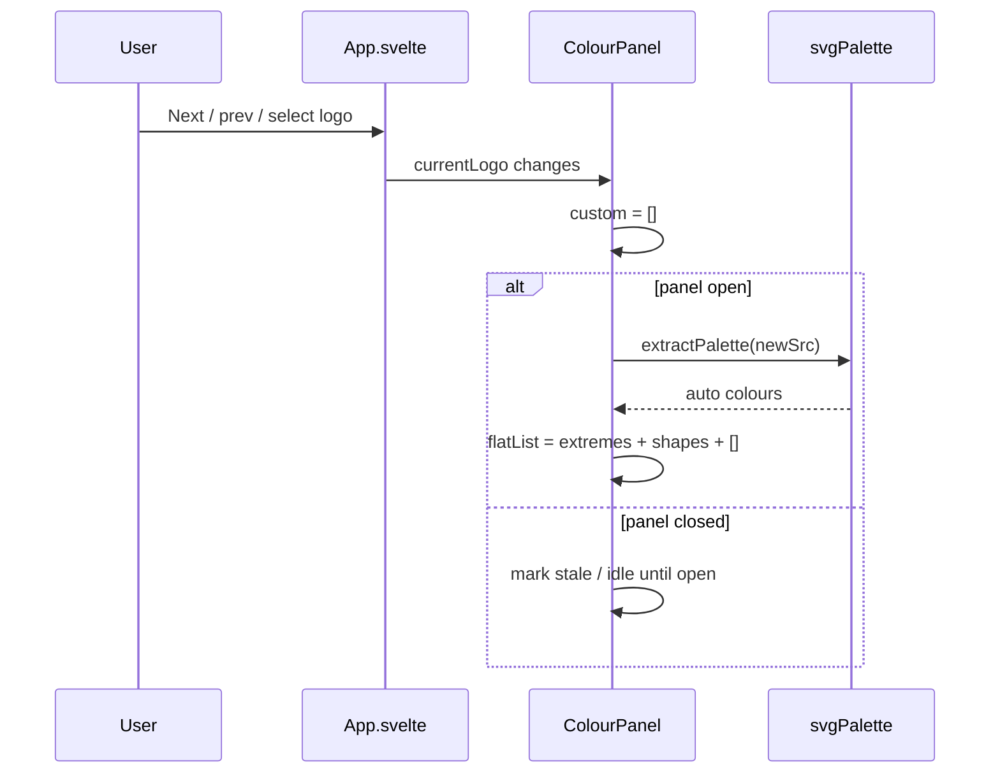
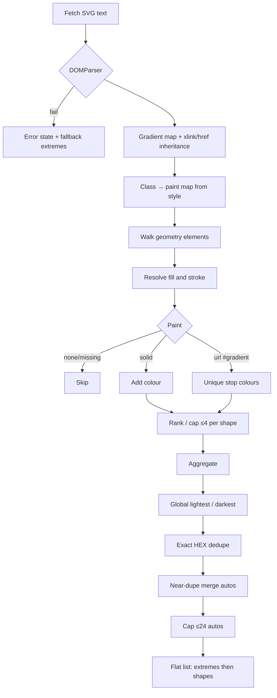
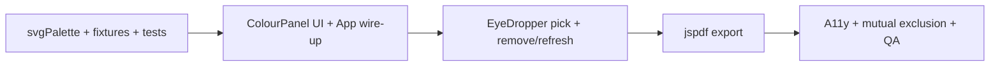

# Logo Demo — Colour Panel Technical Plan

**Feature cycle:** 2026-08-07  
**Status:** **Locked** — decisions recorded in [`01-questions-and-decisions.md`](./01-questions-and-decisions.md). Ready for implementation **after explicit coding approval**.

**Companion:** [`00-brief.md`](./00-brief.md)

---

## Locked decisions (summary)

| ID | Decision | Status |
|----|----------|--------|
| Q1 | **Right slide-over sheet**; footer “Colours” button; closed by default | `Locked` |
| Q2 | On logo change: **re-extract autos** and **clear all customs** | `Locked` |
| Q3 | **Flat single list**: extremes → shape colours → customs | `Locked` |
| Q4 | **Every geometry element** (`path`/`rect`/…) with resolvable paint; skip unresolved / tiny | `Locked` |
| Q5 | **≤4 colours/shape**; **≤24 auto** after dedupe; gradient endpoints preferred | `Locked` |
| Q6 | **Exact HEX + near-duplicate merge** for autos only; never auto-merge customs | `Locked` |
| Q7 | Parse **hex + rgb/rgba + gradient stops + class-style fill map** | `Locked` |
| Q8 | **EyeDropper API only** — no canvas click-sampling fallback | `Locked` |
| Q9 | **Remove customs only**; Refresh rebuilds autos | `Locked` |
| Q10 | PDF: swatches + HEX + RGB + **logo label, company name, date, thumbnail** | `Locked` |
| Q11 | **`jspdf`** client library | `Locked` |
| Q12 | **Independent UX** from “SVG colors” toggle; **shared extractor** underneath | `Locked` |
| Q13 | **Session-only** palette state (no localStorage) | `Locked` |
| Q14 | Display/copy HEX `#RRGGBB` uppercase; display RGB `rgb(r, g, b)`; **HEX copy only** | `Locked` |
| Q15 | **Opaque sRGB**; composite translucent on white | `Locked` |

### Implementation implications of overrides

| Override | Implication |
|----------|-------------|
| Q2 clear customs on logo change | No per-logo custom map; single `custom[]` wiped whenever `currentLogo.id` changes |
| Q3 flat list | UI is one ordered array; labels like “Lightest” / “Shape 2” / “Custom” are row metadata, not section headers |
| Q8 EyeDropper only | No `getImageData` path in v1; unsupported browsers get disabled Pick + short explanation |

---

## Final agreed scope (v1)

### In scope

1. **Colour Panel** — right slide-over (Reorder pattern), **closed by default**, footer “Colours” toggle.
2. **Lazy auto-extraction** when the panel is open (and on logo change while open) for `currentLogo.src` (built-in + blob).
3. Extraction pipeline:
   - Global **lightest** and **darkest**
   - Per-geometry-shape important colours (≤4/shape), including **gradient stops**
   - Global auto cap **24** after dedupe
4. **Flat list UI**: extremes first, then shape-derived colours, then customs; each row shows swatch + HEX + RGB + **Copy HEX**.
5. **EyeDropper-only** custom colour add; removable customs; Refresh rebuilds autos (customs unchanged until logo change clears them).
6. **PDF export** via `jspdf`: thumbnail + logo label + company name + date + all colours with HEX + RGB.
7. Refactor colour extraction so `extractSvgColors()` (name tint) and the panel share one parser; toggle UX stays independent.
8. Sheet a11y: focus management, Escape, labelled controls, live region for copy; mutual exclusion with Reorder sheet.
9. Unit tests for pure parsing / ranking / format helpers (Vitest).

### Out of scope (v1)

- Canvas / image pixel click-sampling fallback
- Per-logo persistence of custom picks across logo switches or reloads
- Grouped / accordion section UI
- Backend, auth, Firestore, shared palettes
- Recolouring / rewriting SVG assets
- CMYK / Pantone / `hsl()` / full CSS cascade
- Copy RGB button
- Contrast-checker product UI
- HEX manual text-entry escape hatch (defer to v1.1 unless required during a11y polish)

---

## Architecture overview

Client-only Svelte 5 SPA. No APIs or DB.



### Data flow



### Logo-change sequence (locked Q2)



### EyeDropper pick sequence (locked Q8)

```mermaid
sequenceDiagram
    participant U as User
    participant CP as ColourPanel
    participant P as colourPick / EyeDropper

    U->>CP: Pick colour
    CP->>P: supported?
    alt EyeDropper unavailable
        P-->>CP: unsupported
        CP-->>U: Disable pick + short message
    else supported
        CP->>P: open EyeDropper
        U->>P: Sample screen pixel
        P-->>CP: sRGB hex
        CP->>CP: Composite/normalize opaque; append custom if not exact-HEX duplicate
        CP-->>U: New row at end of flat list
    end
```

### Module responsibilities

| Module | Responsibility |
|--------|----------------|
| `svgPalette.ts` (new) | Fetch + parse SVG; resolve paints; gradients; extremes; per-shape ranking; near-dupe dedupe; build flat auto list |
| `svgColors.ts` (adapt) | Keep `extractSvgColors()` for App name tint — delegate to palette extremes |
| `colourFormat.ts` (new) | HEX/RGB normalize, opaque composite-on-white, clipboard helper |
| `colourPick.ts` (new) | Feature-detect `EyeDropper`; open + normalize result; **no canvas fallback** |
| `exportPalettePdf.ts` (new) | `jspdf` doc: thumbnail, label, company name, date, colour rows |
| `ColourPanel.svelte` (new) | Sheet UI, flat list, copy, pick, refresh, remove custom, export, unsupported-picker state |
| `App.svelte` (change) | `colourPanelOpen`, footer button, pass logo + `companyName`, mutual exclusion with Reorder |

---

## Data model (client-only)

No database tables. Session memory only.

```ts
type ColourSource = 'extreme' | 'shape' | 'custom'

type PaletteColour = {
  id: string
  hex: string // #RRGGBB uppercase
  rgb: { r: number; g: number; b: number }
  source: ColourSource
  label: string // "Lightest" | "Darkest" | "Shape N" | "Custom"
  shapeId?: string
  removable: boolean // true only for custom
}

type PaletteUiState = {
  logoId: string | null
  status: 'idle' | 'loading' | 'ready' | 'error'
  errorMessage?: string
  colours: PaletteColour[] // flat: extremes, then shapes, then customs
}
```

### Data model changes

| Layer | Change |
|-------|--------|
| Firestore / SQL / remote | **None** |
| `localStorage` | **None** for palette (logo order key unchanged) |
| In-memory App / panel state | `colourPanelOpen`; flat `colours[]`; customs cleared on logo id change |

### API changes

| API | Change |
|-----|--------|
| HTTP backend | **None** |
| Browser APIs | `fetch`, `DOMParser`, `Clipboard`, **`EyeDropper`**, Blob download for PDF |
| npm | **`jspdf`**; **`vitest`** (+ vite config) for unit tests |

---

## Existing files relevant

| Path | Why |
|------|-----|
| `src/App.svelte` | Footer, logo state, SVG name-tint effect, wire panel |
| `src/lib/svgColors.ts` | Current extremes helper — adapt to shared parser |
| `src/lib/ReorderMenu.svelte` | Sheet UX / a11y precedent; mutual exclusion |
| `src/lib/logos.ts` / `customLogos.ts` | Logo identity + blob URLs |
| `public/logos/*.svg` | Gradient fixtures for manual QA |
| `package.json` / `vite.config.ts` | Add deps / test config |

---

## New files likely to be created

| Path | Purpose |
|------|---------|
| `src/lib/ColourPanel.svelte` | Colour panel sheet |
| `src/lib/svgPalette.ts` | Extraction pipeline |
| `src/lib/colourFormat.ts` | Format / normalize / copy |
| `src/lib/colourPick.ts` | EyeDropper-only picker |
| `src/lib/exportPalettePdf.ts` | PDF builder |
| `src/lib/svgPalette.test.ts` (or `src/lib/__tests__/…`) | Unit tests |
| `src/lib/fixtures/*.svg` | Controlled parse fixtures |

---

## Existing files likely to be changed

| Path | Change |
|------|--------|
| `src/App.svelte` | Colours button, open state, props, mutual exclusion with Reorder |
| `src/lib/svgColors.ts` | Delegate extremes to `svgPalette` |
| `package.json` / `package-lock.json` | `jspdf`, `vitest`, test script |
| `vite.config.ts` and/or `vitest.config.ts` | Test setup |
| `tsconfig*.json` | Only if needed for vitest types |

---

## Extraction algorithm (locked)



### Near-duplicate merge (Q6)

- Autos only.
- Exact HEX first.
- Then merge if RGB Euclidean distance ≤ ~18 (approx ΔE ≈ 4) — keep the first-seen / more “endpoint-like” representative.
- Customs never merged away automatically; skip adding a custom only on **exact** HEX match with an existing row (implementation detail — safe default).

### Tiny / degenerate shapes (Q4 detail)

Skip geometry that cannot resolve paint, or that fails a cheap heuristic (empty `d`, missing dimensions, or negligible bbox when cheaply available). Exact threshold is an implementation assumption (see remaining assumptions).

---

## Colour picker (locked Q8 — EyeDropper only)

```mermaid
flowchart TD
    A[Pick colour] --> B{"'EyeDropper' in window?"}
    B -->|no| C[Disable control + unsupported copy]
    B -->|yes| D[await new EyeDropper().open]
    D -->|abort| E[No change]
    D -->|sRGBHex| F[Normalize opaque #RRGGBB]
    F --> G[Append custom at end of flat list]
```

- Button title/help: sampling uses the system eyedropper (may sample outside the page).
- No raster click-path in v1.
- Manual QA focus: Chromium/Safari-with-support; Firefox shows unsupported state cleanly.

---

## PDF export (locked Q10/Q11)

- Library: **`jspdf`**.
- Contents: title “Colour palette”; small logo thumbnail; logo label; company name (if non-empty); date; rows of swatch + HEX + RGB for **entire flat list** (autos + customs).
- Filename: `palette-{logoLabel}-{yyyy-mm-dd}.pdf` (sanitize label).
- Paginate if rows overflow one page.
- Thumbnail: draw from `currentLogo.src` (http or blob); if embed fails, omit thumbnail and still export colours.

---

## Authentication and authorization

None. Public static client app.

---

## Security and privacy risks

| Risk | Mitigation |
|------|------------|
| Malicious SVG | Parse with `DOMParser`; **do not** inject nodes into live DOM; read attributes only |
| Non-colour paints | Ignore `javascript:` / unknown paints |
| Clipboard | Write only on explicit Copy HEX |
| `jspdf` supply chain | Pin version |
| EyeDropper outside-page sampling | Disclose in UI copy |
| Privacy | All processing local; no server upload |

---

## Performance risks

| Risk | Mitigation |
|------|------------|
| Parse cost | Lazy extract when panel open; cancel in-flight on logo change |
| Logo flip while open | Clear customs immediately; re-fetch new SVG |
| Near-dupe O(n²) | n capped (≤24 autos + few customs) |
| PDF | Generate on click only |

---

## Edge cases

| Case | Handling |
|------|----------|
| No colours found | Empty list message; optional fallback extremes for name tint only |
| EyeDropper unsupported | Pick disabled + short message; rest of panel works |
| EyeDropper abort | No add |
| Logo change | Wipe customs; refresh autos if panel open |
| Reorder + Colours both requested | Close the other sheet |
| Blob logo after Reset demos | Clear palette; handle fetch errors |
| Translucent colours | Composite on white → opaque |
| Clipboard denied | Inline “Copy failed” |
| PDF thumbnail fail | Export without thumbnail |

---

## Accessibility considerations

- “Colours” control: visible text, `aria-expanded` / `aria-controls`.
- Sheet mirrors Reorder: dialog semantics, initial focus, restore focus, Escape, backdrop.
- Flat list: each row exposes HEX as text (not colour-only).
- `aria-live="polite"` for copy confirmation.
- Pick control announces unsupported state when EyeDropper missing.
- Mutual exclusion with Reorder to avoid dual focus traps.
- No keyboard-equivalent for EyeDropper sampling (platform limitation) — document in UI; no HEX text entry in v1 unless approved later.

---

## Manual tests

1. Cold load — panel closed; existing features intact.
2. Open panel on gradient asset (e.g. Asset 3 / 8) — extremes + additional colours; flat order correct; HEX uppercase; RGB `rgb(…)`.
3. Copy HEX — clipboard matches display including `#`.
4. Switch logo — autos refresh; **customs cleared**.
5. Custom upload SVG — extraction works.
6. Fixture with `rgb()` fills — colours appear.
7. Chromium: EyeDropper adds custom; remove custom works; Refresh rebuilds autos and keeps customs until logo change.
8. Firefox (or no EyeDropper): Pick disabled/explained; panel otherwise usable; PDF still works.
9. Export PDF — includes thumbnail (when possible), label, company name, date, HEX+RGB for all rows.
10. Reorder vs Colours mutual exclusion.
11. Keyboard open/close/focus restore.
12. “SVG colors” name tint still independent and working.
13. Mobile sheet usability.
14. Abort EyeDropper — no spurious custom row.

---

## Automated tests

| Layer | What |
|-------|------|
| Unit | Fixtures: solid, linearGradient, href-inherited gradient, CSS class `url(#…)` |
| Unit | Lightest/darkest |
| Unit | Per-shape cap 4 + global cap 24 |
| Unit | Exact + near-dupe merge |
| Unit | Format: `#abc` → `#AABBCC`; rgb/rgba; composite on white |
| Unit | Flat ordering helper (extremes → shapes → customs) |
| Typecheck | `npm run check` green |
| Optional | PDF returns non-empty output |

**Harness:** Vitest.

---

## Rollback plan

1. Git revert feature commits.
2. Redeploy previous Logo-Demo build.
3. Remove `jspdf` / vitest with the revert.
4. No palette data migration (session-only).
5. Emergency: hide Colours button behind a local boolean if needed.

---

## Definition of done (implementation)

- [x] Decisions locked; this plan matches them
- [ ] Explicit coding approval received
- [ ] Panel closed by default; right sheet open/close works desktop + mobile
- [ ] Extraction: extremes + per-shape + gradients for demo catalog
- [ ] Flat list; HEX + RGB; Copy HEX with failure feedback
- [ ] EyeDropper customs + remove; unsupported browsers handled
- [ ] Logo change clears customs and re-extracts
- [ ] PDF via jspdf with metadata + HEX/RGB
- [ ] Shared extractor; existing SVG name-tint toggle still works
- [ ] `npm run check` + extractor unit tests pass
- [ ] Manual checklist executed (Chromium + unsupported-EyeDropper browser)

---

## Implementation phases (after approval)



### Exact files to edit / create first

**Phase 1 (start here):**

1. **Create** `src/lib/colourFormat.ts`
2. **Create** `src/lib/svgPalette.ts`
3. **Create** fixtures under `src/lib/fixtures/`
4. **Create** `src/lib/svgPalette.test.ts` (+ Vitest wiring in `package.json` / vite config)
5. **Edit** `src/lib/svgColors.ts` to delegate extremes to the new parser

**Then:** `ColourPanel.svelte` + `App.svelte`, then `colourPick.ts`, then `exportPalettePdf.ts`.

---

## Remaining assumptions (safe to decide during implementation unless you object)

1. **Near-dupe threshold** — RGB Euclidean distance ≤ 18 (≈ ΔE 4); keep first/endpoint-biased colour.
2. **Tiny-path skip** — skip empty/`none` paints and obviously degenerate paths; exact numeric bbox cutoff chosen during implementation.
3. **Lazy extract** — only while panel is open (or when opening).
4. **Custom exact-dupe** — do not add a custom if the same `#RRGGBB` already exists in the flat list.
5. **Vitest** as the unit-test runner.
6. **PDF filename** — `palette-{sanitizedLabel}-{yyyy-mm-dd}.pdf`.
7. **Mutual exclusion** — opening Colours closes Reorder and vice versa.
8. **Unsupported EyeDropper copy** — short inline message; no alternate picker in v1.
9. **No HEX text-entry fallback** in v1 for keyboard-only users.

---

## Stop point

Technical plan is locked to your answers. **Waiting for your approval to start coding.**
