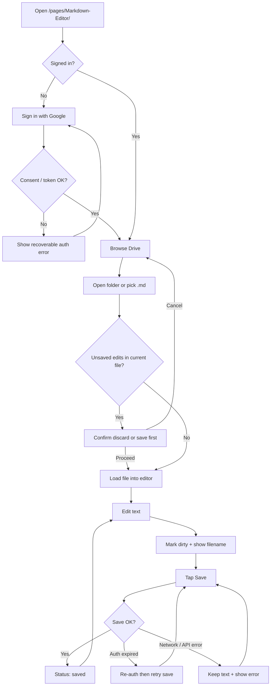
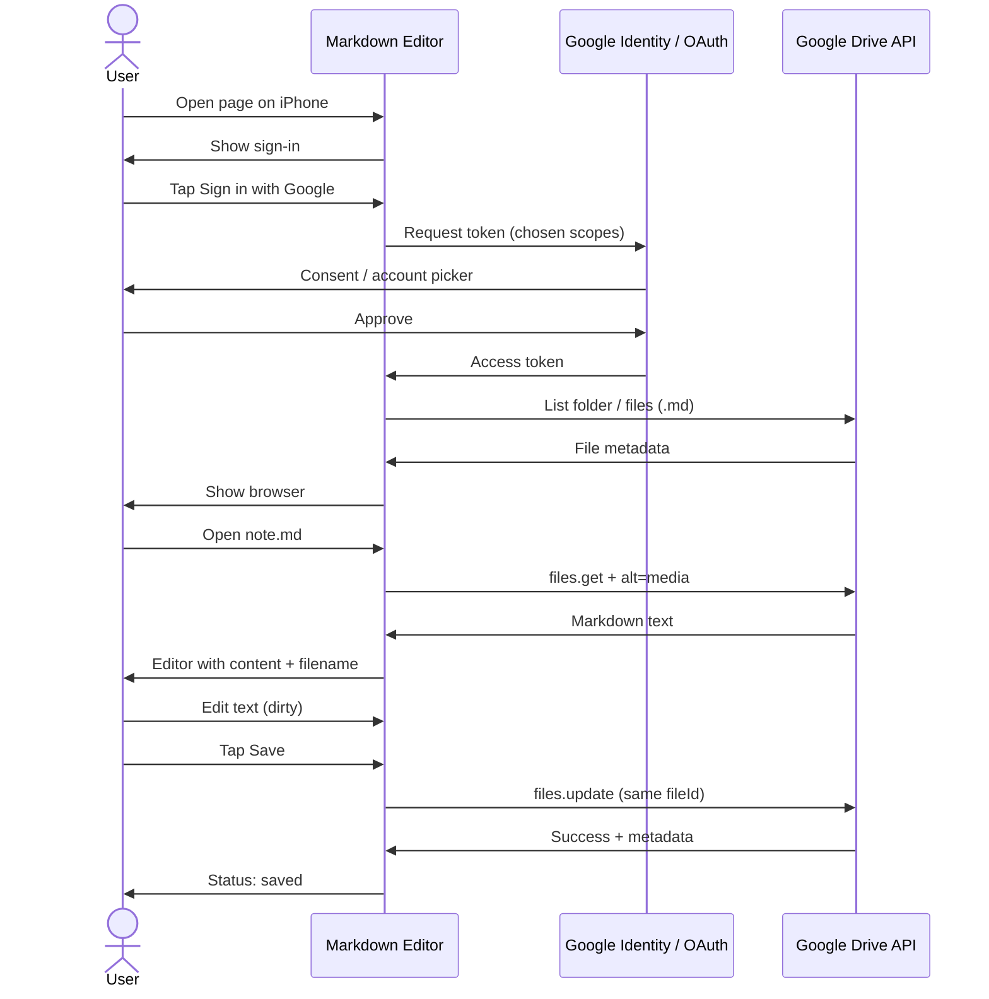

# Google Drive Markdown Editor — Brief

**Feature cycle:** 2026-07-28  
**Repo path:** `pages/Markdown-Editor/`  
**Expected live URL:** `https://xanderwiles.com/pages/Markdown-Editor/`  
**Status:** MVP implemented — configure OAuth client ID per [`README.md`](../../../../README.md).

---

## Summary

Build a **personal, phone-friendly static web app** that signs in with Google, browses Google Drive for `.md` files, edits them in the browser, and saves changes back to the same Drive file.

Primary use case: **iOS Safari / home-screen web app**, where the Google Drive mobile app is a poor markdown editor.

This is a **single-user** tool (your Google account only), hosted for **$0** via existing Vercel static hosting + client-side Drive API. Homepage marketing card is **out of scope for now**.

---

## User problem being solved

| Pain today | Impact |
|------------|--------|
| Drive mobile app is weak for editing `.md` | Notes/docs on phone are hard to revise in place |
| Desktop editors / local files don’t sync from iPhone easily | Context-switching friction when away from laptop |
| Journal (`pages/journal/`) is a separate Firestore PWA | Wrong place for “edit my Drive markdown files” |
| No existing Drive read/write tool on this site | Auth pages today are Firebase identity → Firestore only |

You need one clear loop: **Sign in → pick a `.md` → edit → save → refresh and still see it.**

---

## Target audience

| Audience | Need |
|----------|------|
| **Primary (you only)** | Reliable iPhone editing of personal Drive markdown |
| **Not in scope** | Multi-user sharing, public discovery, team permissions UI |

Rough load: **≤100 saves/day**. Testing-mode OAuth with your account as test user is fine.

---

## Goals (MVP)

1. **Google sign-in** with Drive access (minimum workable scopes).
2. **Browse** Drive in-app: open folders, list `.md`, navigate Up (scope: full `drive` — Option 2C).
3. **Open** a markdown file into an editor.
4. **Edit** in a **plain textarea** (no preview in MVP).
5. **Save** updates the **same** Drive file (content update, not a copy).
6. **Clear status**: loading / dirty / saving / saved / error.
7. **Recoverable failures**: auth expired, network loss, save conflict/error — never silently discard editor text when avoidable.
8. **Unsaved-change warnings** before navigating away when practical.
9. Ship under `pages/Markdown-Editor/` matching this repo’s **static multi-tool** pattern.
10. Short `README.md` documenting Google Cloud / OAuth / env setup.

---

## Non-goals (MVP — locked from product brief)

- Multi-user / sharing / permissions UI
- Offline-first sync engine
- Full wiki / linking / backlinks
- Image upload pipeline
- Converting non-markdown formats
- Homepage marketing card / public discovery
- Merging with Journal (`pages/journal/`)
- Placing the app at site root
- Unrelated repo refactors

---

## Expected user flow

### Happy-path sequence (sign-in → save)

---

## Current state (codebase snapshot)

| Area | Today |
|------|--------|
| **`pages/Markdown-Editor/`** | Empty folder (created 2026-07-28) — no app yet |
| **Static pages pattern** | HTML/CSS/JS under `pages/`; root `npm run dev` → `/pages/<Folder>/`; `build.js` copies into `deploy_out/` |
| **Env injection** | `build.js` replaces `process.env.PUBLIC_*` in deploy output from `.env.local` / Vercel env |
| **Google auth in repo** | Firebase `GoogleAuthProvider` for Firestore apps (To-Do, Watch Later, etc.) — **identity only, no Drive tokens** |
| **GIS / gapi / Drive API** | **Not used anywhere** in this repo |
| **Closest OAuth docs** | Group-Availability (Supabase Google); Home-Design Firebase authorized domains |
| **Journal** | Separate Vite/React Firestore PWA — **do not merge** |
| **`vercel.json`** | SPA rewrite only for Journal (+ Group-Availability named routes). Flat static page needs **no rewrite** |
| **Homepage** | Optional card skipped for this cycle |

---

## Constraints & principles

| Constraint | Implication |
|------------|-------------|
| iPhone-first | Large touch targets; readable editor; reliable keyboard; avoid desktop-only UX |
| Simple & reliable | Prefer plain editor + explicit Save over fancy sync |
| $0 cost | Client-side Drive calls; no new backend; existing Vercel hosting |
| Secrets | Client ID may be public; never commit client secrets; use `.env.example` + `.env.local` |
| Scope discipline | Prefer minimum Drive scope that still satisfies “open my existing `.md` files” |
| No silent data loss | Dirty flag, beforeunload/pagehide where practical, keep text on failed save |

---

## Deliverables (this cycle)

1. Working app at `pages/Markdown-Editor/`
2. Short local/prod setup `README.md` (Drive API, OAuth client, env vars, redirect/origins)
3. Required `.env.example` updates (and `vercel.json` only if SPA routes are added — unlikely for MVP)
4. Brief note on chosen Drive scopes and auth approach (in README + technical plan)

---

## Definition of done (acceptance)

From iPhone Safari (or home-screen web app):

1. Open `/pages/Markdown-Editor/`
2. Sign in with Google
3. Open an existing `.md` from Drive
4. Edit and save
5. Refresh the page, re-open the same file, and see the saved content
6. Repeat saves many times in a day without breaking
7. Unsaved text is not discarded without warning when avoidable
8. No unrelated repo refactors; only this page + env example (+ rewrite only if required)

---

## Implementation sequence (after decisions lock)

1. Scaffold mobile-first shell UI under `pages/Markdown-Editor/`
2. Wire Google OAuth + Drive list/open/save
3. Add dirty-state + save status + basic error recovery
4. Verify deploy path (`build.js` copy + env inject) and document setup in README
5. **Stop at MVP** unless asked to extend

---

## Related docs

| Doc | Purpose |
|-----|---------|
| [`01-questions-and-decisions.md`](./01-questions-and-decisions.md) | Open questions — **answer these before coding** |
| [`02-technical-plan.md`](./02-technical-plan.md) | Architecture, files, risks, tests, rollback |
| `docs/local-development.md` | Repo static vs Vite workflows |
| `build.js` / `vercel.json` / `.env.example` | Deploy + env patterns |
