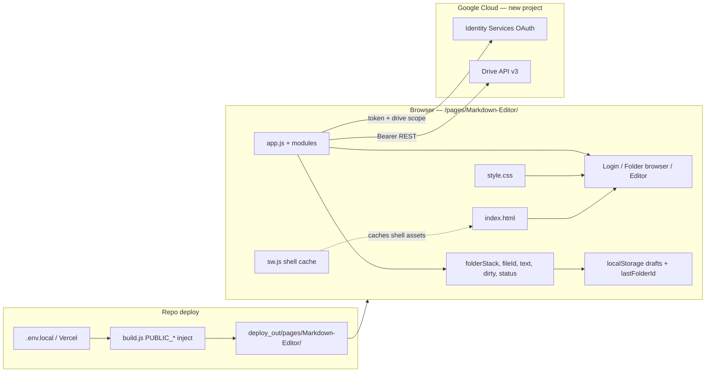
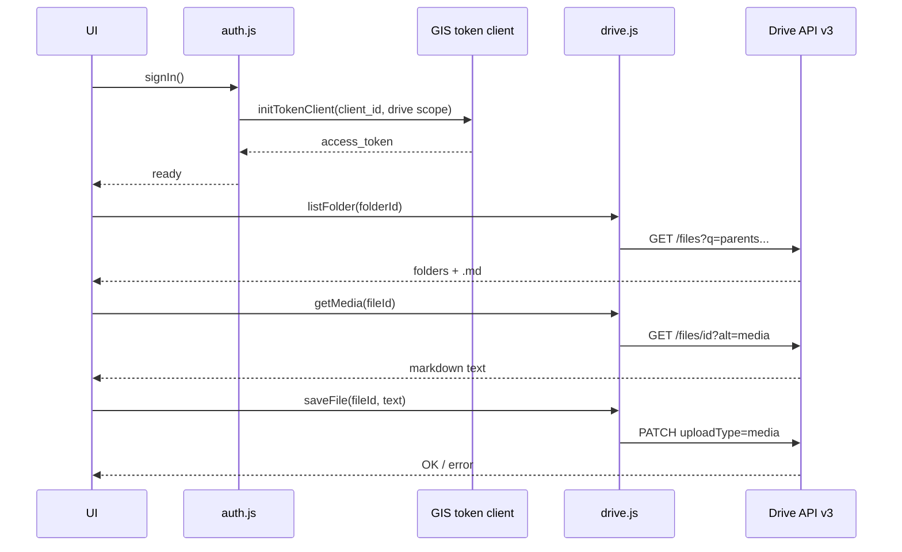
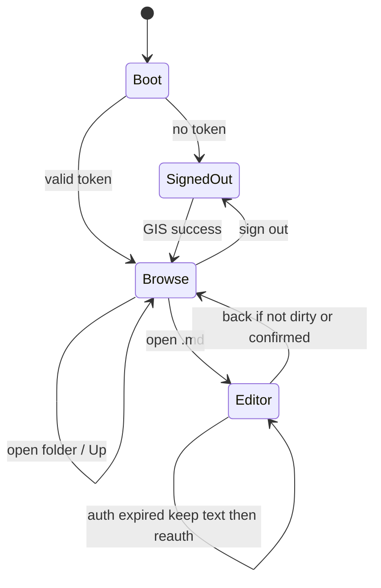

# Google Drive Markdown Editor — Technical Plan

**Feature cycle:** 2026-07-28  
**Status:** **Implemented** (MVP). Decisions locked as Option **2C**. Awaiting your Google Cloud client ID in env for live auth.  
**Source of truth for answers:** [`01-questions-and-decisions.md`](./01-questions-and-decisions.md)

---

## Locked decisions (from your answers)

| ID | Decision |
|----|----------|
| Q1 | **GIS** `google.accounts.oauth2.initTokenClient` + Drive REST — **no Firebase** |
| Q2 | **`https://www.googleapis.com/auth/drive`** (full Drive) — Option **2C** |
| Q3 | **In-app folder browser** (Up, folders + `.md`, start My Drive / remembered folder) |
| Q4 | **New dedicated GCP project** (e.g. `markdown-editor-xander`) |
| Q5 | **Plain `<textarea>`**; no markdown preview library |
| Q6 | **Open/edit/save existing `.md` only** — no “New file” in MVP |
| Q7 | **Manual Save** only (no autosave) |
| Q8 | **Last-write-wins** content update; on failure keep editor text + error |
| Q9 | **Full PWA**: `site.webmanifest` + **service worker** (app-shell cache) |
| Q10 | Single readable **dark** theme (site-adjacent); no multi-theme system |
| Q11 | **Skip** homepage card |
| Q12 | **No** client-side path routes; **no** `vercel.json` rewrite |
| Q13 | Env: `PUBLIC_MARKDOWN_EDITOR_GOOGLE_CLIENT_ID` |
| Q14 | **Local draft** keyed by `fileId` + restore/discard prompt on reopen |
| Q15 | **No** in-app email allowlist — OAuth **Testing** mode + test users |

Empty Q10–Q13 answer fields interpreted as **accept safe defaults**.

---

## Q2/Q3 resolution (locked)

Initial checkboxes (`drive.file` + in-app browser) conflicted. You chose the **recommended** fix:

| Item | Locked value |
|------|----------------|
| Resolution | **Option 2C** |
| Scope | `https://www.googleapis.com/auth/drive` |
| Browse UX | In-app folder browser |
| Why | Personal testing-mode app; enables real My Drive folder navigation on iPhone without Google Picker |

No Google Picker in MVP.

---

## Final agreed scope (MVP)

### In scope

1. Static app at `pages/Markdown-Editor/` → `/pages/Markdown-Editor/`
2. GIS Google sign-in with scope **`https://www.googleapis.com/auth/drive`**
3. In-app browse: open folders, list `.md` / `text/markdown`, navigate Up; remember last folder
4. Open existing file → plain textarea; show filename + dirty/saved/error status
5. Manual Save → `files.update` same `fileId` (last-write-wins)
6. Local draft backup + restore prompt; unsaved navigation confirm when practical
7. Full PWA shell: Apple meta + manifest + **versioned service worker** (shell only, not Drive responses)
8. README: Drive API, OAuth client, env, JS origins, **scope + why**
9. `.env.example` entry for client ID

### Out of scope

- Create new files, preview, autosave, revision conflict UI, Google Picker
- Firestore / Firebase / Journal merge / homepage card
- Multi-user ACL UI, offline sync engine, image upload, format conversion
- Site-root placement, `vercel.json` SPA rewrites, unrelated refactors

---

## Main technical approach

**Static HTML/CSS/vanilla JS** under `pages/Markdown-Editor/`. No Vite. No Firestore. No Picker.

| Layer | Locked choice |
|-------|----------------|
| Hosting | Vercel via existing `build.js` → `deploy_out/` |
| Config | `PUBLIC_MARKDOWN_EDITOR_GOOGLE_CLIENT_ID` (build-time inject; no client secret) |
| Auth | GIS token client; scope = `https://www.googleapis.com/auth/drive` |
| Storage | Google Drive API v3 list / get / update |
| Editor | Plain `<textarea>` |
| Persistence extras | `localStorage` drafts; last-folder id |
| Packaging | PWA: `site.webmanifest` + `sw.js` (shell cache) |
| Routes | In-page views: `signedOut` / `browse` / `editor` |

### Architecture / data flow



### Auth + Drive sequence (locked)



### View state machine



---

## Chosen auth & scope (document in README)

| Item | Value |
|------|--------|
| Auth | GIS OAuth 2.0 **token** client (browser) |
| GCP | **New** project — you create; name suggestion `markdown-editor-xander` |
| Client | Web OAuth client ID → `PUBLIC_MARKDOWN_EDITOR_GOOGLE_CLIENT_ID` |
| Secret | **Never** in frontend |
| Consent | Testing mode; your account as test user; no in-app allowlist |
| Scope string | `https://www.googleapis.com/auth/drive` |
| Why | Enables in-app My Drive folder browsing for existing `.md` files on a personal testing-mode app; `drive.file` alone cannot list arbitrary pre-existing Drive trees |

### Why not Firebase?

Repo Firebase Google sign-in is identity-for-Firestore only. This app has no Firestore and needs a Drive access token; GIS is the direct fit.

### Why not `drive.file`?

`drive.file` cannot power an in-app folder browser over existing notes. Full `drive` is accepted for this single-user tool so Sign in → browse folders → edit → save works without Picker.
---

## Relevant existing files / services

| Path / service | Relevance |
|----------------|-----------|
| `docs/local-development.md` | Static `npm run dev` → `/pages/Markdown-Editor/` |
| `build.js` | Copy page + inject `process.env.PUBLIC_*` |
| `vercel.json` | **Unchanged** |
| `.env.example` | Add client ID var |
| `pages/To-Do-List/` | Mobile/PWA meta + modular JS inspiration; SW pattern reference |
| `pages/Youtube-Link-Extractor/` | `process.env.PUBLIC_*` client config pattern |
| `pages/Home-Design/` | Prefer fail-if-missing config over hardcoded secrets |
| `pages/journal/` | Do not touch / merge |
| Google Drive API v3 + GIS | External dependencies |

---

## New files to create (first implementation set)

| Path | Role |
|------|------|
| `pages/Markdown-Editor/index.html` | Shell, views, Apple meta, manifest link |
| `pages/Markdown-Editor/style.css` | Mobile-first dark UI |
| `pages/Markdown-Editor/config.js` | Client ID from `process.env` |
| `pages/Markdown-Editor/auth.js` | GIS token client, expiry, re-auth |
| `pages/Markdown-Editor/drive.js` | listFolder / getMedia / updateContent |
| `pages/Markdown-Editor/editor.js` | textarea, dirty, drafts |
| `pages/Markdown-Editor/ui.js` | status, confirms, folder list rendering |
| `pages/Markdown-Editor/app.js` | boot + wire views |
| `pages/Markdown-Editor/sw.js` | versioned app-shell cache |
| `pages/Markdown-Editor/site.webmanifest` | standalone home-screen |
| `pages/Markdown-Editor/README.md` | OAuth + Drive setup + scope rationale |
| Favicons / apple-touch-icon | Match site conventions |

No `picker.js` — Picker is out of scope.
---

## Existing files to change

| Path | Change |
|------|--------|
| `.env.example` | `PUBLIC_MARKDOWN_EDITOR_GOOGLE_CLIENT_ID=` |
| `.env.local` | You add real client ID (gitignored) |
| Vercel env | Same for production builds |
| `vercel.json` | **No** |
| Site `index.html` | **No** homepage card |
| `build.js` | **No** (unless SW caching surprises — unlikely) |

---

## Data model changes

**None** server-side.

Client state:

```text
accessToken, tokenExpiresAt
browse: { currentFolderId, folderStack: { id, name }[], lastFolderId? }
openFile: { fileId, fileName, mimeType, originalContent, editorContent, dirty, status, errorMessage? }
draft: localStorage["md-editor:draft:{fileId}"] = { text, savedAt, fileName }
```
---

## API changes

No first-party backend. Drive REST only:

| Op | API |
|----|-----|
| List folder | `GET /drive/v3/files?q='{folderId}' in parents and trashed=false&...` |
| Open | `GET /drive/v3/files/{id}?alt=media` + metadata fields |
| Save | `PATCH /upload/drive/v3/files/{id}?uploadType=media` |
Filter candidates: `mimeType = 'text/markdown'` **or** name ends with `.md`; skip Google-native Docs.

---

## Authentication and authorization

1. Web client ID; authorized JS origins: `http://localhost:3000`, `https://xanderwiles.com`, `https://www.xanderwiles.com` as needed.
2. Testing mode + test user = your account.
3. Access token in **memory**; re-request on 401 / expiry without wiping editor text.
4. PWA standalone: prefer GIS token popup/UX that works in `display-mode: standalone` (document iOS quirks in README; avoid broken redirect patterns from Watch Later notes).

---

## Security and privacy risks

| Risk | Mitigation |
|------|------------|
| Scope is full `drive` | Document why in README; keep app private (no homepage card); testing-mode OAuth || XSS → Drive token abuse | Escape filenames; textContent for lists |
| Stale SW serves old JS | Cache version bump; `skipWaiting` + refresh hint |
| Last-write-wins clobber | Accept for MVP; keep local text on failed save |
| Drafts on shared device | Device-local; optional clear on sign-out |

---

## Performance risks

| Risk | Mitigation |
|------|------------|
| Huge folders | `pageSize` + Load more; folders + `.md` only |
| Large files | Warn &gt; ~1–2 MB |
| SW caching API by mistake | Cache shell assets only; never cache Drive responses |
| iOS keyboard / viewport | Flexible editor height; 16px+ font |

---

## Edge cases (selected)

- Auth expired mid-edit → keep text, re-auth, retry Save  
- Offline Save → error + dirty + draft  
- Draft ≠ Drive on reopen → Restore / Discard  
- Empty folder → friendly empty state  
- Google Docs mistaken for `.md` → skip/reject  
- SW update after deploy → user may need one refresh
---

## Accessibility

Labeled buttons; `aria-live` status; visible “Unsaved”; 44pt targets; focus editor after open.

---

## Manual tests (after OAuth ready)

1. Build/preview with injected client ID → sign in (consent shows Drive scope)  
2. Browse My Drive → open folder → open `.md` → edit → Save → refresh → reopen → content OK  
3. Up navigation and remembered last folder  
4. Dirty back navigation confirms  
5. Offline save error retains text  
6. Draft restore after kill/refresh  
7. iPhone home-screen PWA: keyboard + save loop  
8. After redeploy, confirm SW eventually serves new shell
**Automated tests:** none for MVP.

---

## Rollback

Revert `pages/Markdown-Editor/` + `.env.example`; redeploy. Drive data stays in Google. Revoke OAuth client if needed.

---

## Definition of done

- [x] Q2/Q3 conflict resolved and documented (Option 2C)  
- [ ] You **approve coding**  
- [ ] App at `/pages/Markdown-Editor/` local + prod  
- [ ] Sign-in, browse folders, open, edit, save, refresh works on iPhone  
- [ ] Status + drafts + unsaved warnings  
- [ ] PWA installable; SW caches shell only  
- [ ] README documents setup + scope `drive` + why  
- [ ] `.env.example` updated; no secrets committed  
- [ ] No Journal/homepage/`vercel.json` churn  

---

## Implementation order (after approval)

1. Scaffold HTML/CSS shell (login / browse / editor / status)  
2. `config.js` + `.env.example` + README OAuth checklist  
3. `auth.js` (GIS) with scope `https://www.googleapis.com/auth/drive`  
4. In-app folder browser + `drive.js` list/open/save  
5. Dirty / Save / drafts / errors  
6. Manifest + `sw.js`  
7. Stop at MVP  

---

## Exact files expected to edit/create first

**Create first:**

1. `pages/Markdown-Editor/index.html`  
2. `pages/Markdown-Editor/style.css`  
3. `pages/Markdown-Editor/config.js`  
4. `pages/Markdown-Editor/app.js`  
5. `pages/Markdown-Editor/auth.js`  
6. `pages/Markdown-Editor/drive.js`  
7. `pages/Markdown-Editor/editor.js`  
8. `pages/Markdown-Editor/ui.js`  
9. `pages/Markdown-Editor/README.md`  
10. `pages/Markdown-Editor/site.webmanifest`  
11. `pages/Markdown-Editor/sw.js`  
12. Minimal favicon / apple-touch assets  

**Edit first (repo root):**

1. `.env.example` — add `PUBLIC_MARKDOWN_EDITOR_GOOGLE_CLIENT_ID=`  

**Not in first pass:** site `index.html`, `vercel.json`, `build.js`, Journal, any Firebase project, Google Picker.

---

## Still needed from you before coding

1. ~~Resolve Q2 vs Q3~~ → **Option 2C locked**.  
2. Explicit **“approve coding”** (or equivalent).  
3. Create the GCP project + OAuth client (or follow README during implementation) and put the client ID in `.env.local` / Vercel.
