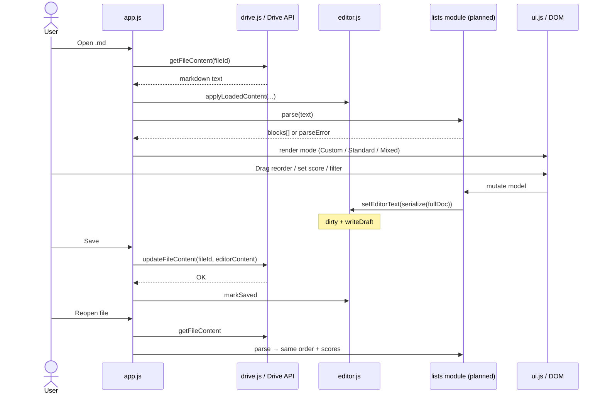

# Custom Structured Lists inside Markdown — Brief

**Feature cycle:** 2026-07-29  
**App path:** `pages/Markdown-Editor/`  
**Expected live URL:** `https://xanderwiles.com/pages/Markdown-Editor/`  
**Status:** Decisions locked in [`01-questions-and-decisions.md`](./01-questions-and-decisions.md) — awaiting coding approval  
**Parent product:** Personal Google Drive Markdown Editor (GIS + Drive REST, static vanilla JS)

---

## Summary

Add a **custom structured list format** that lives inside `.md` files. The app detects that format and can render/edit it as interactive list elements (drag-reorder, per-item sub-variables like `score`, filter), while still supporting normal markdown editing and mixed files.

Drive remains the source of truth: custom list data serializes into the file text so open → edit → save → reopen round-trips without a separate database.

---

## User problem being solved

| Pain today | Impact |
|------------|--------|
| Ideas / ranked notes live as plain markdown bullets | Reordering means manual cut/paste; easy to break formatting |
| Metadata (e.g. idea score) has no first-class place in the editor | Scores live in ad-hoc text (`(7)`, tags in body) that is hard to filter |
| Want structured UX *without* leaving Drive markdown | A separate app/DB would break the “one `.md` in Drive” workflow |
| Phone editing of long lists is especially painful in a raw textarea | Need large touch targets, drag, and filter on iPhone |

You need: **open a note → work with structured lists when present → save back to the same Drive file → reopen with order and metadata intact**.

---

## Target audience

| Audience | Need |
|----------|------|
| **Primary (you only)** | Personal idea / ranked lists inside Drive markdown on iPhone |
| **Not in scope** | Multi-user schemas, shared list templates, public list formats |

---

## Goals (this feature)

1. **Detect** custom list block(s) in a `.md` file via a clear, parseable syntax.
2. Support **three display modes**: Custom List Structured Format, Standard, Mixed Markdown Format.
3. In custom list UI: **interactive items**, **drag reorder**, **sub-variables** (at least `score`), **filter** by those variables.
4. **Persist** all structured edits into the `.md` file on Save (same `fileId`, existing save path).
5. **Preserve** surrounding normal markdown on round-trip.
6. **Fail gracefully** if syntax is invalid — keep raw text editable.
7. Keep existing **dirty / draft / save / unsaved warnings** working.
8. Stay within current stack: **static HTML/CSS/vanilla JS**, mobile-first, no new backend.

---

## Non-goals (first pass)

- Full wiki / backlinks
- Offline sync engine beyond existing local draft
- Changing Google auth / Drive browse / scopes
- Replacing the editor with a full WYSIWYG markdown IDE
- Full markdown preview renderer for Standard mode (unless you decide otherwise in Qs)
- Multi-user schema registry or server-side validation
- Unrelated homepage / Journal / site-root work

---

## Current product context (relevant)

| Area | Today |
|------|--------|
| Editor | Single plain `<textarea id="editor">` — opaque string content |
| Open/save | `getFileContent` → `editorContent` → manual Save → `updateFileContent` |
| Dirty / draft | `setEditorText` + `localStorage` draft keyed by `fileId` |
| App modes | Finder / Edit / Settings (nav tabs) — **not** Custom/Standard/Mixed |
| Auth / Drive | Unchanged for this feature |
| Stack | Vanilla ES modules; SW shell cache (`sw.js` must list + version-bump new files) |

Custom lists must plug into the **string pipeline** (`editorContent` ↔ Drive), not invent a parallel storage system.

---

## Expected user flow

```mermaid
flowchart TD
  A[Open .md from Finder] --> B[Load Drive text into editorContent]
  B --> C{Detect custom list block(s)?}
  C -->|None| D[Default to Standard mode]
  C -->|Valid block(s)| E[Offer / enter Mixed or Custom per mode rules]
  C -->|Invalid syntax| F[Show warning + stay editable as raw text]
  D --> G[Edit in textarea]
  E --> H{Active display mode}
  H -->|Standard| G
  H -->|Custom| I[Show interactive list UI only]
  H -->|Mixed| J[Custom UI for blocks + textarea/segments for rest]
  I --> K[Reorder / set score / filter]
  J --> K
  K --> L[Serialize mutations back into editorContent]
  G --> L
  L --> M{Dirty?}
  M -->|Yes| N[Local draft + enable Save]
  N --> O[Save to Drive]
  O --> P[Reopen later]
  P --> B
```

---

## Sequence: open → structured edit → save → reopen



---

## Deliverables (this cycle)

1. Chosen custom syntax — documented briefly (locked via Qs in `01`)
2. Parser + serializer for custom lists
3. UI for structured list edit (drag, metadata, filter)
4. Mode handling (Custom / Standard / Mixed)
5. Integration with existing open / edit / save / draft flow
6. Planning docs (`00` / `01` / `02`) — this set

---

## Acceptance criteria (product)

- [ ] Custom list blocks are detected in a `.md` file
- [ ] Custom mode shows interactive list items
- [ ] Standard mode shows normal markdown editing
- [ ] Mixed files show custom UI only for custom blocks
- [ ] Drag reorder updates order and persists on Save to Drive
- [ ] Sub-variables (at least `score`) can be set per item and persist on Save
- [ ] List can be filtered by sub-variables
- [ ] Non-custom markdown in the same file is preserved
- [ ] Invalid custom syntax fails gracefully; raw text remains editable
- [ ] Dirty / draft / Save status continues to work

---

## Definition of done (planning → implementation gate)

Planning is done when:

1. You answer (or accept defaults for) questions in [`01-questions-and-decisions.md`](./01-questions-and-decisions.md)
2. [`02-technical-plan.md`](./02-technical-plan.md) is updated to mirror **locked** decisions
3. You explicitly approve coding in chat

Implementation DoD is listed in `02-technical-plan.md`.

---

## Related docs

| Doc | Role |
|-----|------|
| [`01-questions-and-decisions.md`](./01-questions-and-decisions.md) | Open questions + answer boxes |
| [`02-technical-plan.md`](./02-technical-plan.md) | Architecture, files, risks, tests, rollback |
| Prior cycle | `docs/2026/07-28/feature-plan/` — original editor MVP |
| App README | `pages/Markdown-Editor/README.md` |

---

## Next step

**Stop here for answers.** Fill in [`01-questions-and-decisions.md`](./01-questions-and-decisions.md), then say when to lock decisions and start implementation.
