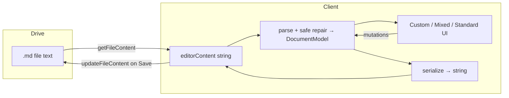
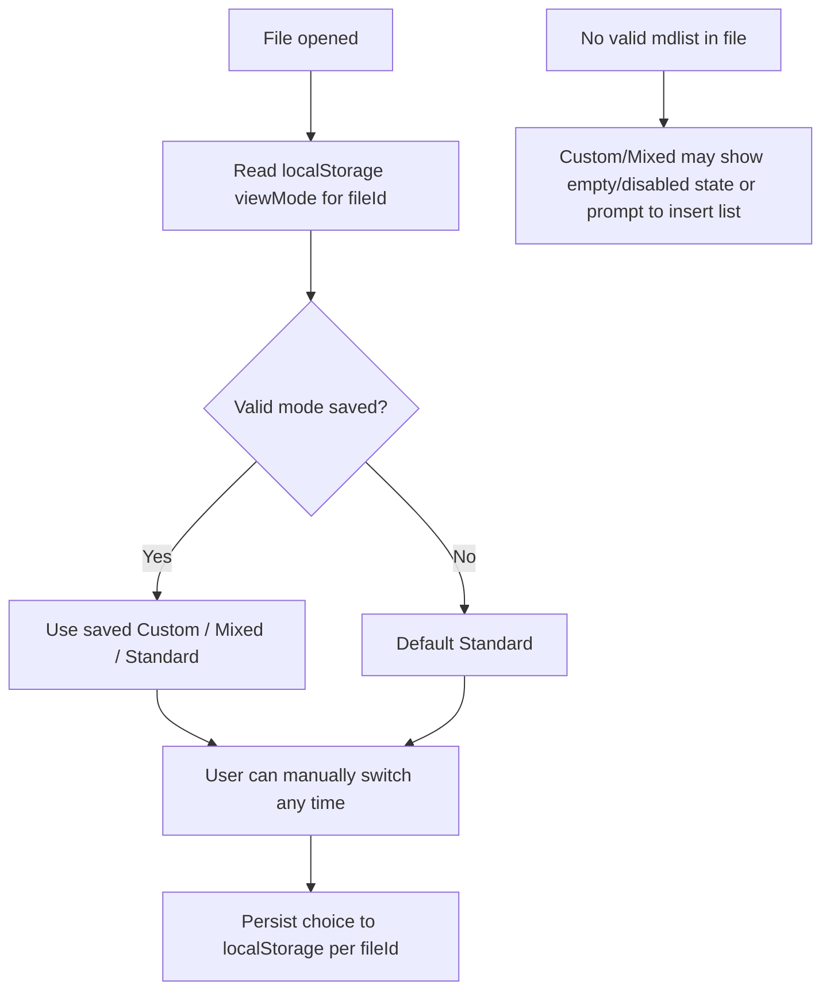
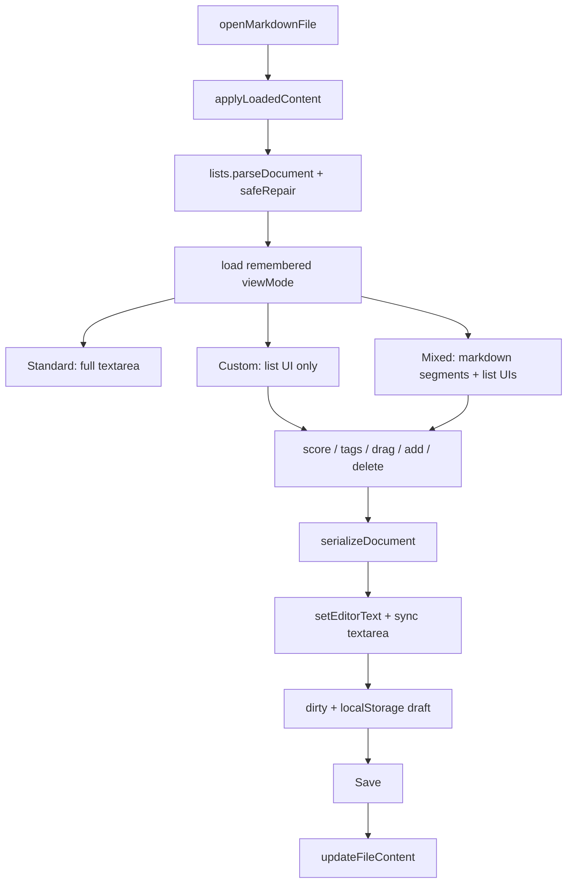

# Custom Structured Lists — Technical Plan

**Feature cycle:** 2026-07-29  
**Status:** Implemented — await manual iPhone verification  
**Source of truth for answers:** [`01-questions-and-decisions.md`](./01-questions-and-decisions.md)  
**Brief:** [`00-brief.md`](./00-brief.md)

---

## Locked decisions

| ID | Locked decision |
|----|-----------------|
| Q1 | Fenced ` ```mdlist ` JSON blocks |
| Q2 | **Manual** Custom \| Mixed \| Standard toggle; remember last choice **per file** in `localStorage` |
| Q3 | Multiple named lists per file |
| Q4 | UI fields: **`score` + `tags` (string[])**; preserve unknown item keys on round-trip |
| Q5 | Score = **any finite number** (unbounded) |
| Q6 | **Order by score**; **unique scores** within a list; **show score in UI** (replaces min-threshold filter as primary UX) |
| Q7 | Plain text item body only |
| Q8 | Vanilla pointer-event drag + up/down buttons; **no** drag library |
| Q9 | Mode switch in **editor chrome** (not app nav tabs) |
| Q10 | **No** new npm/CDN dependencies |
| Q11 | **Best-effort repair** when safe + **warn / raw Standard** when not; never clobber unrepairable blocks |
| Q12 | Require `"version": 1`; unknown version → unsupported |
| Q13 | Any view-only filter does **not** delete on Save; full list always serialized |
| Q14 | Standard = **full-file** textarea (including fences) |
| Q15 | **Add + Delete** in custom UI (confirm on delete) |

---

## Final agreed scope

### In scope

1. Detect `mdlist` fenced JSON blocks in `.md` text
2. Parser + serializer with stable round-trip for valid (or safely repaired) blocks
3. Manual display modes: **Custom**, **Standard**, **Mixed**, with per-file remembered mode
4. Interactive list UI for each list block:
   - Items as separate elements
   - Score shown and editable (finite number, **unique within list**)
   - Tags editable (string array)
   - Display **ordered by score**
   - Vanilla drag + up/down (see drag↔score rules below)
   - Add / delete items
5. Hook mutations into existing `setEditorText` → dirty → draft → Save → Drive
6. Preserve surrounding normal markdown
7. Safe repair on open when possible; otherwise warn and keep raw editable
8. Document syntax in README (short section)
9. Precache new modules in `sw.js` + bump cache version

### Out of scope

- Auth / Drive browse / OAuth scope changes
- Full markdown preview / WYSIWYG IDE
- Offline sync engine beyond current drafts
- Wiki / backlinks
- Server-side schema
- New npm/CDN dependencies
- Homepage / Journal / unrelated refactors
- Classic min-score threshold filter as the primary Q6 UX (replaced by unique score ordering)

---

## Main technical approach

Keep Drive as the only durable store. Canonical editor state remains a **single markdown string** (`editorContent`). Structured UI is a view/controller over parsed slices of that string.



### Locked syntax (Q1)

Fenced code block, language tag `mdlist`, JSON body:

| Field | Type | Notes |
|-------|------|--------|
| `version` | number | Must be `1` |
| `id` | string | Stable list id (multi-list) |
| `title` | string | Optional display title |
| `items` | array | Logical set; **UI order = sort by score** |
| `items[].id` | string | Stable; reorder/score change does not change id |
| `items[].text` | string | Plain text |
| `items[].score` | number | Finite number; **unique within the list** |
| `items[].tags` | string[] | Default `[]` if missing after repair |
| `items[]` extra keys | any | Preserve on round-trip |

**Example:**

````markdown
```mdlist
{
  "version": 1,
  "id": "ideas",
  "title": "Ideas",
  "items": [
    { "id": "i1", "text": "Ship custom lists", "score": 8, "tags": ["product"] },
    { "id": "i2", "text": "Add tags later", "score": 5, "tags": ["meta"] }
  ]
}
```
````

**Parsing:** Scan for fences with info string `mdlist`. `JSON.parse` + validate. Apply **safe repairs** (Q11). Unrepairable → `error` segment; leave raw fence.

**Serialization:** Rewrite each known valid list fence from the in-memory model; leave markdown segments and unrepairable fences untouched.

### Score ordering & uniqueness (Q5 + Q6)

| Rule | Behavior |
|------|----------|
| Display | Sort items by **score descending** (highest first) — *assumption if not overridden* |
| Uniqueness | Reject / block setting a score that another item already has; show clear UI error |
| Missing score | Unscored items sort **after** scored items (bottom); uniqueness applies among defined scores |
| Show in UI | Score control visible on every item row |
| Persist | Array order in JSON should match **score-sorted order** on serialize so Standard/raw matches Custom view |

### Drag ↔ score (Q6 + Q8) — locked approach

Drag and up/down still ship, but because **order is defined by score**:

- Dragging item A above item B **reassigns scores** so the new visual order remains strictly score-descending with **unique** values.
- Algorithm (implementation detail, safe default): on drop, assign a new unique score sequence to the visible ordered list (e.g. densest integer ranks, or midpoint scores between neighbors). Prefer **simple integer re-rank** (n, n−1, …) when all scores were integers; otherwise use midpoints / small deltas between neighbors.
- Editing score directly re-sorts the list; if collision → block with message.
- Up/down buttons = same as drag by one slot (score reassignment).

### Tags (Q4)

- Edit as a simple chip/list or comma-separated field on the item (mobile-friendly).
- Optional **tag filter** (view-only): show only items that include selected tag(s). Does not delete on Save (Q13).
- If no tag filter is built in v1, tag **edit + display** still required; filter-by-tag can be the v1 “filter by sub-variable” surface.

### Document model

```text
DocumentModel {
  segments: Array<
    | { type: 'markdown', text: string }
    | { type: 'mdlist', raw: string, list: MdList | null, error?: string, repaired?: boolean }
  >
}

MdList {
  version: 1
  id: string
  title?: string
  items: Array<{ id, text, score?, tags: string[], ...extras }>
}
```

Mutations → `serialize(DocumentModel)` → `setEditorText(state, string)`.

### Mode resolution (Q2 = A)



Default when no preference: **Standard** (safest for raw files). User must manually pick Mixed/Custom.

`localStorage` key (proposed): `md-editor:viewMode:{fileId}` → `'custom' | 'mixed' | 'standard'`.

---

## Architecture / data-flow



---

## Existing files / services relevant

| Path | Relevance |
|------|-----------|
| `pages/Markdown-Editor/app.js` | Open/save; wire mode + list mutations |
| `pages/Markdown-Editor/editor.js` | String-canonical dirty/draft |
| `pages/Markdown-Editor/ui.js` | Mode chrome; show/hide textarea vs list host |
| `pages/Markdown-Editor/index.html` | Mode control + list/mixed hosts |
| `pages/Markdown-Editor/style.css` | List UI, drag handles, tags, scores |
| `pages/Markdown-Editor/drive.js` | Unchanged full-text upload |
| `pages/Markdown-Editor/auth.js` / `config.js` | Optional new LS key constant in `config.js` |
| `pages/Markdown-Editor/sw.js` | Precache + bump |
| `pages/Markdown-Editor/README.md` | Syntax docs |

**No new routes, DB tables, or Drive APIs.**

---

## New files likely to be created

| File | Role |
|------|------|
| `pages/Markdown-Editor/lists.js` | Parse, repair, validate uniqueness, serialize, sort helpers |
| `pages/Markdown-Editor/lists-ui.js` | DOM: mode-aware render, drag, score/tags controls, add/delete |

(May fold UI into one module if small — safe to decide while coding.)

---

## Existing files likely to be changed

| File | Changes |
|------|---------|
| `index.html` | Editor chrome mode switch; `#list-root` / mixed host; keep `#editor` |
| `style.css` | Structured list UI |
| `app.js` | Parse on open; mode preference; mutation → serialize → `setEditorText` |
| `editor.js` | Likely unchanged unless tiny helpers |
| `ui.js` | Bind mode + list hosts; parse warnings in status |
| `config.js` | `VIEW_MODE_KEY_PREFIX` (optional) |
| `sw.js` | Assets + cache bump |
| `README.md` | Custom lists section |

---

## Data model changes

| Layer | Change |
|-------|--------|
| Drive `.md` | Optional `mdlist` fences |
| App state | `documentModel`, `viewMode`, per-list UI filter state (tags) |
| `localStorage` | Draft unchanged (full text); **new** per-file view mode key |
| DB | None |

---

## API changes

None for Google Drive or site backend. New in-app pure module API only.

---

## Authentication and authorization

Unchanged. Same GIS + `drive` scope. No extra consent.

---

## Security and privacy risks

| Risk | Mitigation |
|------|------------|
| Huge/malicious JSON | Size cap; try/catch; no `eval` |
| XSS via item text/tags | `textContent` / safe attribute writes only |
| Repair overwrites user intent | Only safe repairs; unrepairable stays raw until user acts |
| Score re-rank on drag surprises user | Make re-rank explicit in UI (scores update visibly) |
| Dependency risk | No new deps (Q10) |

---

## Performance risks

| Risk | Mitigation |
|------|------------|
| Re-parse every Standard keystroke | Re-parse on leaving Standard / before structured actions |
| Drag spam → draft writes | Debounce `setEditorText` during drag (~100–250ms) |
| Large lists | Personal scale; no virtualization in v1 unless needed |

---

## Edge cases

| Case | Behavior |
|------|----------|
| No `mdlist` | Standard works; Custom/Mixed empty or “insert list” affordance |
| Invalid JSON | Warn; raw kept; Standard editable |
| Safe repair succeeds | Use repaired model; mark dirty only if user edits (prefer: repair in-memory for UI, persist repair on first structured Save — *assumption*) |
| Duplicate scores on open | Repair by adjusting colliding scores (stable order) **or** warn and require user fix — *assumption: auto-adjust with warn* |
| `version` ≠ 1 | Unsupported → raw |
| Tag filter active + Save | Full list saved |
| Drag while tag filter active | Disable drag **or** re-rank only among visible — *assumption: disable drag while filtered* |
| Empty list | Valid; Add works |
| Unscored items | Allowed; sort last; assigning score must be unique |

---

## Accessibility considerations

| Area | Approach |
|------|----------|
| Mode switch | Radiogroup / tabs with `aria-selected` |
| Drag | Up/down buttons required |
| Score | Number input with validation message on collision |
| Tags | Labeled input; chips removable via keyboard |
| Touch | ≥44px targets; separate drag handle |

---

## Manual tests

1. No `mdlist` → Standard unchanged.
2. Valid block → Custom/Mixed render; scores visible; order by score.
3. Mixed file → markdown + lists; Standard shows full raw.
4. Mode toggle remembered per file after reopen.
5. Change score → re-sort; Save → reopen OK.
6. Duplicate score rejected in UI.
7. Drag reorder → scores update → Save → reopen matches.
8. Edit tags → Save → reopen.
9. Tag filter (if present) hides items; Save keeps them.
10. Add / delete → persist.
11. Unknown extra JSON key survives.
12. Broken JSON → warn; Standard edit/save works; no clobber.
13. Repairable missing ids/tags → structured UI works.
14. Dirty/draft/Save/sign-out warnings still work.
15. iPhone: drag, score, tags, keyboard + nav actions reachable.

---

## Automated tests

Nice-to-have: Node `node --test` round-trips for parse/serialize/uniqueness. Manual iPhone checklist required.

---

## Rollback plan

1. Revert feature commits  
2. Bump SW cache  
3. Drive files remain valid markdown / code fences  
4. No DB migration  

---

## Definition of done (implementation)

- [ ] Behavior matches locked Q1–Q15
- [ ] Syntax documented in README
- [ ] Parser/serializer round-trip + unique scores
- [ ] Manual modes + per-file memory
- [ ] Score order + tags + drag/up-down + add/delete
- [ ] Safe repair + graceful invalid handling
- [ ] Dirty/draft/Save intact
- [ ] Mobile-usable UI
- [ ] `sw.js` updated
- [ ] Manual tests passed

---

## Suggested implementation order

1. `lists.js` parse / repair / serialize / uniqueness / sort  
2. Wire parse on open; Standard unchanged  
3. Mode switch + `localStorage` preference  
4. Custom list render (score, tags, sort)  
5. Score edit + collision handling + dirty path  
6. Drag / up-down → score re-rank  
7. Add/delete  
8. Mixed segment UI  
9. Optional tag filter (view-only)  
10. README + SW bump + iPhone pass  

---

## Remaining assumptions (safe defaults unless you override)

1. **Sort direction:** score **descending** (highest first).  
2. **Unscored items:** allowed; sort to bottom; must get a unique score when set.  
3. **Drag re-rank:** integer re-sequence when practical; otherwise neighbor midpoints.  
4. **Tag filter:** include a simple view-only tag filter in v1 to satisfy “filter by sub-variables”; if you prefer tags display/edit only, say so.  
5. **Default mode** when no preference: **Standard**.  
6. **In-memory repair** shown in UI; write-back of repairs on first successful Save after structured use (not silent Save on open).  
7. **Duplicate scores on open:** auto-adjust with status warning.  
8. **Drag disabled** while a tag filter is active.  
9. Module split: `lists.js` + `lists-ui.js`.  

---

## Next step

**Do not implement until you approve coding in chat.**
