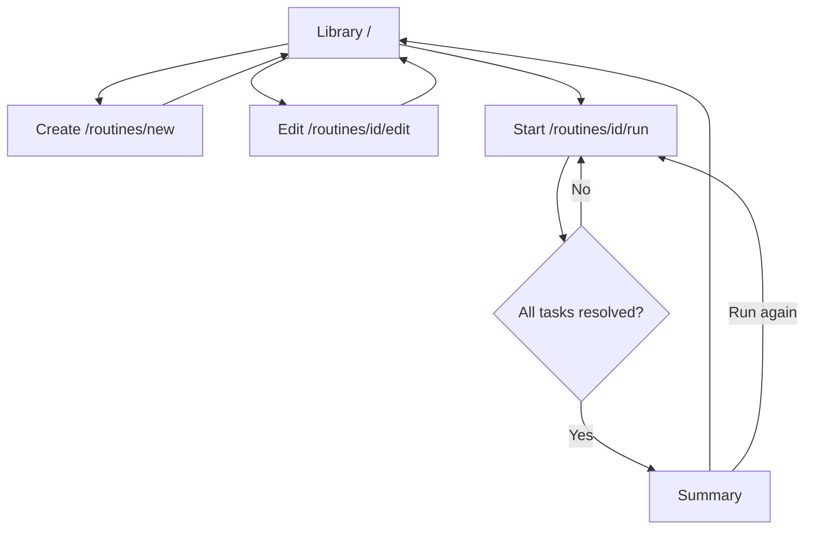
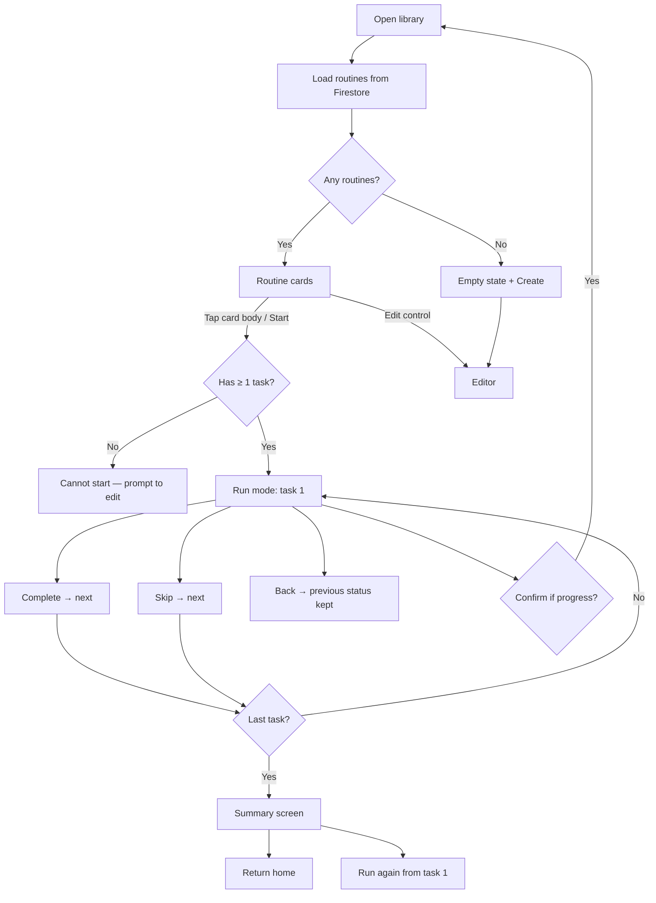
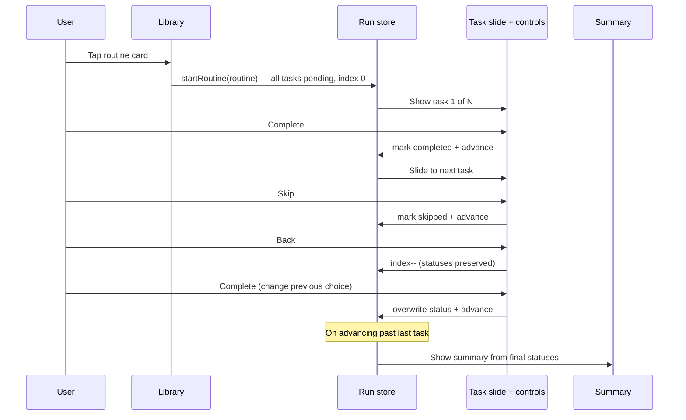
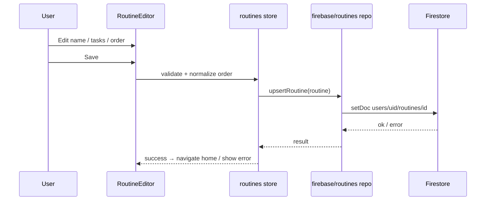

# Routine Manager — Feature Brief

**Feature cycle:** 2026-08-10  
**Repo path:** `pages/Routine/`  
**Expected live URL:** `https://xanderwiles.com/pages/Routine/`  
**Status:** Decisions locked — awaiting implementation approval (see [`01-questions-and-decisions.md`](./01-questions-and-decisions.md) and [`02-technical-plan.md`](./02-technical-plan.md))

---

## Summary

Build a polished, mobile-first **Routine Manager** web app for creating, managing, and running step-by-step routines (morning, gym, leaving-the-house, cleaning, bedtime, etc.).

The product lives as a **new standalone SvelteKit + TypeScript app** under the empty folder `pages/Routine/`, deployed through the existing monorepo pipeline (`build.js` → `deploy_out/` → Vercel). Routine **definitions** persist in **Firebase Firestore** (not Storage). The in-progress run experience is the priority: one task at a time, full-screen, thumb-friendly Complete / Skip / Back / Exit hierarchy.

This cycle is **greenfield**. `pages/Routine/` currently contains no application code — only this feature-plan folder.

---

## User problem being solved

People know what they *should* do in a routine, but executing it on a phone is often friction-heavy:

1. Checklists bury the current step among many items.
2. Notes and to-do apps are not optimised for “do this, then this” one-handed flow.
3. Progress (completed vs skipped) is hard to review after the fact.

Routine Manager solves this by:

- Storing reusable ordered routines in the cloud
- Starting a routine with one tap from a library card
- Presenting **one task at a time** like slides
- Making **Complete** the dominant thumb action
- Ending with a clear summary of what was done vs skipped

---

## Target audience

| Audience | Need |
|----------|------|
| **Primary: you (site owner)** | Personal routines that sync across devices via Firebase |
| **Secondary: visitors** | Anyone with a Google account can use the app; their routines stay private to their account |
| **Future you** | A calm, production-quality app rather than a prototype |

---

## Goals (v1)

1. **Routine library** — large touch cards; start on main tap; edit/delete; create new; empty state
2. **Routine editor** — name, optional description/icon, ordered tasks; add/edit/delete/reorder; save to Firestore
3. **Run mode** — distraction-free slide UX; Complete / Skip / Back / Exit hierarchy; progress indicator
4. **Summary** — completed / skipped counts, percentage, per-task results; Finish + Run Again
5. **Run state machine** — `pending | completed | skipped`; back navigation preserves and allows changing status
6. **Firebase data layer** — isolated config + repository; env vars; no secrets in git
7. **Monorepo integration** — SvelteKit `adapter-static` SPA, `build.js` wire-up, nav + homepage card
8. **Quality bar** — loading/error states, a11y, Vitest for run logic, Playwright (in-memory backend), pass `svelte-check` / lint / TS

---

## Non-goals (v1)

- Native iOS/Android apps
- Shared multi-user collaboration on the same routine
- Timers / alarms / push notifications per task
- Recurring schedules or calendar integration
- AI-generated routines
- Firebase Storage for routine payloads (structured data belongs in Firestore)
- Cloud Functions (client + security rules only, unless a decision forces otherwise)
- Tailwind or heavy UI kits
- Using Firebase Storage as the primary routine database

---

## Product pillars

1. **Run experience first** — one-handed Complete loop must feel effortless
2. **Calm consumer UI** — not an admin dashboard
3. **Touch-first** — large targets, safe areas, no accidental zoom on primary controls
4. **Clean architecture** — components / stores / firebase / types separated
5. **Honest persistence** — definitions in Firestore; run state session-local only

---

## Expected user flows

### High-level product map

### Library → start → run → summary

### Run interaction sequence

### Editor save sequence

---

## Screens (minimum)

| Route (app-relative) | Purpose |
|----------------------|---------|
| `/` | Routine library |
| `/routines/new` | Create routine |
| `/routines/[id]/edit` | Edit routine |
| `/routines/[id]/run` | Run routine (presentation mode) |
| Summary | Client phase inside `/routines/[id]/run` (no separate summary URL) |

Live site base: `/pages/Routine/` (monorepo static inject).

---

## Success criteria (product)

- Starting a routine from a card is immediate and obvious
- Complete is unmistakably the primary control and easy with one thumb
- Back never silently wipes prior Complete/Skip choices
- Empty library and empty-task routines are handled without dead ends
- Saved routines survive refresh / re-open (Firestore)
- App feels like a focused consumer mobile product, not a CRUD admin panel

---

## Related documents

- Decisions / open questions: [`01-questions-and-decisions.md`](./01-questions-and-decisions.md)
- Technical plan: [`02-technical-plan.md`](./02-technical-plan.md)

---

## Codebase context (current state)

| Item | Finding |
|------|---------|
| `pages/Routine/` | Empty except this docs tree |
| Closest SvelteKit templates | `pages/Tax-Helper/`, `pages/Fighter-Jet/` (`adapter-static` → `dist/`) |
| Closest Firebase patterns | `pages/Work-Tracker/`, `pages/To-Do-List/`, `pages/journal/` — **dedicated project per app**, Google auth, `users/{uid}/…` |
| Deploy | Root `build.js` builds selected apps into `deploy_out/pages/<Name>/` |
| Routine in `build.js` / nav / homepage | **Not wired yet** |

---

## Next step

Decisions are locked. Implementation starts only after you approve the summary / technical plan in chat.
