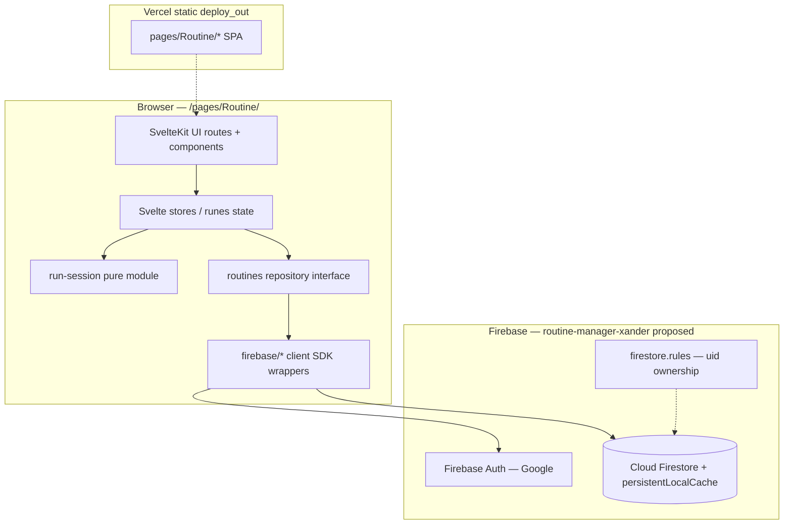
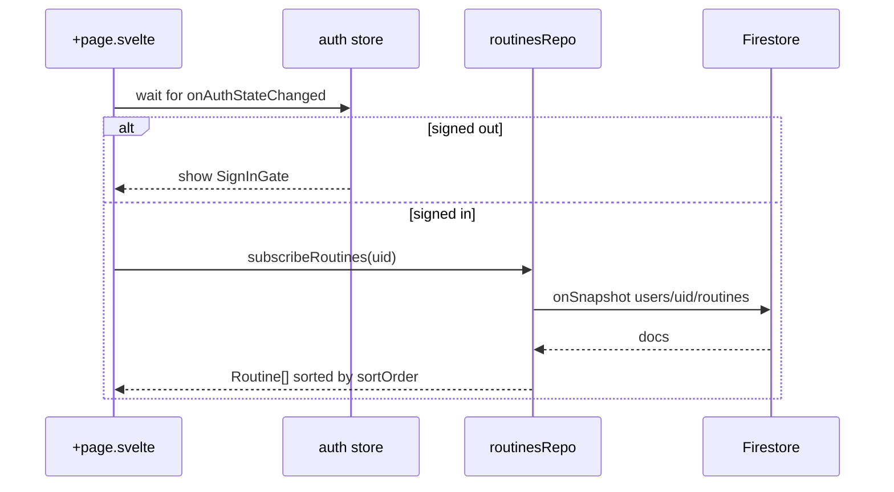
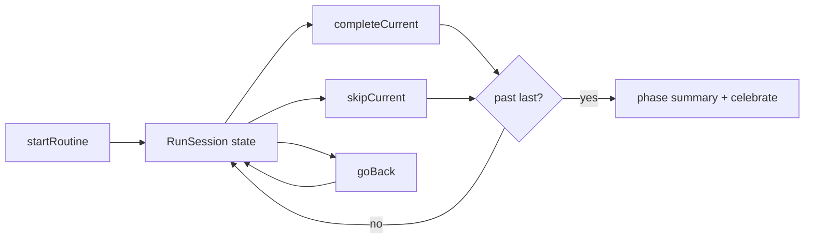

# Routine Manager — Technical Plan

**Feature cycle:** 2026-08-10  
**Status:** **Implemented** — decisions locked; app scaffolded and quality gates green. Firebase project + rules deploy still required for production persistence.  
**Brief:** [`00-brief.md`](./00-brief.md)

---

## Locked decisions (summary)

| ID | Decision | Status |
|----|----------|--------|
| Q1 | **Any Google account**; private data at `users/{uid}/routines` | `Locked` |
| Q2 | **New dedicated Firebase project** (proposed ID: `routine-manager-xander` — confirm) | `Locked` |
| Q3 | Primary test account **`xanderwiles@gmail.com`** (rules by uid, not email allowlist) | `Locked` |
| Q4 | Env prefix **`PUBLIC_ROUTINE_FIREBASE_*`** | `Locked` |
| Q5 | **One Firestore doc per routine** with embedded `tasks[]` | `Locked` |
| Q6 | Run state **session-local** (memory + optional sessionStorage) | `Locked` |
| Q7 | Summary as **client phase** on `/routines/[id]/run` | `Locked` |
| Q8 | **SPA fallback** + Vercel rewrite for `/pages/Routine/` | `Locked` |
| Q9 | **Custom touch drag** + button/keyboard fallback (no DnD library) | `Locked` |
| Q10 | **Nav + homepage card** when shipping | `Locked` |
| Q11 | Firestore **persistent local cache** | `Locked` |
| Q12 | Missing env → setup message; tests → **in-memory repo** | `Locked` |
| Q13 | **Daylight calm / teal accent** visual direction | `Locked` |
| Q14 | **Always celebrate** any finished run (subtle; honor reduced motion) | `Locked` |
| Q15 | **Library reorder** via persisted `sortOrder` | `Locked` |
| Q16 | Playwright against **in-memory/mocked** backend | `Locked` |
| Q17 | **Skip App Check** v1 | `Locked` |
| Q18 | Auth domains: localhost + production (+ preview as needed) | `Locked` |
| D1–D12 | Stack, Firestore (not Storage), UUID ids, edge-case UX, build.js wire-up, Vitest run logic | `Locked` |

---

## Final agreed scope (v1)

### In scope

1. **Greenfield SvelteKit app** at `pages/Routine/` (Svelte 5 runes, TypeScript, standard CSS, npm).
2. **Google Auth** — any signed-in user; each user’s routines private under their uid.
3. **Routine library** — large cards; tap to start; edit/delete; create; empty state; **reorder routines**.
4. **Routine editor** — name, optional description/icon, ordered tasks (add/edit/delete); **touch drag reorder** + a11y fallback; save to Firestore.
5. **Run mode** — full-screen one-task slides; Complete ≫ Skip > Back > Exit; progress text + bar; session-local run state.
6. **Summary phase** (same run route) — counts, %, per-task results; Finish / Run Again; **subtle celebration on every finished run**.
7. **Firestore** persistence for definitions only; persistent client cache; dedicated Firebase project.
8. **Monorepo deploy** — `adapter-static` SPA fallback, `build.js` inject, `vercel.json` rewrite, nav + homepage.
9. **Quality** — loading/error/auth/setup states; a11y; Vitest run logic; Playwright journey with in-memory repo; README.

### Out of scope (v1)

- Native apps, timers/alarms, schedules, AI generation
- Multi-user shared routines / collaboration
- Cross-device resume of in-progress runs
- Dedicated `/summary` URL
- Firebase Storage as routine store; Cloud Functions; App Check
- Tailwind / heavy UI or DnD libraries
- Live-Firebase Playwright in CI

---

## Locked / assumed technical constraints (from monorepo)

1. Apps under `pages/` are standalone; live at `/pages/<Folder>/`.
2. SvelteKit pages use **`@sveltejs/adapter-static`** → `dist/` → `build.js` → `deploy_out/pages/<Name>/`.
3. Relative asset paths (`paths.relative: true`) under `/pages/Routine/`.
4. Firebase is **per-app** with `PUBLIC_<APP>_FIREBASE_*`.
5. `pages/Routine/` is greenfield (docs only today).
6. No SvelteKit app in this repo uses Firebase yet — patterns from Work-Tracker / To-Do-List / Journal.

**Persistence choice:** **Cloud Firestore** for routine definitions (structured documents). Not Storage.

---

## Main technical approach

### System context



### Why this shape

- **UI never imports Firestore APIs directly** — in-memory repo for Playwright; clear setup UI if env missing.
- **Run logic is pure TypeScript** — unit-test complete/skip/back/summary without DOM or Firebase.
- **SPA on static hosting** — dynamic `[id]` routes cannot be prerendered from Firestore IDs.

### Data flow — library load



### Data flow — run session (local)



### Visual design (Q13 locked)

| Token area | Direction |
|------------|-----------|
| Mood | Calm daylight consumer app — not admin, not neon |
| Background | Soft atmospheric wash / subtle gradient (avoid flat #F4F1EA cream cliché) |
| Accent | Teal / soft blue-green (single strong accent) |
| Text | Deep ink; high contrast |
| Shape | Rounded cards; generous spacing |
| Type | Expressive sans for UI; slightly friendlier display for run task titles (no Inter/Roboto/Arial/system-only stack) |
| Motion | Short slide between tasks; Complete press feedback; subtle summary celebration **every finished run** (Q14-B); honor `prefers-reduced-motion` |

Exact hex/font pairings chosen at scaffold time within this direction.

---

## Data model (locked)

### TypeScript

```ts
type TaskStatus = 'pending' | 'completed' | 'skipped';

interface RoutineTask {
  id: string;
  title: string;
  description?: string;
  order: number;
}

interface Routine {
  id: string;
  name: string;
  description?: string;
  icon?: string;
  tasks: RoutineTask[];
  sortOrder: number;
  createdAt: string; // ISO
  updatedAt: string; // ISO
}

interface RunTaskResult {
  taskId: string;
  title: string;
  status: TaskStatus;
}

interface RunSession {
  routineId: string;
  routineName: string;
  tasks: RoutineTask[]; // ordered snapshot at start
  statuses: Record<string, TaskStatus>;
  currentIndex: number;
  phase: 'running' | 'summary';
}

interface RoutineSummaryStats {
  completed: number;
  skipped: number;
  pending: number;
  total: number;
  percentComplete: number;
  results: RunTaskResult[];
}
```

### Firestore paths

```text
users/{uid}/routines/{routineId}
  name, description?, icon?, tasks[], sortOrder, createdAt, updatedAt
```

No `activeRuns` collection in v1 (Q6-A).

### Security rules (intent)

```text
match /users/{userId}/routines/{routineId} {
  allow read, write: if request.auth != null && request.auth.uid == userId;
  // + validate name string, tasks list bounds, sortOrder number, etc.
}
```

No email allowlist (Q1-B).

---

## Routing plan (locked)

| Route | Notes |
|-------|--------|
| `/` | Library (+ reorder) |
| `/routines/new` | Create |
| `/routines/[id]/edit` | Edit |
| `/routines/[id]/run` | Run **and** summary phase |

No `/summary` route (Q7-B).

**Adapter:** `adapter-static` with `fallback: 'index.html'`.  
**Trailing slash:** Prefer `trailingSlash = 'always'` for consistency with Tax-Helper; verify rewrite + refresh during scaffold (safe to adjust if SPA path breaks).

**Vercel rewrite:**

```json
{
  "source": "/pages/Routine/(.*)",
  "destination": "/pages/Routine/index.html"
}
```

---

## Proposed file tree (new)

```text
pages/Routine/
  package.json
  svelte.config.js
  vite.config.ts
  tsconfig.json
  playwright.config.ts
  vitest.config.ts
  eslint.config.js
  .env.example
  README.md
  firestore.rules
  firebase.json
  static/
  src/
    app.html
    app.css
    app.d.ts
    lib/
      types/routine.ts
      types/run.ts
      firebase/app.ts
      firebase/auth.ts
      firebase/firestore.ts
      data/routines-repo.ts
      data/firestore-routines-repo.ts
      data/memory-routines-repo.ts
      run/run-session.ts
      run/summary.ts
      stores/auth.ts
      stores/routines.ts
      stores/run.ts
      components/
        RoutineCard.svelte
        RoutineEditor.svelte
        TaskEditorRow.svelte
        ProgressBar.svelte
        RoutineTaskSlide.svelte
        RoutineControls.svelte
        RoutineSummary.svelte
        ConfirmDialog.svelte
        SignInGate.svelte
        EmptyState.svelte
        SetupRequired.svelte
      utils/id.ts
      utils/order.ts
    routes/
      +layout.svelte
      +layout.ts
      +page.svelte
      routines/new/+page.svelte
      routines/[id]/edit/+page.svelte
      routines/[id]/run/+page.svelte
  tests/unit/run-session.test.ts
  tests/unit/summary.test.ts
  tests/e2e/routine-journey.spec.ts
  docs/2026/08-10/feature-plan/
```

---

## Existing files likely to change

| File | Change |
|------|--------|
| `build.js` | Exclude/build/inject `pages/Routine` |
| `.env.example` | `PUBLIC_ROUTINE_FIREBASE_*` block |
| `.env.local` | You add real values (not committed) |
| `vercel.json` | SPA rewrite for Routine |
| `nav.html` | Routine link + icon |
| `index.html` | Homepage card |
| Possibly `serve.json` | SPA fallback parity for local preview |

---

## Relevant existing references

| Path | Relevance |
|------|-----------|
| `pages/Tax-Helper/` | Svelte 5 + adapter-static + relative paths |
| `pages/Fighter-Jet/` | Vitest + Playwright + eslint/prettier |
| `pages/Work-Tracker/` | Google auth + `users/{uid}` + rules |
| `pages/To-Do-List/` | Offline persistence ideas |
| `pages/journal/src/firebase.js` | npm `firebase` + bundler env |
| Root `build.js`, `vercel.json` | Deploy contract |

---

## API changes

No HTTP API. Client ↔ Firestore via repository:

```ts
interface RoutinesRepository {
  subscribeAll(uid: string, cb: (routines: Routine[]) => void): () => void;
  get(uid: string, id: string): Promise<Routine | null>;
  upsert(uid: string, routine: Routine): Promise<void>;
  remove(uid: string, id: string): Promise<void>;
  reorder(uid: string, orderedIds: string[]): Promise<void>;
}
```

---

## Authentication and authorization

| Concern | Locked plan |
|---------|-------------|
| Provider | Google (popup; redirect fallback if needed on mobile) |
| Who | Any Google account; private per uid |
| Gate | Sign-in required for library/editor/run |
| Rules | `request.auth.uid == userId` + payload validation |
| Domains | localhost, xanderwiles.com, www.xanderwiles.com (+ previews as needed) |
| App Check | Skipped v1 |

---

## Security and privacy risks

| Risk | Mitigation |
|------|------------|
| Open rules | Production-mode uid rules from day one |
| XSS | Svelte escaping; no `{@html}` for user text |
| Auth popup blocked | Detect + redirect sign-in |
| Env leakage | `.env.local` gitignored; only `PUBLIC_*` in client |
| Abuse of public API key | Acceptable v1 without App Check; rules still block cross-user data |

---

## Performance risks

| Risk | Mitigation |
|------|------------|
| Slow transitions | ≤ ~200ms CSS; no await on Complete/Skip |
| Re-render cost | Snapshot routine into run session at start |
| Cold load | Skeletons; persistent cache (Q11) |
| Drag jank | `touch-action`; transform while dragging; commit on drop |

---

## Edge cases

- Empty library; empty-task routine cannot start  
- One-task routine → summary after first Complete/Skip  
- Delete last task; edit control must not start run  
- Back on first task disabled; Exit confirms if any non-pending  
- Run Again resets to task 1 all pending  
- Missing id → not-found; double-tap lock on Complete/Skip  
- Landscape + safe areas; last-write-wins across tabs  

---

## Accessibility

- Focus rings; keyboard operable run controls  
- Labels on icon-only controls; dialog focus trap  
- Always show `Task X of Y` (not bar-only)  
- ≥44px targets; `touch-action: manipulation` on primaries  
- `prefers-reduced-motion` disables slides/celebration  

---

## UI / component responsibilities

| Component | Responsibility |
|-----------|----------------|
| `RoutineCard` | Name, count, icon, Start, Edit; main press → start |
| `RoutineEditor` | Metadata + task list + save |
| `TaskEditorRow` | Fields + drag handle + delete + move fallback |
| `ProgressBar` | Run progress visual |
| `RoutineTaskSlide` | Dominant task + transition |
| `RoutineControls` | Complete ≫ Skip > Back > Exit |
| `RoutineSummary` | Stats, results, Finish / Run Again, celebration |
| `ConfirmDialog` | Exit / delete |
| `SignInGate` / `SetupRequired` | Auth and missing-config states |

Run layout:

```text
┌─────────────────────────┐
│ Exit          Routine   │
│████████░░░░  3 of 8     │
│                         │
│      Task title         │
│   short description     │
│                         │
│  [ ✓ Complete & Next ]  │
│  [ Skip → ]             │
│  [ Back ]               │
└─────────────────────────┘
```

---

## Manual tests

1. Create routine with 3+ tasks; save  
2. Reorder tasks and library cards; persist after refresh  
3. Tap card → task 1  
4. Complete / Skip / Back / change prior status  
5. Finish → summary + celebration  
6. Run Again; Exit with confirm when progress  
7. Empty routine cannot start; delete routine  
8. Sign in/out with Google; data scoped to uid  
9. Mobile portrait/landscape safe areas  
10. Refresh deep link `/routines/{id}/run` does not 404  
11. Nav + homepage open the app  
12. Missing Firebase env shows setup message  

---

## Automated tests

**Vitest:** complete, skip, back, status overwrite, final → summary, summary math.  
**Playwright:** 11-step journey via in-memory repo (no Google OAuth in CI).

```bash
cd pages/Routine
npm run check && npm run lint && npm run test:unit && npm run test:e2e
```

Plus root `node build.js` inject verification once wired.

---

## Rollback plan

1. Revert Routine commits / remove from `build.js` inject list.  
2. Remove nav/homepage links and Vercel rewrite.  
3. Leave Firebase project/data; optionally deny-all rules if needed.  
4. No destructive data migration in v1.

---

## Implementation phases (after approval)

1. Scaffold SvelteKit + tokens + lint/test tooling  
2. Domain core (`run-session`, summary) + Vitest  
3. Firebase layer + rules + env examples  
4. Library + editor (incl. reorder)  
5. Run + summary UI (priority polish + celebration)  
6. Monorepo wire-up (`build.js`, `vercel.json`, nav, index)  
7. Playwright + README  
8. Quality gates  

---

## Definition of done

- [ ] Decisions locked and implementation approved  
- [ ] Create / Edit / Run / Summary flows working  
- [ ] Firestore + uid rules; persistent cache  
- [ ] Run UX hierarchy + edge cases from brief  
- [ ] Auth, loading, empty, setup, error states  
- [ ] Vitest + Playwright green  
- [ ] `svelte-check`, TS, lint clean  
- [ ] README (setup, Firebase, env, dev, test, Vercel, Firestore rationale)  
- [ ] `build.js` + SPA rewrite verified; nav + homepage live  
- [ ] No secrets committed  

---

## Remaining assumptions (non-blocking for code start if you accept)

| # | Assumption | Confirm? |
|---|------------|----------|
| A1 | Firebase project ID = **`routine-manager-xander`** | Please confirm or supply another ID |
| A2 | Exact teal hex + font pairing chosen within Q13 daylight direction at scaffold | OK unless you have preferred fonts/colours |
| A3 | Run session uses **memory + sessionStorage** so refresh mid-run can resume same tab | OK unless you want memory-only |
| A4 | `trailingSlash: 'always'` unless SPA rewrite testing forces otherwise | OK |
| A5 | You will create the Firebase project / enable Google Auth / paste web config into `.env.local` (and Vercel) when ready — coding can scaffold against env placeholders first | OK |

---

## First files expected to edit (after approval)

**Create (scaffold + core):**

1. `pages/Routine/package.json`  
2. `pages/Routine/svelte.config.js`  
3. `pages/Routine/vite.config.ts`  
4. `pages/Routine/tsconfig.json`  
5. `pages/Routine/src/app.html`, `src/app.css`, `src/app.d.ts`  
6. `pages/Routine/src/routes/+layout.ts`, `+layout.svelte`, `+page.svelte`  
7. `pages/Routine/src/lib/types/routine.ts`, `run.ts`  
8. `pages/Routine/src/lib/run/run-session.ts`, `summary.ts`  
9. `pages/Routine/tests/unit/run-session.test.ts`  

**Monorepo (early or mid cycle):**

10. `build.js`  
11. `.env.example`  
12. `vercel.json`  

**Later (not first):** `nav.html`, `index.html`, Firebase rules, full component set, Playwright, README.

---

## Next step

Approve this locked plan (and confirm **A1** project ID if possible). **No application code until you say to proceed.**
