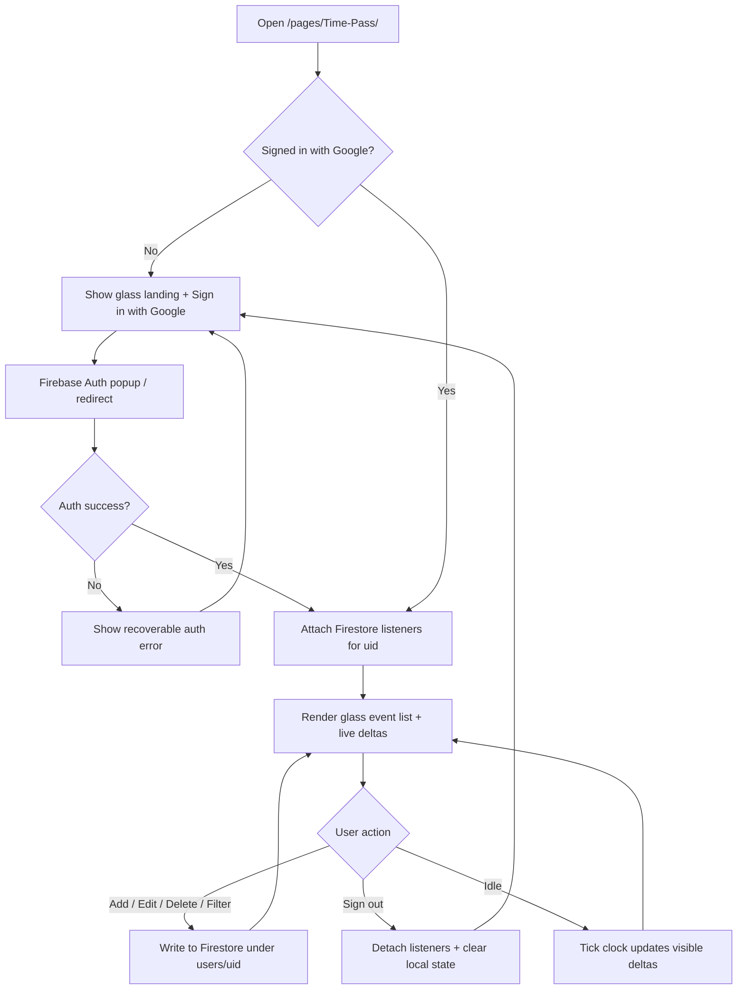
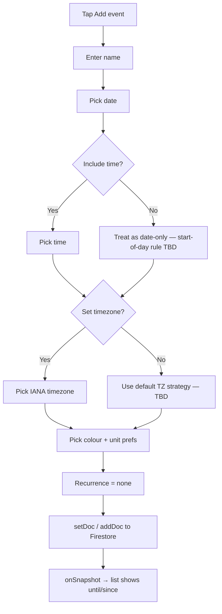
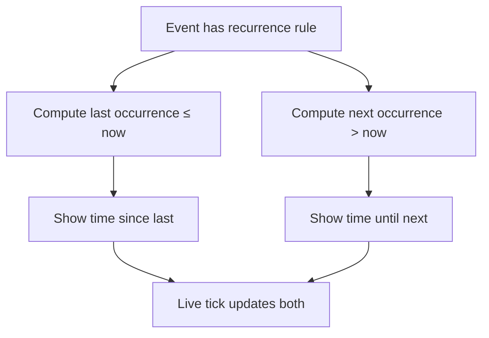
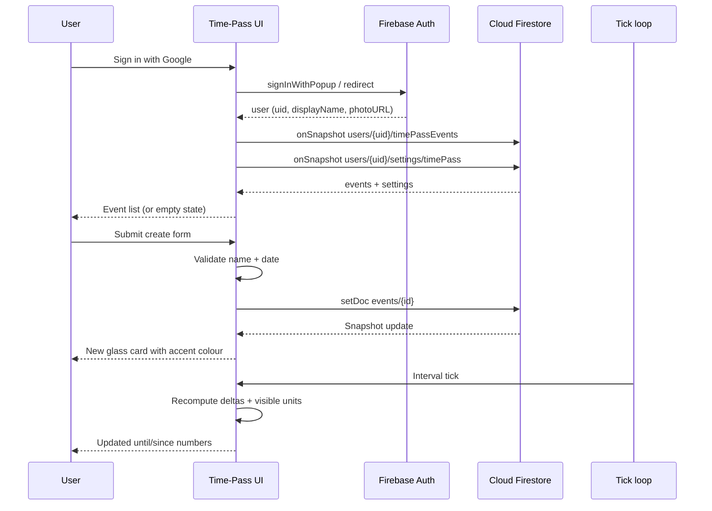

# Time-Pass — Feature Brief

**Feature cycle:** 2026-07-30  
**Repo path:** `pages/Time-Pass/`  
**Expected live URL:** `https://xanderwiles.com/pages/Time-Pass/`  
**Status:** Decisions locked — awaiting Phase 1 approval in [`02-technical-plan.md`](./02-technical-plan.md). **No implementation yet.**

---

## Summary

Build **Time-Pass**: a personal countdown / count-up app where the user tracks named life moments — birthdays, anniversaries, deadlines, “days since X” — with optional time-of-day, optional timezone, custom colours, unit preferences, filters, edit/rename, and recurring schedules (daily / weekly / monthly / yearly).

The product is a **list of events**, each showing **time until** (future) or **time since** (past). Recurring events show **time to the next occurrence** and **time since the last occurrence**.

**Auth & sync (locked for this cycle):** Users **sign in with Google** via **Firebase Authentication**. Events and settings persist in **Cloud Firestore**, scoped to the signed-in user (`uid`), so data follows them across devices — matching the pattern used by To-Do List, Work Tracker, and Journal on this site.

Visual direction: **Futuristic Antigravity Glassmorphism** — deep space / midnight atmosphere, translucent glass panels, soft glowing orbs, neon-bordered controls. **No translateY lift on hover** (glow/brightness only).

`pages/Time-Pass/` is currently an **empty directory**. This is a **greenfield** app. The existing mystery page at `pages/Countdown/` stays a **separate** product (Q1 locked). Auth uses a **new dedicated Firebase project** (Q5a). Guests get a **read-only demo preview** (Q5b); signed-in users sync via Firestore.

---

## User problem being solved

| Pain today | Impact |
|------------|--------|
| No personal multi-event timer on this site | Birthdays, deadlines, and “how long since…” live in notes or other apps |
| Single-event tools (including `pages/Countdown/`) are fixed / mystery / non-editable | Cannot manage a personal catalogue of dates |
| Phone calendar shows dates but not rich “years + months + days left” breakdowns with unit control | Hard to feel the scale of long spans |
| Recurring moments (every year, every Monday) need both “next” and “last” | Most countdown widgets only show the next one |
| Browser-only storage loses data across devices / clears | Personal dates need a signed-in cloud home |

Users need one place to **sign in, add, colour, filter, and live-update** a set of meaningful timestamps — past and future — with readable unit breakdowns that sync with their Google account.

---

## Target audience

| Audience | Need |
|----------|------|
| **Primary (you)** | Personal event catalogue; Google sign-in; sync across phone and desktop |
| **Other Google users** (if public) | Same app; their own uid-scoped data only |
| **Signed-out visitors** | Glass landing + **read-only sample events**; Sign in with Google to save |
| **Not in scope (v1 unless decided)** | Multi-user collaboration, public shared event boards |

---

## Goals (v1 product intent)

1. **Google sign-in** via Firebase Auth (popup with redirect fallback, matching To-Do List patterns).
2. **Firestore persistence** of events + settings under the signed-in `uid`, with live listeners (`onSnapshot`).
3. **Create events** with a required name + date; **optional** time; **optional** timezone.
4. Support **past and future** anchors; UI clearly distinguishes *until* vs *since*.
5. **Unit control** — decades, years, months, weeks, days, hours, minutes, seconds (exact set TBD); default = show **relevant** units only (hide units larger than the remaining span).
6. **Event list** that live-updates (at least once per second when seconds are visible).
7. **Filters** (exact filter dimensions TBD — see questions).
8. **Edit / rename** existing events (and change date/time/colour/units/recurrence).
9. **Custom colour** per event (drives glass accent / glow).
10. **Recurring events** — every day / week / month / year; show **next** and **last** occurrence deltas.
11. **Visual redesign aesthetic** applied from day one (glassmorphism + drifting orbs + neon buttons; **no hover lift**).
12. Ship under `pages/Time-Pass/` using this repo’s deployment patterns once stack is chosen.
13. **Sign out** and clear in-memory event state; no cross-user leakage.

---

## Non-goals (v1 unless decided otherwise)

- Replacing or merging `pages/Countdown/` (mystery hard-coded countdown) — **open; see Q1**
- Real calendar sync (Google Calendar / iCal import) — unless you insist in Q&A
- Push notifications / alarms when an event hits zero
- Multi-user sharing / collaborative boards / public event URLs
- Server-side scheduling or Cloud Functions (client + Firestore rules only)
- Exact astronomical calendars, leap-second precision, or historical timezone database UI beyond IANA labels
- Complex RRULE (nth weekday, “every 2 weeks”, exclusion dates) beyond simple daily/weekly/monthly/yearly — unless expanded in Q&A
- Anonymous / guest full CRUD without Google (see Q5b — optional preview only)

---

## Design direction (locked from this brief)

| Rule | Detail |
|------|--------|
| Atmosphere | Deep dark multi-layer background (deep space / midnight blue / rich purple gradients) |
| Orbs | 2–3 large blurry glowing orbs that slowly drift behind content |
| Glass | Containers: `rgba(255,255,255,0.05–0.1)`, `backdrop-filter: blur(16px+)`, 1px subtle white gradient border, soft layering shadows |
| Hover | **Glow brighter only** — **do not** apply `translateY` lift |
| Type | Modern wide sans (candidate fonts: Outfit / Montserrat / Inter via Google Fonts — **final choice open in Q&A**) |
| Text | White / off-white on dark glass |
| Buttons | “Condensed light” — neon gradients or bright borders; glow on hover |
| Auth CTA | Glass-styled **Sign in with Google** button (same visual language as other chrome) |
| Upload controls | If any file import exists, style as glass (not native ugly file chrome) |
| Sliders | Track thicker than thumb; padding at track ends so thumb never kisses the edge |

---

## Current state (codebase snapshot)

| Area | Today |
|------|--------|
| **`pages/Time-Pass/`** | Empty folder only — no `index.html`, CSS, JS, or docs until this plan |
| **Related app** | `pages/Countdown/` — single hard-coded target; no auth; no user events |
| **Site hosting** | Static multi-tool monorepo; Vercel via root `build.js` copy of `pages/*` |
| **Auth patterns elsewhere** | Firebase Google auth + Firestore on To-Do List (`taskmaster-cloud-xander`), Work Tracker, Journal, Home-Design — **reusable pattern for Time-Pass** |
| **Reference config** | e.g. `pages/To-Do-List/firebase-config.js` — Auth + Firestore CDN modules, Google provider, multi-tab persistence |
| **Homepage** | No Time-Pass card yet (`index.html` has Countdown card) |
| **Dev** | Static page path: root `npm run dev` → `/pages/Time-Pass/` once files exist |

**Reusable reference (patterns only — whether to share one Firebase project is Q5a):**

- Unit visibility logic in `pages/Countdown/countdown.js`
- Google sign-in + `onAuthStateChanged` + Firestore listeners in `pages/To-Do-List/main.js`
- Glass / dark aesthetic cues on homepage `glass-card` and Countdown CSS
- Favicon / `site.webmanifest` packs used across sibling static pages

---

## Expected user flow

### High-level journey (auth-gated)

### Create a one-shot event (signed in)

### Recurring event — next and last

### Sequence — Google sign-in then add event

---

## Product surfaces (proposed)

| Surface | Behavior |
|---------|----------|
| **Atmosphere shell** | Full-page dark gradient + drifting orbs behind all content |
| **Signed-out landing** | Brand + short pitch + glass **Sign in with Google** |
| **Header / toolbar** | App title, user avatar/name, Sign out, Add, filters, settings |
| **Event list** | Glass cards; accent colour; live unit breakdown; until/since labels |
| **Create / edit modal or panel** | Name, date, time toggle, timezone, colour, units, recurrence |
| **Empty state** | Friendly prompt to add first event (optional sample — TBD) |
| **Filters** | Past / future / recurring / colour / search — exact set TBD |
| **Homepage card** | Optional discoverability on `index.html` — TBD |

---

## Success criteria

- User can **sign in with Google** and **sign out** cleanly.
- Only the signed-in user’s events are readable/writable (Firestore rules enforce `request.auth.uid`).
- User can create, edit, rename, recolour, and delete events; changes sync across devices signed into the same Google account.
- Past events count **up**; future events count **down**; labels make direction obvious.
- Units larger than the span are hidden by default; user can override per event (or globally — TBD).
- Recurring events show **both** next and last when both exist.
- Aesthetic matches the glassmorphism brief; hover does **not** lift.
- Usable on phone and desktop; `prefers-reduced-motion` respected for orb drift / non-essential motion.
- Deploys through existing site pipeline once files exist under `pages/Time-Pass/`.

---

## Definition of done (high level)

- [ ] Decisions locked in `01-questions-and-decisions.md`
- [ ] Technical plan approved in `02-technical-plan.md`
- [ ] Firebase project + Auth Google provider + Firestore rules decided and documented
- [ ] App scaffold + glass aesthetic shell + sign-in landing
- [ ] Google Auth (sign-in / sign-out / session restore)
- [ ] CRUD for events (create, read, update, delete, rename) against Firestore
- [ ] Live until/since rendering with unit rules
- [ ] Filters
- [ ] Custom colour per event
- [ ] Recurrence (daily / weekly / monthly / yearly) with next + last
- [ ] Optional JSON export/import if chosen (still useful as backup)
- [ ] Accessibility pass (keyboard, contrast, reduced motion, live regions)
- [ ] Manual test checklist executed (incl. auth + rules)
- [ ] Rollback path documented
- [ ] Homepage / favicons / cache bump handled per decisions

Full engineering checklist: [`02-technical-plan.md`](./02-technical-plan.md).

---

## Next step

Approve **Phase 1** in [`02-technical-plan.md`](./02-technical-plan.md). Do not start coding until that approval.
