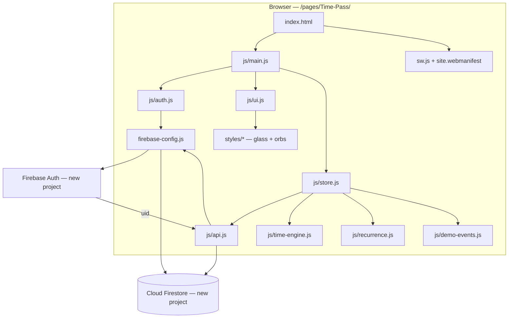
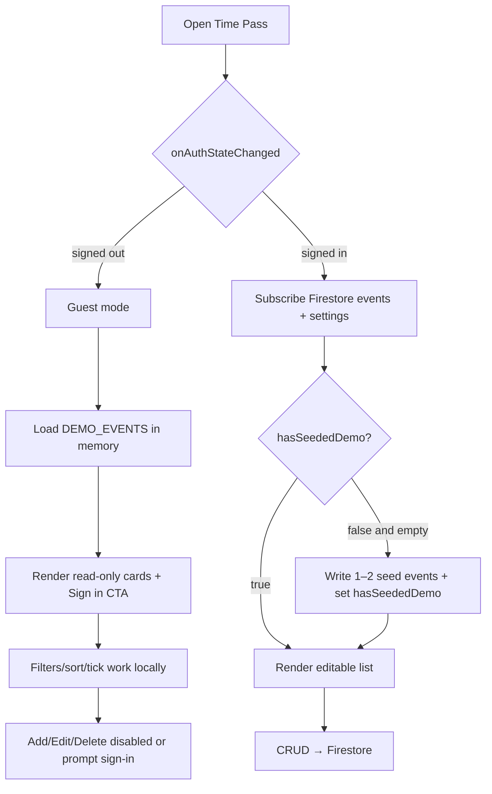
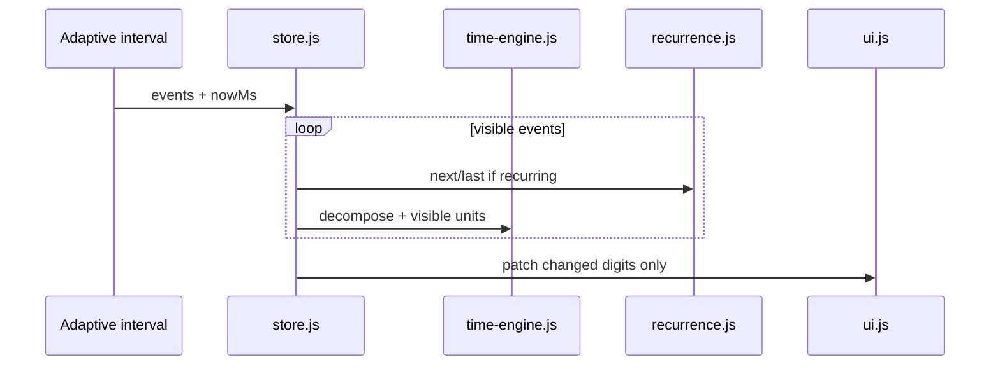
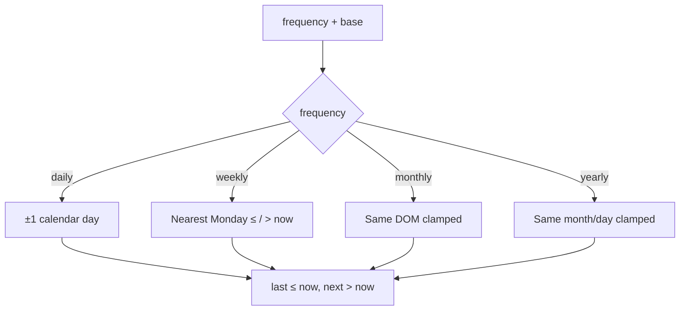
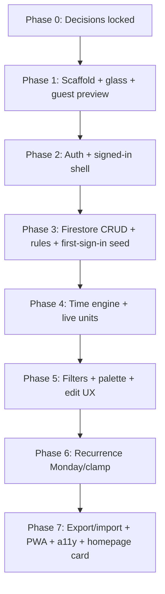

# Time-Pass — Technical Plan

**Feature cycle:** 2026-07-30  
**Status:** **Implemented (v1)** — configure Firebase project per `README.md`, deploy `firestore.rules`, then verify Auth.  
**Owner model:** Signed-in Google user (uid-scoped); guests see read-only demo preview  
**Display name:** Time Pass  
**Stack:** Vanilla static HTML/CSS/JS (ES modules) + Firebase CDN  
**Related:** [`00-brief.md`](./00-brief.md)

---

## Locked decisions (summary)

| ID | Decision | Status |
|----|----------|--------|
| Q1 | Countdown stays **separate** | `Locked` |
| Q2 | **Homepage card** in this cycle | `Locked` |
| Q3 | Name: **Time Pass** | `Locked` |
| Q4 | **Vanilla** + Firebase CDN | `Locked` |
| Q5 | Firebase Auth (Google) + Firestore | `Locked` |
| Q5a | **New dedicated** Firebase project | `Locked` |
| Q5b | Guest **read-only** sample preview | `Locked` |
| Q5c | Firestore **offline persistence** on | `Locked` |
| Q5d | **Any** Google account | `Locked` |
| Q6 | Full **PWA** (manifest + SW) | `Locked` |
| Q7 | Date-only → `00:00:00` effective TZ | `Locked` |
| Q8 | Blank TZ → browser local | `Locked` |
| Q9 | Per-event optional TZ | `Locked` |
| Q10 | Units: decades → seconds | `Locked` |
| Q11 | Calendar-aware math | `Locked` |
| Q12 | Units **per event only** | `Locked` |
| Q13 | Hide leading zero large units | `Locked` |
| Q14 | Weekly = **Monday**; weeks start Monday | `Locked` |
| Q15 | Clamp invalid month days | `Locked` |
| Q16 | Infinite recurrence | `Locked` |
| Q17 | Past one-shots count up forever | `Locked` |
| Q18 | Filters: direction + recurring + search | `Locked` |
| Q19 | Sort: upcoming soonest, then past newest | `Locked` |
| Q20 | Curated palette **only** | `Locked` |
| Q21 | Seed 1–2 demos on **first sign-in** | `Locked` |
| Q22 | Font **Outfit** | `Locked` |
| Q23 | Midnight blue + cyan | `Locked` |
| Q24 | Adaptive tick | `Locked` |
| Q25 | JSON export/import | `Locked` |
| Q26 | Confirm delete | `Locked` |
| Q27 | Soft 100 / hard 250 | `Locked` |
| D1–D20 | Ids, schema, a11y, auth UX, paths, SW bump — see questions doc | `Locked` |

---

## Final agreed scope (v1)

### In scope

1. **Time Pass** app at `/pages/Time-Pass/` — glassmorphism UI (orbs, glass cards, neon buttons, **no hover lift**).
2. **Guest preview** — read-only in-memory sample events + Sign in with Google CTA (no Firestore writes while signed out).
3. **Google sign-in / sign-out** via Firebase Auth on a **new dedicated** Firebase project.
4. **Firestore CRUD** for events under `users/{uid}/events/{eventId}`; settings at `users/{uid}/settings/app`.
5. Event fields: name, date, optional time, optional TZ, curated colour, per-event units, recurrence.
6. Live **until / since** with calendar-aware unit breakdown; hide leading zero large units.
7. **Recurrence** daily / weekly (Mondays) / monthly / yearly — show next + last; infinite; clamp short months.
8. **Filters**: upcoming / past / all + recurring / one-shot + name search.
9. **Sort**: upcoming soonest first, then past most recent.
10. First sign-in seed of 1–2 demo events (once per uid via `hasSeededDemo`).
11. JSON **export/import**, delete confirm, event caps (warn 100 / stop 250).
12. **PWA**: `site.webmanifest` + `sw.js` offline shell (bump cache on release).
13. **Homepage card** on site root `index.html`.
14. Favicons + home escape link.

### Out of scope (v1)

- Replacing or merging `pages/Countdown/`
- Custom hex colours outside curated palette
- Global user unit defaults (units are per-event only)
- Recurrence end dates / counts; non-Monday weekly anchors; complex RRULE
- Guest→account merge of local edits
- Cloud Functions, App Check, allowlists
- Google Calendar / iCal sync, push notifications
- Automated E2E suite (manual tests + optional pure-function unit tests)

---

## Problem statement (technical)

`pages/Time-Pass/` is empty. Build a greenfield vanilla app with Firebase Auth + Firestore on a **new** project, a client time engine (calendar math, Monday weeks, recurrence), and glassmorphism list UX — without touching Countdown.

---

## Architecture



### Auth + guest vs signed-in



### Live tick (never writes Firestore)



---

## Data model (locked)

### Paths (dedicated project — D19)

```
users/{uid}/events/{eventId}
users/{uid}/settings/app
```

### Event document

```typescript
type RecurrenceFrequency = 'none' | 'daily' | 'weekly' | 'monthly' | 'yearly';

type TimeUnit =
  | 'decades' | 'years' | 'months' | 'weeks'
  | 'days' | 'hours' | 'minutes' | 'seconds';

interface EventDocument {
  id: string;
  name: string;                 // max 80
  date: string;                 // YYYY-MM-DD
  time: string | null;          // HH:mm[:ss] or null → 00:00:00
  timeZone: string | null;      // IANA or null → browser local
  color: string;                // must be in COLOR_PALETTE
  units: TimeUnit[];            // required; per-event only (Q12)
  recurrence: { frequency: RecurrenceFrequency };
  createdAt: Timestamp | string;
  updatedAt: Timestamp | string;
}
```

### Settings document

```typescript
interface AppSettings {
  schemaVersion: 1;
  hasSeededDemo: boolean;
  filters: {
    direction: 'all' | 'upcoming' | 'past';
    recurring: 'all' | 'recurring' | 'one-shot';
    query: string;
  };
  // sort is fixed by Q19 — optional to persist later; default upcoming-then-past
  updatedAt: Timestamp | string;
}
```

**Note:** No `defaultUnits` field — units live only on events (Q12). New events get `DEFAULT_UNITS` = full set from app constant (D16).

### Data / API changes

| System | Change |
|--------|--------|
| New Firebase project | Create; enable Google Auth; authorized domains; Firestore |
| Firestore | New `users/{uid}/events`, `users/{uid}/settings/app` |
| Rules | Dedicated `firestore.rules` for this project only |
| Site `index.html` | Add Time Pass homepage card |
| REST / SQL | None |

---

## Security rules (dedicated project)

```
rules_version = '2';
service cloud.firestore {
  match /databases/{database}/documents {
    match /users/{userId}/events/{eventId} {
      allow read, write: if request.auth != null
        && request.auth.uid == userId
        && isValidEvent(request.resource.data);
    }
    match /users/{userId}/settings/app {
      allow read, write: if request.auth != null
        && request.auth.uid == userId;
    }
  }
}
```

`isValidEvent`: name/date types + lengths; `color in COLOR_PALETTE`; `recurrence.frequency` enum; `units` non-empty subset of allowed units. Any Google uid may create their own tree (Q5d).

---

## Time engine (locked rules)

| Rule | Behavior |
|------|----------|
| Date-only | `00:00:00` in effective TZ (Q7) |
| Blank TZ | `Intl…timeZone` browser local (Q8) |
| Math | Calendar-aware years/months; decade = floor(years/10) (Q11) |
| Weeks | Monday-start boundaries (Q14) |
| Visibility | Hide leading zero **large** units among enabled set (Q13) |
| Weekly recurrence | Occurrences on **Mondays** at event time / date-only midnight (Q14) |
| Monthly/yearly invalid days | Clamp (Q15) |
| Tick | Adaptive: 1s if seconds visible, else coarser (Q24) |



**TZ conversion approach (safe to decide in Phase 4):** prefer a small dependency-free helper using `Intl` / iterative offset resolution; add Temporal polyfill only if needed for correctness.

---

## UI / CSS (locked)

| Token | Value |
|-------|--------|
| Font | Outfit (Google Fonts) |
| Atmosphere | Midnight blue / indigo + cyan accents; secondary soft orb may be cool violet |
| Glass | `rgba(255,255,255,0.05–0.1)`, blur ≥16px, gradient border, soft shadow |
| Hover | Brighten glow only — **no** `translateY` |
| Colours | Curated palette constant (8–12); palette picker UI only |
| Guest | Same card chrome; badge “Preview”; mutations → sign-in prompt |
| PWA | Installable; SW caches shell + static assets; network for Firebase |

---

## Auth, security, performance (condensed)

| Area | Plan |
|------|------|
| AuthN | Google only; popup → redirect fallback; `browserLocalPersistence` |
| AuthZ | Rules `uid == userId` only |
| Guest | In-memory demos; never `setDoc` while signed out |
| First seed | If signed in, `!hasSeededDemo`, and events empty → write demos + flag |
| Privacy | No analytics; personal dates in Firestore |
| Cost | Event hard stop 250; open Google sign-in — monitor usage |
| XSS | `textContent` for names; validate import |
| Perf | Diff digit updates; tick ≠ Firestore; chunk import batches |
| SW | Do not cache Auth/Firestore API responses aggressively; bump `CACHE_NAME` (D20) |

---

## Files

### New files (create first)

```
pages/Time-Pass/
  index.html
  firebase-config.js          # placeholders until project exists
  firestore.rules
  firebase.json               # optional local rules deploy helper
  site.webmanifest
  sw.js
  README.md                   # Firebase project setup checklist
  styles/
    tokens.css
    base.css
    atmosphere.css
    components.css
    auth.css
  js/
    main.js
    auth.js
    api.js
    store.js
    time-engine.js
    recurrence.js
    filters.js
    demo-events.js
    ui.js
    format.js
  favicon.ico / favicon-*.svg / png icons (cloned from Countdown pattern)
```

### Existing files to change

| File | Change |
|------|--------|
| `index.html` (site root) | Add **Time Pass** `page-card` (Q2) |
| `docs/local-development.md` | Optional one-liner for Time-Pass |

**Do not change:** `pages/Countdown/*`, To-Do List / Work Tracker Firebase projects or rules.

### Phase 1 — exact first edits (on approval)

1. **Create** `pages/Time-Pass/index.html` — shell, Outfit font link, CSS/JS entrypoints, guest + signed-in regions.
2. **Create** `pages/Time-Pass/styles/tokens.css` + `atmosphere.css` + `base.css` — glass tokens, orbs, midnight/cyan.
3. **Create** `pages/Time-Pass/js/demo-events.js` + minimal `main.js` / `ui.js` — render guest read-only preview.
4. **Create** `pages/Time-Pass/firebase-config.js` — placeholder config + comments pointing at README.
5. **Create** `pages/Time-Pass/README.md` — new Firebase project setup steps.
6. Later in Phase 1 polish: favicons, `site.webmanifest`, stub `sw.js`.
7. Homepage card on root `index.html` can land in Phase 1 end or Phase 8 — **prefer late Phase 1** once favicon exists so the card isn’t broken.

---

## Phased delivery



| Phase | Deliverable | Depends on Firebase project? |
|-------|-------------|------------------------------|
| 1 | Glass shell, guest read-only demos, placeholders | No |
| 2 | Google sign-in / out UI wired | **Yes** (config) |
| 3 | CRUD + rules + seed | **Yes** |
| 4–6 | Engine, filters, recurrence | No (can unit-test offline) |
| 7 | Export, SW, homepage card, polish | Partial |

---

## Manual tests (high level)

1. Guest: demos visible, read-only, Sign in CTA.
2. Auth: popup/redirect, persistence, sign-out clears user data from DOM.
3. First sign-in: 1–2 seeds once only (`hasSeededDemo`).
4. CRUD sync across tabs; delete confirm; caps at 100/250.
5. Date-only midnight; blank TZ = local; calendar units; Monday weekly; clamp Feb/31.
6. Filters + sort; palette only; export/import round-trip.
7. PWA install / offline shell; reduced motion; no hover lift.
8. Homepage card links to `/pages/Time-Pass/`.
9. Rules: other uid denied; signed-out writes denied.

---

## Rollback

| Scenario | Action |
|----------|--------|
| Bad app deploy | Revert `pages/Time-Pass/` + homepage card; redeploy |
| Bad rules on **new** project | Restore rules in that project only — siblings unaffected |
| Auth misconfig | Fix domains/config; data retained |
| Kill feature | Unpublish page; leave Firestore data |

---

## Definition of done

- [x] Decisions locked in `01-questions-and-decisions.md`
- [x] Technical plan updated to match answers
- [ ] You approve Phase 1
- [ ] Dedicated Firebase project created + Google Auth + domains + rules
- [ ] App at `/pages/Time-Pass/` with glass aesthetic (no hover lift)
- [ ] Guest read-only preview + Google sign-in/out
- [ ] Firestore CRUD, seed once, filters, sort, palette, per-event units
- [ ] Calendar engine + Monday weekly recurrence + next/last
- [ ] Export/import, PWA, homepage card
- [ ] Manual tests + a11y/reduced-motion pass

---

## Remaining assumptions

1. **Firebase web config** for the new project is not in-repo yet — Phase 1 can proceed with placeholders; Phases 2–3 need real `apiKey` / `projectId` / etc. from you.
2. **Demo copy** (guest + seed event names/dates) will use sensible placeholders unless you specify otherwise.
3. **Homepage card** placement: utilities / near Countdown-style tools section unless you prefer another spot.
4. **Q14** interpreted as Monday weekly occurrences + Monday week boundaries — say if you meant only week math and not recurrence weekday.

---

## Next step

**Do not code yet.** Reply with approval to start **Phase 1** (and optionally Firebase config / demo preferences / Q14 confirmation).
