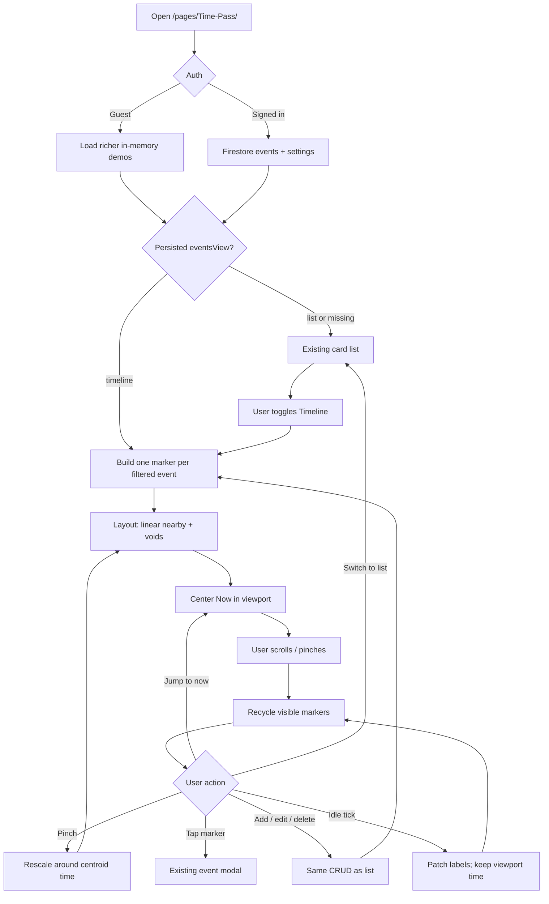
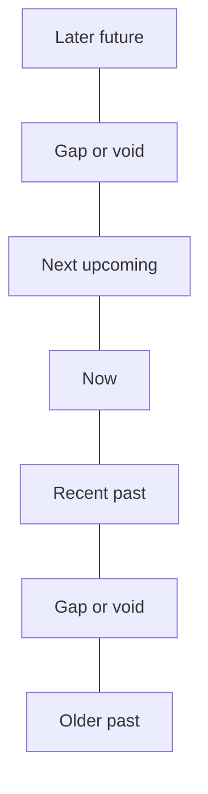

# Time Pass — Timeline View — Feature Brief

**Feature cycle:** 2026-08-16  
**Repo path:** `pages/Time-Pass/`  
**Expected live URL:** `https://xanderwiles.com/pages/Time-Pass/`  
**Status:** Decisions locked — awaiting implementation approval in [`02-technical-plan.md`](./02-technical-plan.md). **No implementation yet.**

**Related:** [`01-questions-and-decisions.md`](./01-questions-and-decisions.md) · [`02-technical-plan.md`](./02-technical-plan.md)

---

## Summary

Add a **vertical timeline view** to Time Pass. Unlike the current event **list** (equal-height cards, sorted but not spaced by time), the timeline’s job is to make **felt time** visible: the **real relative distance** between events, including past and upcoming, with the **event name** and the **gap between neighbouring markers**.

It must work well on **mobile** (bottom footer chrome, 44px targets, PWA standalone). Scrolling is **continuous** across a finite padded span. Empty decades are **compressed labeled voids**; **pinch-zoom** opens those voids back toward linear. The list stays; users **toggle** List ↔ Timeline (default **list**).

This cycle is a **new view inside the existing app**, not a new product. Auth, Firestore, event CRUD, calculator, and settings stay.

---

## User problem being solved

| Pain today | Impact |
|------------|--------|
| List cards are **equal height** regardless of whether two events are 2 hours or 20 years apart | The catalogue answers “what’s next?” but not “how far apart are these lives?” |
| Sort only **reorders** rows | Distance is a number on a card (`in 3 months`), never a **spatial** relationship between cards |
| Pinned / “This week” bands **lift** events out of chronological space | Nearby-in-time events can sit far apart in the scroll |
| Compact/expanded density changes **card chrome**, not time geometry | Mobile users still cannot *see* empty years vs clustered days |
| Recurring events show next + last **on the same card** | A yearly birthday and a daily standup compete as peers in a list |

Users need a second reading of the same events: a **map of time**, not a **stack of cards**.

---

## Locked product intent

| Intent | Meaning |
|--------|---------|
| **Vertical** | Time runs along the Y axis |
| **Now-centered (Q1=C)** | Scroll **up = future**, **down = past**; first open **centers now** |
| **Real relative distance (Q2=B)** | Linear among nearby events; **labeled compressed voids** for empty stretches |
| **Pinch-zoom (Q13=A)** | Two-finger pinch changes the time scale around the gesture centroid |
| **Past and upcoming** | Both on one axis, with a **Now** marker that **scrolls away** (Q8=A) plus Jump-to-now FAB |
| **Names + distances (Q5=C)** | Name + until/since-now on the marker; **inter-event gap** on the track |
| **One marker per event (Q3=A default)** | Same primary instant as the list card (next if it exists, else last) |
| **Clusters (Q6=B)** | Same-instant events share one stem; names stack |
| **Mobile-first** | Own scroller above the footer stack; FAB above safe-bottom |
| **List kept (Q4=B)** | Toggle; default remains list; last view persisted (Q9=B) |

---

## Current state (codebase snapshot, 2026-08-16)

Time Pass is a **vanilla** static app (HTML/CSS/ES modules + Firebase CDN) at `pages/Time-Pass/`.

| Area | Today |
|------|--------|
| **Views** | `list` (default), `settings`, `calculator`. `store.setView()` only accepts those three. |
| **List rendering** | `ui.js` → `getDisplayEntries()`: Pinned → This week → Upcoming/Past. Cards reconciled in place to **preserve document scroll**. |
| **Time math** | `time-engine.js` + `recurrence.js` + `filters.js` (`toViewModel`) |
| **Relative copy** | `formatRelativeCue()`; compact cue settings in `users/{uid}/settings/app` |
| **Auth** | Google via Firebase Auth; guests see **read-only** `demo-events.js` |
| **Persistence** | Firestore `users/{uid}/events/{eventId}` and `users/{uid}/settings/app`. Hard cap **250** events. |
| **Mobile chrome** | At `max-width: 720px`, app header + filters toolbar become **fixed bottom footers**. List scrolls in `document`. |
| **Live tick** | Adaptive 1s / 15s; `patchListDigits()` updates numbers **without** rebuilding the list |
| **Automated tests** | **None** in this app today |
| **PWA** | `sw.js` cache `time-pass-v67`; must bump when new JS/CSS ships |

There is **no** timeline, virtual scroller, or time-to-pixel mapper yet.

---

## Target audience

| Audience | Need |
|----------|------|
| **Primary (you)** | See life events as a spatial timeline on phone and desktop |
| **Signed-in users** | Same uid-scoped events as the list; last view syncs via settings |
| **Guests** | Richer sample events so the timeline is obvious before sign-in |
| **Not in scope** | Sharing a public timeline URL, collaborative editing, calendar sync |

---

## Goals (this cycle)

1. A **timeline reading** of the current filtered event set (guest demos + signed-in Firestore events).
2. **Now-centered** vertical layout; past below, future above.
3. Marker **names**, **until/since now**, and **labeled distances between neighbouring markers**.
4. **Continuous scroll** across earliest→latest plus padding; interior emptiness via compressed voids; **pinch-zoom** to open scale.
5. **Toggle** with the existing list without breaking add/edit/delete, filters, or sign-in.
6. Same glass aesthetic: glow-only hover, Outfit, event colour accents, `prefers-reduced-motion`.
7. Guest remains **read-only**; signed-out users never write Firestore.

---

## Non-goals (this cycle)

- Replacing or merging `pages/Countdown/`
- Replacing the list view
- Horizontal / Gantt / calendar-month views
- Exploding daily/weekly recurrences onto the axis
- Sticky now overlay
- Infinite civil-time map
- Multi-select on the timeline
- Hash/URL routing
- On-screen zoom buttons/slider (pinch only, plus desktop Ctrl+wheel equivalent — see remaining assumptions)
- Push notifications, Cloud Functions, Calendar overlay
- Changing event CRUD fields
- Automated E2E suite (layout unit tests **are** in scope)
- Horizontal mode, print, screenshot export, haptics, “play time”

---

## Design direction

| Rule | Detail |
|------|--------|
| Atmosphere | Existing midnight / OLED / light themes; drifting orbs stay behind content |
| Glass | Markers and gap chips use existing glass tokens; **no** `translateY` hover lift |
| Colour | Event palette colour on the node / stem |
| Type | Outfit; names clamp to 2 lines on a ~360px-wide phone |
| Motion | Scroll + pinch are primary. Tick updates must **not** yank scroll. Reduced-motion: instant Jump-to-now, no ornamental pulse |
| Icons | Inline SVG |
| Chrome | Timeline clears the **mobile footer stack**. Filters stay (Order/sort hidden). Jump-to-now FAB above that stack |

---

## Expected user flow

### High-level — enter timeline and travel through time



### Sequence — open timeline, scroll, pinch, edit

```mermaid
sequenceDiagram
    participant U as User
    participant UI as ui.js
    participant Store as store.js
    participant Lay as timeline-layout.js
    participant TV as timeline-view.js
    participant FS as Firestore

    U->>UI: Toggle Timeline
    UI->>Store: setView(timeline)
    Store->>Lay: filtered view-models
    Lay-->>TV: y-map, voids, clusters, gaps
    TV-->>U: Vertical timeline, Now centered

    U->>TV: Scroll
    TV->>Lay: visible window + overscan
    Lay-->>TV: nodes in range
    TV-->>U: Recycled markers

    U->>TV: Pinch
    TV->>Lay: new scale, centroid time
    Lay-->>TV: rebuilt layout
    TV->>TV: keep centroid time under fingers
    TV-->>U: Voids open or compress

    U->>TV: Tap marker
    TV->>UI: openEventModal
    U->>UI: Save date
    UI->>FS: updateDoc (signed in only)
    FS-->>Store: onSnapshot
    Store->>Lay: recompute
    TV-->>U: Marker moves; viewport time stable
```

### Scroll model (locked)



**Top of screen = future.** Scroll **up** to later, **down** to earlier. Now is a marker on the axis, not a sticky overlay.

---

## Product surfaces (locked)

| Surface | Behavior |
|---------|----------|
| **View switch** | Toolbar/header control List ↔ Timeline; `t` on desktop |
| **Timeline canvas** | Own scroller; track; Now; event nodes; names; until/since; inter-event gaps; year ticks on linear segments; void labels |
| **Jump to now** | FAB when Now is off-screen; first open / view-enter centers now |
| **Pinch-zoom** | Two-finger pinch on the scroller; desktop Ctrl+wheel (assumption) |
| **Filters** | When / Type / Category / Search; **Order hidden** |
| **Event modal** | Reuse create/edit |
| **Empty state** | Same CTAs as list |
| **Guest** | Richer demos; read-only |
| **Badges** | Pin / this-week on chronological markers; no lifted bands |

---

## Success criteria

- User can open a **vertical timeline** of filtered events on phone and desktop.
- Nearby spacing is **linear**; long emptiness is a **labeled void**, not a fake equal gap.
- Pinch-zoom rescales around the gesture and can **open** voids toward linear.
- Each marker shows **name** + **until/since now**; **gaps between neighbours** are labeled.
- Scrolling is **continuous** across the padded event span (not paginated).
- **Now** is obvious; Jump-to-now returns when it has scrolled away.
- Tick updates do not **jump** the scroll position.
- Guest timeline is read-only; signed-in CRUD works from a marker tap.
- List, settings, calculator, auth, and Firestore paths keep working.
- Aesthetic and a11y bars of the current app still hold.

---

## Definition of done (high level)

- [x] Decisions locked in `01-questions-and-decisions.md`
- [ ] Technical plan approved in `02-technical-plan.md`
- [ ] Timeline view ships under `/pages/Time-Pass/`
- [ ] Mobile scroll + pinch + footer chrome verified (Safari iOS + Chrome Android or equivalent)
- [ ] Layout math covered by automated unit tests
- [ ] Manual test checklist executed
- [ ] Service worker cache bumped
- [ ] Rollback path documented

Full engineering checklist: [`02-technical-plan.md`](./02-technical-plan.md).

---

## Next step

Approve **implementation** in [`02-technical-plan.md`](./02-technical-plan.md). Confirm Q3 = **A** if that skip was intentional. Do not start coding until that approval.
