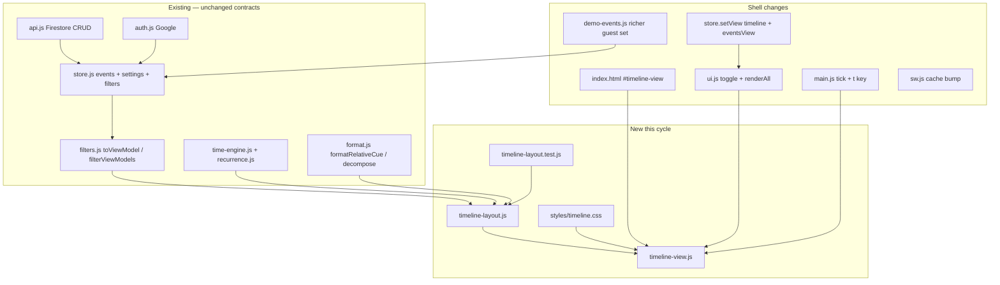
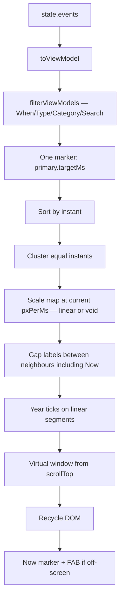
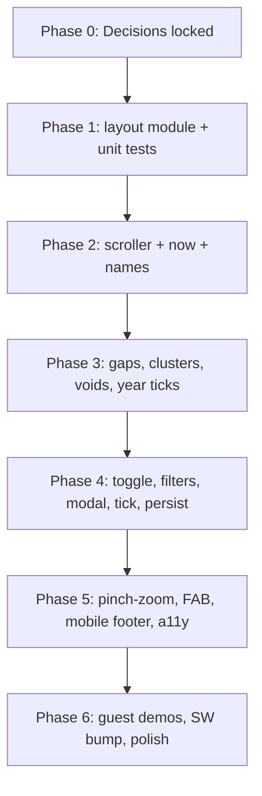

# Time Pass — Timeline View — Technical Plan

**Feature cycle:** 2026-08-16  
**Status:** **Decisions locked — awaiting your approval to implement.** **No implementation yet.**  
**Owner model:** Unchanged — signed-in Google user (uid-scoped); guests see read-only demos  
**Stack:** Unchanged — vanilla static HTML/CSS/JS (ES modules) + Firebase CDN  
**Related:** [`00-brief.md`](./00-brief.md) · [`01-questions-and-decisions.md`](./01-questions-and-decisions.md)

---

## Locked decisions

| ID | Decision | Status |
|----|----------|--------|
| Q1 | Now-centered; **up = future**, **down = past**; first open centers now | `Locked` |
| Q2 | Linear + min-gap + **labeled compressed voids** | `Locked` |
| Q3 | **One marker per event** at list primary instant | `Locked (default)` — left unchecked |
| Q4 | **Toggle** List ↔ Timeline; default **list** | `Locked` |
| Q5 | **Both**: gap-on-track + until/since on marker | `Locked` |
| Q6 | **Cluster** same-instant names on one stem | `Locked` |
| Q7 | Finite event span + **padded** empty time at both ends | `Locked` |
| Q8 | Now **scrolls away**; Jump-to-now FAB when off-screen | `Locked` |
| Q9 | Persist `eventsView` in Firestore (signed in); `sessionStorage` (guest) | `Locked` |
| Q10 | Filters: When / Type / Category / Search; **no sort** | `Locked` |
| Q11 | No bands; pin / this-week **badges** | `Locked` |
| Q12 | Tap → existing event modal | `Locked` |
| Q13 | **Pinch-zoom the time scale** | `Locked` (overrode recommended no-zoom) |
| Q14 | Marker minimal; extras only in modal/list | `Locked` |
| Q15 | No multi-select on timeline | `Locked` |
| Q16 | **Year ticks** on linear segments only | `Locked` |
| Q17 | Richer **guest** demos only; seeds unchanged | `Locked` |
| Q18 | `t` toggles List ↔ Timeline | `Locked` |
| Q19 | Patch labels every tick; coarse re-layout; **viewport time stable** | `Locked` |
| Q20 | No hash/query | `Locked` |
| D1–D16 | See questions doc | `Locked (default)` |

---

## Final agreed scope (this cycle)

### In scope

1. New **content view** `timeline`, peer of `list` (not a settings page). Default remains **list**.
2. **Now-centered camera**: future toward the top of the scroller, past toward the bottom.
3. **One marker per filtered event**, placed at `vm.primary.targetMs` (same instant the list card uses).
4. Scale: **linear** between neighbours that are close; **compressed labeled voids** when empty time would dominate; **min-gap** never silently stretches the axis — close events **cluster** (Q6) instead.
5. **Pinch-zoom** (and desktop Ctrl+wheel equivalent) changes `pxPerMs` around the gesture centroid so voids can open toward linear when zooming in.
6. Labels: event **name** + compact **until/since now** on the marker; **inter-event** (or event↔now when that is the neighbour) **gap** on the track.
7. **Now** is an axis marker that scrolls. **Jump to now** FAB when it leaves the viewport. Entering the view **centers now**.
8. Scroll range: `min(instant) − pad` … `max(instant) + pad` (pad ≈ one viewport at current scale). No infinite time, no extend-on-demand.
9. Filters shared with the list except **sort** (Order control hidden on timeline). Gap math uses the **filtered** set.
10. Pin / this-week as **badges**, not lifted bands. No multi-select. No extra recurring stats on the track.
11. Year ticks only inside **linear** segments.
12. Persist last view: `users/{uid}/settings/app.eventsView`; guests `sessionStorage`.
13. Richer **guest-only** demos (~6 events, past + future, clustered + void-worthy spans). First-sign-in seeds unchanged.
14. Keyboard: `t` toggles when not typing / no modal. Esc from settings/calculator returns to **last content view**.
15. Virtualized own scroller; layout unit tests; SW cache bump.
16. Reuse event modal, time engine, format cues, Auth, Firestore CRUD.

### Out of scope

- Replacing the list or `pages/Countdown/`
- Occurrence explosion (daily/weekly/yearly instances on the axis)
- Sticky now, infinite map, URL routing, zoom buttons/slider
- Multi-select, in-place peek, month ticks
- New Firestore collections, rules rewrite, Cloud Functions
- E2E suite, extra JS libraries (no d3 / virtual-list package)
- Horizontal timeline, print, screenshot, haptics, play-time animation

---

## Problem statement (technical)

The app already knows **when** each event is. The list throws that geometry away. Build a second layout that maps instants → Y, virtualizes a mobile scroller, labels names and neighbour distances, pinch-rescales without fighting iOS, and patches live copy without jumping scroll — with **no new backend**.

Hard constraints:

- Cap **250** events; pathological date spans must not create a billion-pixel node.
- Mobile footer stack must stay clear.
- Inline SVG only; no hover lift.
- `ui.js` must not absorb the scroller.

---

## Main technical approach

**Same in-memory events → `toViewModel` + filters → pure `timeline-layout.js` → virtualized `timeline-view.js`. Pinch updates scale and rebuilds layout around a stable centroid time.**



### Data flow — one frame



Now is a **layout neighbour**. Consecutive pairs are `…, pastMarker, Now, futureMarker, …` so the user always sees distance from the nearest events to now, plus event–event gaps.

### Y mapping (Q1 = C)

Layout space: `y = 0` at the **future** end (top), increasing **downward** toward the past (matches CSS `scrollTop`).

```
y(instant) increases as instant becomes more past
y(future) < y(now) < y(past)
```

First open / Jump-to-now: `scrollTop = y(now) - viewportHeight/2`.

### Scale (Q2 = B) + pinch (Q13 = A)

Walk consecutive layout points (cluster representatives + Now), at current `pxPerMs`:

| Pair condition | Segment |
|----------------|---------|
| Same instant | Already clustered — no segment |
| Linear projected height `>= minGap` and not void-worthy | **Linear** segment, height = `Δt * pxPerMs` |
| Empty span `> 21 days` **and** linear height `> 2 viewports` | **Void**: fixed ~80px (clamped 72–96), label = calendar duration of `Δt` |
| Linear height `< minGap` but not the same instant | **Cluster** if within a small time epsilon of equal civil instant; otherwise keep linear at **minGap only inside a cluster group**, never as a silent axis lie for distinct days |

**Pinch** multiplies `pxPerMs` (clamped). Rebuild layout. Because void eligibility uses **projected linear height**, zooming **in** can turn a void back into a linear stretch (the void “opens”). Zooming **out** can create more voids. That is the intended “smart” part of continuous travel.

**Zoom origin:** time under the pinch centroid (or Ctrl+wheel cursor). After rebuild, set `scrollTop` so that time stays under that point.

**Clamps (implementation constants):** `scaleMin` / `scaleMax` such that (a) the full padded span is at least ~1.2 viewports (cannot pinch out to a single dot) and (b) 1 hour is at most ~2 viewports (cannot pinch in to a blank). Exact numbers tuned in Phase 5; tests lock monotonicity and centroid stability, not the numeric caps.

**Gesture:** listen on `#timeline-scroller` only. One finger = pan. Two fingers = pinch (`touch-action: pan-y` on the scroller). Do **not** `preventDefault` on single-finger or on `document` — browser a11y zoom elsewhere must keep working. Desktop: **Ctrl+wheel** over the scroller as the pinch equivalent (see remaining assumptions). No on-screen slider (Q13 is A, not D).

### Virtual scroller (D2, D6, Q7)

Finite layout height after voids — typically modest even at 250 events. Still **virtualize**: only markers, voids, ticks, and gap chips in view + ~1 viewport overscan exist in the DOM. Position with `transform: translate3d`. Spacer height = layout height + padding.

`#timeline-view` fills the remaining viewport (`100dvh` minus header on desktop; minus `--mobile-footer-stack` on small screens). `overflow-y: auto; -webkit-overflow-scrolling: touch; overscroll-behavior-y: contain`. `body.is-timeline-view` → document does **not** scroll.

```mermaid
sequenceDiagram
    participant Scr as Timeline scroller
    participant TV as timeline-view.js
    participant Lay as timeline-layout.js
    participant DOM as Recycled nodes

    Scr->>TV: scroll / resize / pinch
    TV->>Lay: visible y-range + overscan + scale
    Lay-->>TV: markers, clusters, voids, ticks, gaps
    TV->>DOM: reuse by event id / void id / tick year
    TV->>TV: translate3d; FAB visibility from Now y vs viewport
```

### Tick (Q19)

Same `scheduleTick()` in `main.js`. If `view === 'timeline'`: patch until/since **text** every tick. Recompute positions on the coarse timer (15s, or 1s only if a visible cue includes seconds). Always restore `scrollTop` from **viewport-center time**, not from a pixel offset.

---

## Existing files, components, routes, data, APIs

One page: `/pages/Time-Pass/`. Firestore paths unchanged:

```
users/{uid}/events/{eventId}
users/{uid}/settings/app
```

### Relevant existing modules

| Path | Role |
|------|------|
| `index.html` | Add `#timeline-view` section + `timeline.css` |
| `js/store.js` | `setView('timeline')`; `eventsView`; last content view for Esc |
| `js/ui.js` | Toggle; `renderAll` branch; hide Order/sort and list density on timeline; `body.is-timeline-view`; `openEventModal` from marker tap |
| `js/main.js` | Tick → `patchTimeline`; `t` shortcut; persist `eventsView` |
| `js/filters.js` | Consume `toViewModel`, `filterViewModels`, `isPinnedEvent`, `isThisWeekVm` — do not fork instants |
| `js/time-engine.js` / `js/recurrence.js` | Unchanged source of primary instant |
| `js/format.js` | Gap and until/since copy |
| `js/api.js` | Persist/export `eventsView` |
| `js/demo-events.js` | Guest set expansion |
| `js/constants.js` | Compact cue settings reused |
| `styles/components.css` | Footer-stack interaction only |
| `sw.js` | Cache bump |

### Routes / tables / services

| Kind | Change |
|------|--------|
| HTTP routes | None |
| Firestore collections | **None new** |
| Cloud Functions | None |
| REST / SQL | None |
| Auth providers | None |
| `firestore.rules` | **No change** (settings already owner-writable) |

---

## New files

```
pages/Time-Pass/styles/timeline.css
pages/Time-Pass/js/timeline-layout.js
pages/Time-Pass/js/timeline-view.js
pages/Time-Pass/js/timeline-layout.test.js
```

No `timeline-occurrences.js` (Q3 = one marker).

---

## Existing files to change

| File | Change |
|------|--------|
| `pages/Time-Pass/index.html` | Section + stylesheet |
| `pages/Time-Pass/js/store.js` | View enum, `eventsView`, last content view |
| `pages/Time-Pass/js/ui.js` | Toggle, `renderAll`, toolbar (hide sort/density), chrome subtitle |
| `pages/Time-Pass/js/main.js` | Tick, `t`, persist settings, Esc return |
| `pages/Time-Pass/js/api.js` | `eventsView` on save/export/ensure/seed merge paths |
| `pages/Time-Pass/js/demo-events.js` | ~6 guest events |
| `pages/Time-Pass/styles/components.css` | `body.is-timeline-view` vs footer stack / hide `#list-view` |
| `pages/Time-Pass/sw.js` | `CACHE_NAME` + new assets |
| `pages/Time-Pass/README.md` | Optional one-liner |

**Do not change:** `pages/Countdown/*`, other apps’ Firebase, homepage card, `firestore.rules`.

---

## Data model changes

### Events

**None.** Read existing fields. `showSinceLast` / `showSinceFirst` / `showCycleProgress` stay list/modal-only (Q14).

### Settings

```typescript
type EventsView = 'list' | 'timeline';

interface AppSettings {
  // existing fields unchanged
  eventsView?: EventsView; // default 'list' when missing
}
```

`schemaVersion` stays **1**. Client whitelist only `'list' | 'timeline'`.

### Guest

`sessionStorage` key `time-pass:events-view`. Never Firestore.

---

## API changes

| API | Change |
|-----|--------|
| Firestore listeners | None |
| Event CRUD | None |
| `saveSettings` / `ensureSettings` / seed merge / `exportPayload` | Include `eventsView`; missing → `list` |
| HTTP | None |

---

## Authentication and authorization

Unchanged Google auth. Guests only **read** in-memory demos. Marker tap uses existing modal guards (sign-in prompt). No cross-user leakage (`state.events` is already uid-scoped or guest). First-sign-in seed path unchanged.

---

## Security and privacy risks

| Risk | Mitigation |
|------|------------|
| XSS via names | `textContent` / existing `el({ text })` only |
| `eventsView` injection | Whitelist two strings |
| Custom pinch stealing a11y zoom | Gesture only on scroller; no document-level `preventDefault` on one-finger |
| SW serving stale JS | Cache bump |
| Privacy | Same personal dates as list; no URL share (Q20) |

---

## Performance risks

| Risk | Mitigation |
|------|------------|
| Huge DOM height | Voids + virtualize + finite pad |
| Pinch re-layout | rAF-throttle; reuse node pool; do not wipe innerHTML |
| Tick jitter | Q19: text patch + viewport-time anchor |
| 250 markers | Overscan ~1 viewport |
| Backdrop-filter on every chip | Prefer solid glass fill if mobile janks |
| `renderAll` on every snapshot | Fingerprint; patch in place like the list |
| `visualViewport` / iOS keyboard | Resize → keep center time |
| Recurrence explosion | N/A (Q3 = one marker) |

---

## Edge cases

| Case | Handling |
|------|----------|
| 0 events | Existing empty state; no axis; no FAB |
| 1 event | Marker + Now + one gap (event ↔ now) |
| All identical instants | One cluster |
| Date-only vs timed same day | Distinct instants; cluster only if still within min-gap / same-instant rule |
| Recurring | One marker at primary instant (matches list) |
| Upcoming-only filter | Past omitted; Now stays; gaps on remaining set |
| Malformed event | Skip; no NaN y |
| Snapshot while scrolled | Keep **viewport-center time** |
| Deleted focused event | Jump to now |
| Guest → sign-in | Apply signed-in `eventsView` |
| Sign-out | Guest demos + session view |
| Settings/calculator | Hide timeline; Esc returns to timeline if that was last |
| Long names | 2-line clamp; full name in `title` + modal |
| Reduced motion | Instant jump; no now pulse; pinch still works |
| Cluster tap | Open a short chooser if >1 event, then existing modal; single-event cluster opens modal directly |
| Pinch at min/max scale | Clamp; no rubber-band scale |

---

## Accessibility

| Area | Plan |
|------|------|
| Structure | `region` named “Timeline”; Now labeled with local time |
| Markers | `button`; accessible name = event name + until/since |
| Cluster | One button; chooser lists names |
| Keyboard | Tab: Jump-to-now (when visible), then markers in visual order. Arrows move + scroll into view. Enter = modal. `t` toggles |
| Live region | Announce view switch once. No per-scroll live updates |
| Contrast | Check atmosphere / OLED / light |
| Touch | ≥44px hit slop |
| Zoom | Browser pinch on the page remains; custom pinch is scroller-only |

---

## Manual tests

Device matrix: desktop Chrome, desktop Safari, iPhone Safari (PWA + browser), Android Chrome. Themes: atmosphere, OLED, light.

1. Guest: richer demos; timeline shows past + future + at least one void-worthy gap; read-only tap → sign-in path.
2. Toggle List ↔ Timeline; filters (except sort) persist; Order hidden on timeline.
3. First open / switch-in **centers now**. Scroll now off-screen → FAB → jump recenters. FAB hidden when now visible.
4. Scroll **up** reveals later events; **down** reveals earlier.
5. Two nearby events sit closer than a multi-year pair; a long emptiness is a **labeled void**, not a huge blank.
6. Pinch in: void can open toward linear; centroid time stays under fingers. Pinch out: more compression. Scale clamps.
7. Desktop Ctrl+wheel zooms around cursor (if shipping that equivalent).
8. Filters change markers and **recompute gaps**.
9. Tap marker → modal; save date; marker moves; viewport time stable.
10. Recurring event: **one** marker matching list primary.
11. Pinned / this-week: chronological + badge, not a top band.
12. Two date-only same-day events: one cluster; tap chooses / opens modal.
13. Empty / filtered empty: list-equivalent CTAs.
14. Tick 15s (and 1s if seconds visible): labels update; **scroll does not jump**.
15. Mobile: content not under footer; FAB above footer + safe-bottom.
16. iOS: one-finger scroll momentum; two-finger pinch; no desynced spacer.
17. `t`, arrows, Esc from modal, Esc from settings returns to **timeline**.
18. Sign-out: no user events in DOM.
19. Export/import: `eventsView` round-trips; old JSON still imports.
20. Reduced motion: instant jump.
21. PWA after cache bump: new CSS/JS load.
22. Regression: list density, multi-select, calculator, CSV, settings.

---

## Automated tests

`node --test` on `timeline-layout.js` (no DOM):

| Test | Assert |
|------|--------|
| Order | Future has smaller y than past |
| Now | `y(now)` between a past and a future instant |
| Nearby linear | 2-day pair farther than 2-hour pair; ~proportional |
| Void | 10-year empty pair + small viewport → void height << linear; label duration matches decompose |
| Zoom opens void | Increasing `pxPerMs` can convert a void back to linear |
| Cluster | Two equal instants → one cluster, two ids |
| Window query | Only in-range items + overscan |
| Filter subset | Removing middle event changes neighbour gap |
| Centroid | After scale change, `y(tCentroid)` mapping stays consistent for scroll correction |
| Q3 | Recurring vm produces a single marker at `primary.targetMs` |

No Playwright in this cycle.

---

## Rollback

| Scenario | Action |
|----------|--------|
| Bad deploy | Revert Time-Pass diff. Event documents untouched. |
| Bad `eventsView` | Ignore unknown; revert JS. No migration. |
| Bad SW | Bump `CACHE_NAME` again. |
| iOS pinch unusable | Ship with pinch disabled behind a one-line flag; voids still make the view usable (Q2). |
| Kill feature | Remove section, new JS/CSS, toggle; keep docs. |

---

## Phased delivery



| Phase | Deliverable | First files |
|-------|-------------|-------------|
| 1 | Pure layout + tests for Q1–Q3, Q5–Q7, scale+void+cluster | **New** `js/timeline-layout.js`, `js/timeline-layout.test.js` |
| 2 | Hidden section, scroller, now, names | `index.html`, **new** `js/timeline-view.js`, **new** `styles/timeline.css`, `store.js` |
| 3 | Gaps, clusters, voids, year ticks | layout + view + CSS |
| 4 | Toggle, filters, modal, tick, `eventsView` | `ui.js`, `main.js`, `api.js` |
| 5 | Pinch, FAB, mobile, a11y | `timeline-view.js`, `components.css` |
| 6 | Guest demos, SW, README | `demo-events.js`, `sw.js` |

**Do not start Phase 1 until you approve this plan.**

---

## Definition of done

- [x] Decisions recorded in `01-questions-and-decisions.md`
- [x] Technical plan aligned to answers (including Q13 pinch)
- [ ] You confirm Q3 = A (left unchecked) **or** correct it
- [ ] You approve implementation
- [ ] Layout module + unit tests
- [ ] Timeline view: names, until/since, inter-event gaps, voids, clusters, year ticks
- [ ] Now-centered scroll; Jump-to-now; pinch-zoom
- [ ] List toggle, filters minus sort, persist view, richer guest demos
- [ ] List / settings / calculator / auth / CRUD still work
- [ ] Guest read-only
- [ ] Tick does not jump scroll
- [ ] SW cache bumped
- [ ] Manual tests executed

---

## Remaining assumptions

1. **Q3 was unchecked.** Plan uses recommended **A** (one marker at list primary). Say so if you wanted last+next or occurrence expansion.
2. **D1–D16** had empty answer boxes → recommended defaults are locked.
3. **Void threshold:** empty `> 21 days` **and** linear height `> 2 viewports` → ~80px void. Tunable constant, not a settings field.
4. **Same-instant epsilon:** cluster when timestamps are equal after resolving TZ; distinct civil times that still fall under min-gap at current scale stay separate linear marks unless they share the exact instant.
5. **Desktop zoom equivalent:** Ctrl+wheel over the scroller (no on-screen buttons). Trackpad pinch on desktop if the browser surfaces it as wheel+ctrl or 2-finger on the element.
6. **Guest demo copy:** ~6 clearly fake events spanning hours → years, including one same-day pair (cluster) and one multi-year gap (void), unless you specify names/dates.
7. **No new npm dependencies.**
8. **No Firebase Console / rules deploy** for this feature.
9. **Cluster tap:** if more than one event, a small chooser then the existing modal (not a new editor).
10. **Pinch vs Safari:** if custom pinch proves unreliable in Phase 5, fallback is “pinch disabled, voids remain” rather than expanding Q13 to on-screen buttons unless you ask.

---

## Exact files to edit first (Phase 1, after approval)

1. **Create** `pages/Time-Pass/js/timeline-layout.js`
2. **Create** `pages/Time-Pass/js/timeline-layout.test.js`

No shell/UI files until Phase 1 tests pass for: Y direction, linear nearby pairs, void compression, clustering, now as a neighbour, window query, and scale-up opening a void.

---

## Next step

**Do not code yet.** Reply with approval to start **Phase 1** (and confirm or correct **Q3 = A**).
