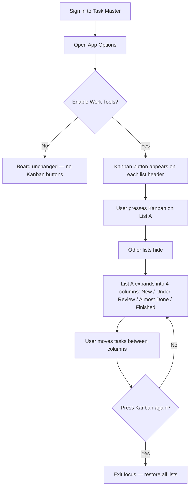
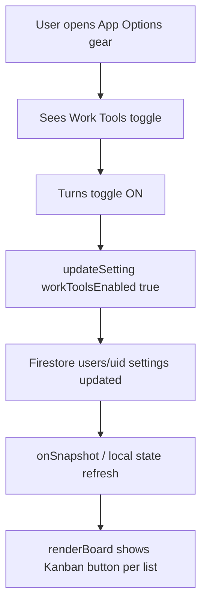
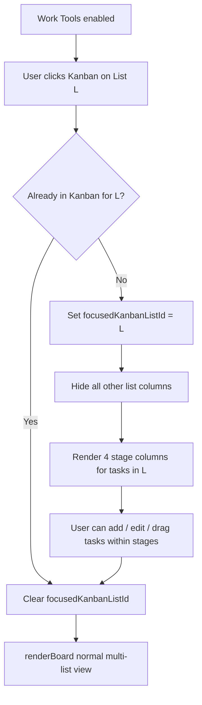

# Task Master — Work Tools / Kanban Brief

**Feature cycle:** 2026-07-14  
**Repo path:** `pages/To-Do-List/`  
**Expected live URL:** `https://xanderwiles.com/pages/To-Do-List/`  
**Status:** Phases 1–5 implemented. Runtime QA checklist: [`04-manual-test-checklist.md`](./04-manual-test-checklist.md).

---

## Summary

Add a **Work Tools** preference in App Options. When enabled, each list gains a **Kanban** button. Pressing it focuses that list: other lists on the board disappear, and the focused list expands into four workflow columns — **New**, **Under Review**, **Almost Done**, **Finished**. Pressing the Kanban button again exits focus mode and restores the normal multi-list board.

This is an **intra-list workflow view** on top of the existing board → list → task model. Today, board columns *are* lists; Work Tools adds stages *inside* one list.

---

## User problem being solved

Task Master already answers:

- **“What ideas/tasks do I have?”** — boards, lists, tasks
- **“Is this done?”** — checkbox `completed` + archive
- **“Where does this live?”** — which list / board

It does **not** answer, for work-style tracking:

- **“Where is this in my pipeline?”** (new → review → almost done → finished)
- **“Can I focus on one list’s workflow without the rest of the board?”**
- **“Can I move work through stages without creating four separate lists?”**

Without this, users who want a classic kanban pipeline either create multiple lists (polluting the board) or track stage mentally / elsewhere.

---

## Target audience

| Audience | Need |
|----------|------|
| **Primary (you)** | Optional work-oriented pipeline view without changing casual list use |
| **Same account, casual mode** | Work Tools off → board behaves exactly as today |
| **Story Manager skin** | Included (Q12) — same Work Tools / Kanban via shared assets |

---

## Goals

1. Add a **Work Tools** toggle in App Options (settings).
2. When Work Tools is on, show a **Kanban** control on each list header.
3. Entering Kanban for a list: **hide other lists**, expand that list into the four stage columns.
4. Exiting Kanban: restore the normal board of lists.
5. Persist `kanbanStatus` on tasks; drag between stages; Finished ↔ `completed` synced both ways.
6. Allow **user-editable display names** for the four fixed column keys.
7. Include Story Manager (shared assets); exclude beta from this change.
8. Match existing Task Master UI patterns (Phosphor icons, glass options toggles, SortableJS).

---

## Non-goals (v1)

- Replacing boards/lists with a global project kanban
- Adding/removing columns or changing stage keys (labels only are editable)
- Swimlanes, WIP limits, due dates as first-class kanban fields
- Real-time multiplayer cursors or presence
- Cloud Functions / server-side workflow engine
- Beta To-Do List parity in this change
- Full redesign of list headers beyond adding the Kanban control

---

## Current state (codebase snapshot)

| Area | Today |
|------|--------|
| **Stack** | Static HTML + CSS + vanilla JS (ES modules), Firebase Auth + Firestore |
| **App version** | v1.37 (UI) |
| **Auth** | Google sign-in; data under `users/{uid}/…` |
| **Hierarchy** | Boards → Lists (`taskIds[]`) → Tasks |
| **Task status** | `completed: boolean`, `archived: boolean`, `completedAt` — **no stage enum** |
| **Board UI** | Horizontal `.board-container` of `.list-column` (~300px) |
| **List collapse / focus** | **Does not exist** |
| **Settings** | `users/{uid}.settings.*` via `updateSetting()`; Options modal toggles |
| **Work Tools / Kanban** | **Not present** |
| **Session-only UI flags** | `showArchived`, `showRecentCompleted`, `compactView`, `multiEditMode`, `expandedTaskId` |
| **Drag** | SortableJS on lists and tasks; cross-list move/copy |
| **Linked tasks** | Same task id can appear in multiple lists |
| **Time automation** | Moves tasks between lists on schedule/duration |
| **Tests** | None in repo for To-Do-List |
| **Firestore rules** | Not in this folder (Console for `taskmaster-cloud-xander`) |

**Key modules:** `index.html`, `main.js`, `ui.js`, `api.js`, `store.js`, `utils.js`, `style.css`, `firebase-config.js`.

**Settings pattern to extend:** Options modal `#options-modal-overlay` label toggles → `main.js` listeners → `api.updateSetting(key, value)`.

**List header today:** drag handle, title, count badge, optional automation clock, broom (clear completed), select-all, edit list (sliders).

---

## Expected user flow

### High-level journey



### Enable Work Tools (settings)



### Enter / exit Kanban focus



### System interaction (sequence)

```mermaid
sequenceDiagram
    participant U as User
    participant Opt as Options modal
    participant Main as main.js
    participant API as api.js
    participant FS as Firestore
    participant Store as store.js
    participant UI as ui.js

    U->>Opt: Enable Work Tools
    Opt->>Main: toggle change
    Main->>API: updateSetting("workToolsEnabled", true)
    API->>FS: updateDoc users/{uid} settings.workToolsEnabled
    FS-->>Store: onSnapshot user doc
    Store->>UI: renderBoard()
    UI-->>U: Kanban buttons visible on lists

    U->>UI: Click Kanban on List A
    UI->>Store: focusedKanbanListId = A (session-only)
    Store->>UI: renderKanbanFocus(A)
    UI-->>U: Only List A as 4 columns + pin tray

    U->>UI: Drag task to Almost Done
    UI->>API: updateKanbanStatus(taskId, "almost_done")
    API->>FS: updateDoc task (status + completed sync if Finished)
    FS-->>Store: onSnapshot tasks
    Store->>UI: re-render columns
```

---

## Product surface (locked)

| Surface | Behavior |
|---------|----------|
| **App Options** | **Work Tools** toggle (off by default) + editable column display names |
| **List header** | **Kanban** icon button when Work Tools on |
| **Kanban focus view** | Other lists unmounted; pin tray above four stage columns |
| **Exit** | Kanban button toggle + Escape |
| **Normal board** | Unchanged when Work Tools off or when not in focus |
| **Apps** | Task Master + Story Manager |

---

## Success criteria

- Work Tools off → zero visible Kanban UI; board identical to today.
- Work Tools on → Kanban button on each non-orphan list.
- Enter focus → only that list’s workflow visible as four columns.
- Exit focus → all lists restored in previous board order.
- Stage changes behave per locked decisions (persist / sync / relate to completed).
- No data loss for existing tasks when enabling/disabling Work Tools.
- Usable on desktop and mobile (horizontal or stacked columns per Q11).

---

## Definition of done (high level)

- [ ] Work Tools toggle in settings, persisted in Firestore
- [ ] Kanban button on lists when enabled; enter/exit focus works
- [ ] Four columns with correct task membership
- [ ] Stage move behavior locked and implemented (Q2–Q4)
- [ ] Interaction with completed/archived/linked/pinned/automation documented and handled
- [ ] Auth remains Google-scoped; no cross-user leakage
- [ ] Manual test plan executed
- [ ] Rollback path documented
- [ ] Open questions in `01-questions-and-decisions.md` locked

Full engineering checklist: [`02-technical-plan.md`](./02-technical-plan.md).

---

## Next step

Approve **Phase 1** in [`02-technical-plan.md`](./02-technical-plan.md) (Work Tools settings toggle only). Implementation begins after that approval.
