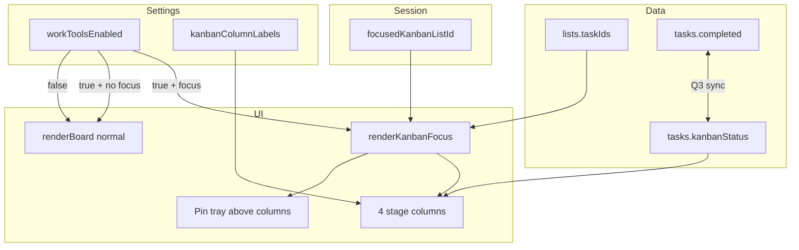
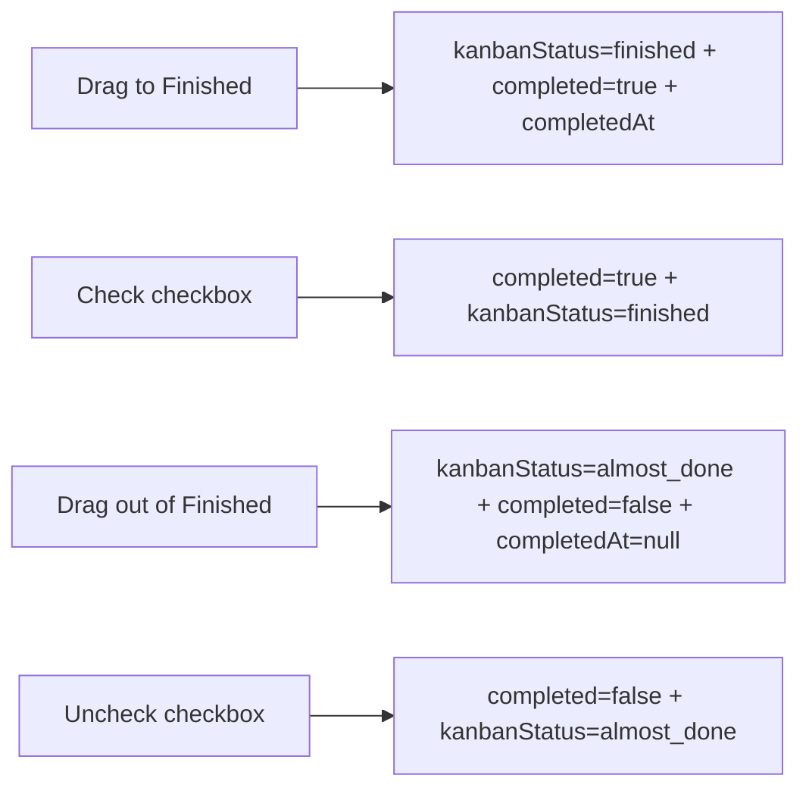
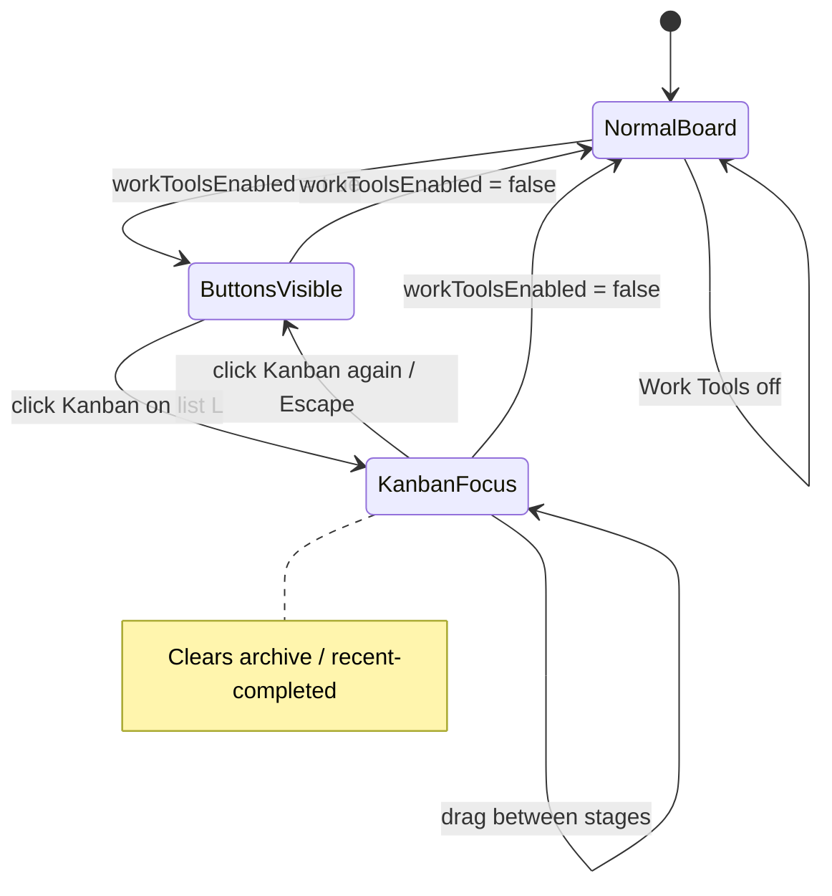

# Task Master — Work Tools / Kanban Technical Plan

**Feature cycle:** 2026-07-14  
**Status:** Locked — decisions recorded in [`01-questions-and-decisions.md`](./01-questions-and-decisions.md)  
**Owner:** Signed-in Google user (existing Task Master auth model)  
**Implementation:** Do not start coding until Phase 1 is explicitly approved.

---

## Locked decisions (summary)

| ID | Decision | Status |
|----|----------|--------|
| Q1 | **User-global** `settings.workToolsEnabled` | `Locked` |
| Q2 | Persist **`kanbanStatus`** on each task document | `Locked` |
| Q3 | **Finished ↔ `completed` synced both ways** (archive stays separate) | `Locked` |
| Q4 | New tasks → `new`; missing field: completed → `finished`, else `new` | `Locked` |
| Q5 | **Global** stage on task (linked lists share stage) | `Locked` |
| Q6 | **Session-only** `focusedKanbanListId` | `Locked` |
| Q7 | **Do not render** other lists while focused; disable list reorder in focus | `Locked` |
| Q8 | **List header** Kanban icon button when Work Tools on | `Locked` |
| Q9 | **Stage drag + within-column reorder**; no cross-list; prefer custom sort in focus | `Locked` |
| Q10 | **Fixed keys**, **user-editable display names** | `Locked` |
| Q11 | **Horizontal scroll** of four columns on mobile | `Locked` |
| Q12 | **Task Master + Story Manager** (not beta in this change) | `Locked` |
| Q13 | **Pin tray above all columns** in Kanban | `Locked` |
| Q14 | Automation unchanged; default stage on arrival via Q4 | `Locked` |
| Q15 | Kanban **mutually exclusive** with archive + recent-completed | `Locked` |
| Q16 | Include `kanbanStatus` in **JSON backup/restore**; CSV later | `Locked` |
| D1 | Key: `workToolsEnabled` default `false` | `Locked` |
| D2 | Enum: `new` \| `under_review` \| `almost_done` \| `finished` | `Locked` |
| D3 | Google sign-in required | `Locked` |
| D4 | No remote flag; rollback via git + setting off | `Locked` |
| D5 | Phosphor + existing toggle/button patterns | `Locked` |
| D6 | No Kanban on orphan lists | `Locked` |
| D7 | Add-task in Kanban → New column | `Locked` |
| D8 | Escape exits Kanban focus | `Locked` |
| D9 | No new npm deps; SortableJS CDN | `Locked` |
| D10 | Confirm Firestore Console allows optional task/settings fields | `Locked` |
| D11 | Column labels stored in `settings.kanbanColumnLabels` (user-global) | `Safe to decide now` → treat as locked for plan |
| D12 | Leaving Finished / unchecking completed → stage `almost_done` | `Safe to decide now` → treat as locked for plan |
| D13 | In Kanban focus, treat sort as custom for stage Sortables (allow drag even if global sort ≠ custom) | `Safe to decide now` → treat as locked for plan |
| D14 | Pinned tasks appear **only** in pin tray (not duplicated in stage columns), matching normal board | `Safe to decide now` → treat as locked for plan |
| D15 | Rename column labels via App Options (when Work Tools on) or inline on column header — **Options section recommended** | `Safe to decide now` → treat as locked for plan |
| D16 | Multi-edit in Kanban deferred to v1.1 if costly; basic select optional | `Safe to decide now` |

---

## Final agreed scope (v1)

### In scope

1. **Work Tools** toggle in App Options → `settings.workToolsEnabled` (default off), user-global.
2. When on: **Kanban button** on each non-orphan list header (Task Master and Story Manager).
3. **Focus mode:** unmount other lists; show focused list as four stage columns + pin tray above; horizontal scroll on mobile.
4. Persist **`kanbanStatus`** on tasks; drag between columns updates stage (+ within-column order via `taskIds`).
5. **Finished ↔ completed** two-way sync; archive unchanged.
6. **Editable display names** for the four fixed keys (user-global labels in settings).
7. Session-only focus; exit via Kanban button or Escape.
8. Mutual exclusion with archive / recent-completed modes.
9. JSON backup/restore includes `kanbanStatus` (and column labels if present).
10. Pin tray retained above the four columns.

### Out of scope (v1)

- Adding/removing columns or changing stage keys
- Per-board / per-list Work Tools
- Beta To-Do List parity in this change
- CSV column for `kanbanStatus`
- WIP limits, swimlanes, Cloud Functions, remote feature flags
- Pausing time automation in Kanban
- Per-list kanban stage (linked tasks share one status)

---

## Architecture overview

```
┌─────────────────────────────────────────────────────────────────────────────┐
│  Browser — /pages/To-Do-List/  (+ Story Manager skin via APP_CONFIG)          │
│  ┌────────────┐  ┌────────────┐  ┌────────────┐  ┌────────────────────────┐ │
│  │ index.html │  │ style.css  │  │ main.js    │  │ ui.js (+ optional      │ │
│  │ Options:   │  │ kanban     │  │ toggle,    │  │ kanban.js)             │ │
│  │ Work Tools │  │ focus +    │  │ Escape,    │  │ renderBoard /          │ │
│  │ + labels   │  │ columns    │  │ backup     │  │ renderKanbanFocus      │ │
│  └─────┬──────┘  └────────────┘  └──────┬─────┘  └───────────┬────────────┘ │
│        │         ┌──────────────────────┴────────────────────┘              │
│        │         │  store.js  api.js  utils.js  firebase-config.js          │
│        └─────────┴──────────────────────────────────────────────────────────│
└─────────────────────────────────────────────────────────────────────────────┘
                                    │
              Google Auth           │  Firestore (Task Master or Story Manager project)
              onSnapshot            │
                                    ▼
┌─────────────────────────────────────────────────────────────────────────────┐
│  users/{uid}.settings.workToolsEnabled          (NEW)                         │
│  users/{uid}.settings.kanbanColumnLabels        (NEW — display names)         │
│  users/{uid}/boards/{boardId}                   (unchanged)                   │
│  users/{uid}/lists/{listId}.taskIds             (order; membership)           │
│  users/{uid}/tasks/{taskId}.kanbanStatus        (NEW)                         │
│  users/{uid}/tasks/{taskId}.completed           (synced with finished)        │
└─────────────────────────────────────────────────────────────────────────────┘
```

### Data / control flow



### Completed ↔ Finished sync



### Focus mode state machine



---

## Relevant existing files

| Path | Relevance |
|------|-----------|
| `pages/To-Do-List/index.html` | Options modal; `#board-container` |
| `pages/To-Do-List/store.js` | Settings defaults; session flags |
| `pages/To-Do-List/api.js` | `updateSetting`, task CRUD, complete/archive |
| `pages/To-Do-List/ui.js` | `renderBoard`, `renderListColumn`, Sortable, pin tray |
| `pages/To-Do-List/main.js` | Options listeners, snapshots, JSON backup/restore |
| `pages/To-Do-List/style.css` | Board / list layout / themes |
| `pages/To-Do-List/utils.js` | Toasts, `getTerm`, escapeHtml |
| `pages/Story-Manager/` | Shares To-Do-List assets via `APP_CONFIG` — **included** (Q12) |
| `beta-pages/beta-to-do-list/` | **Out of scope** this change |

---

## New files likely to be created

| Path | Purpose |
|------|---------|
| *(optional)* `pages/To-Do-List/kanban.js` | Pure helpers: resolve status, partition columns, label defaults, enter/exit focus API |

Prefer a small `kanban.js` once Phase 2+ grows; Phase 1 can stay in existing files only.

---

## Existing files likely to be changed

| File | Changes |
|------|---------|
| `index.html` | Work Tools toggle; column-label editors (when Work Tools on) |
| `store.js` | `workToolsEnabled`, `kanbanColumnLabels` defaults; `focusedKanbanListId` |
| `main.js` | Toggle + label listeners; Escape; clear focus on board switch; backup fields |
| `api.js` | `addTask` default status; `updateKanbanStatus`; complete↔stage in toggle complete |
| `ui.js` | Header Kanban button; `renderKanbanFocus`; pin tray + 4 Sortables; mode exclusion |
| `style.css` | Focus bar, four columns, active button, pin tray spanning width |

Story Manager needs **no separate fork** if it already loads these assets; verify Work Tools UI appears and checkbox-hidden behavior still works with stage sync via drag.

---

## Data model changes

### Settings

```
users/{uid}.settings.workToolsEnabled: boolean   // default false

users/{uid}.settings.kanbanColumnLabels: {
  new: string,            // default "New"
  under_review: string,   // default "Under Review"
  almost_done: string,    // default "Almost Done"
  finished: string        // default "Finished"
}
```

Keys are fixed (D2). Only display strings are editable (Q10B). Empty string → fall back to default label.

### Tasks

```
users/{uid}/tasks/{taskId}
  kanbanStatus?: 'new' | 'under_review' | 'almost_done' | 'finished'
  completed: boolean
  completedAt?: number | null
  archived: boolean
  // ...existing fields
```

| Rule | Behavior |
|------|----------|
| Resolve display stage | If `kanbanStatus` set, use it (still enforce Q3 consistency on write). If missing: `completed ? 'finished' : 'new'` |
| New task | `kanbanStatus: 'new'`, `completed: false` |
| → Finished | `kanbanStatus: 'finished'`, `completed: true`, `completedAt: Date.now()` |
| ← Finished / uncheck | `kanbanStatus: 'almost_done'`, `completed: false`, `completedAt: null` (D12) |
| Linked tasks | One `kanbanStatus` for all list memberships |
| Work Tools off | Field retained; normal board ignores stage for layout |

### Lists / boards

No schema change. Membership and global order remain `taskIds`. Within-column order: rebuild `taskIds` as concatenation of the four column orders (plus pinned ordering policy consistent with today).

### Migration

- **Read-time defaults** — no bulk migration.
- Writes occur on add, stage drag, or complete toggle.
- Disabling Work Tools does not delete fields.

---

## API changes

**No REST API.** Client Firestore only.

| Operation | API |
|-----------|-----|
| Toggle Work Tools | `updateSetting('workToolsEnabled', bool)` |
| Save labels | `updateSetting('kanbanColumnLabels', { … })` |
| Set stage | `updateKanbanStatus(taskId, status)` — single `updateDoc` with status + completed fields as needed |
| Toggle complete | Extend existing complete handler to set/clear `kanbanStatus` per Q3/D12 |
| Add task | Set `kanbanStatus: 'new'` |
| Kanban drag end | Update status for moved task(s); rewrite list `taskIds` order |

Realtime: existing `onSnapshot` listeners drive re-render.

---

## Authentication and authorization

| Concern | Approach |
|---------|----------|
| Auth | Google sign-in required (unchanged) |
| Isolation | `users/{uid}/…` only |
| Story Manager | Separate Firebase project; same client code paths |
| Rules | Confirm Console allows new settings keys + optional `kanbanStatus` on tasks (D10) |
| Offline | Existing multi-tab persistence; stage writes queue offline |

---

## Security and privacy risks

| Risk | Mitigation |
|------|------------|
| Cross-user leak | uid-scoped paths only |
| XSS via labels / task text | `escapeHtml` on column titles and task text |
| Invalid stage strings | Client enum validate before write |
| Label injection | Treat labels as plain text; escape on render |

---

## Performance risks

| Risk | Mitigation |
|------|------------|
| Full re-render on drag | Match current snapshot→`renderBoard` pattern |
| Four Sortables + pin tray | Cleanup via existing `sortableInstances` |
| Label settings churn | Rare writes; fine |

---

## Edge cases

| Case | Handling |
|------|----------|
| Work Tools off while focused | Clear focus; hide buttons |
| Delete / leave focused list | Clear focus |
| Switch board | Clear focus |
| Enter Kanban while archive/recent on | Exit those modes first (Q15) |
| Linked task stage | Shared globally (Q5) |
| Empty column | Empty-state message |
| Pin tray | Important tasks only in tray above columns; not duplicated in stages (D14) |
| Story Manager `hideCheckboxes` | Drag to Finished still sets `completed`; checkbox UI may be hidden — sync still applies |
| Clear completed broom | Archives completed (Finished) tasks as today |
| Sort mode ≠ custom | In focus, still allow stage Sortables (D13) |
| Orphans | No Kanban button |
| Automation moves task away | Disappears from focus view |

---

## Accessibility considerations

| Item | Plan |
|------|------|
| Kanban button | `aria-pressed`, title Open/Close Kanban |
| Column headings | Visible labels (editable names) |
| Escape | Exits focus |
| Drag-only stages | Known AT gap; consider “Move to…” in task tray as follow-up |
| Label inputs | Proper `<label>` in Options |

---

## Manual tests

1. Work Tools off → no Kanban UI.
2. Enable → buttons on lists; persists reload (Task Master + Story Manager).
3. Enter focus → other lists gone; four labeled columns + pin tray.
4. Exit via button and Escape.
5. Drag through all stages; Finished checks completed.
6. Uncheck / drag out of Finished → `almost_done`, incomplete.
7. New task → New column.
8. Existing completed without field → Finished on open.
9. Rename columns in Options → headers update; keys unchanged.
10. Archive/recent + Kanban → modes exclusive.
11. Important task → pin tray only in Kanban.
12. Linked task stage shared across lists.
13. JSON backup/restore round-trips `kanbanStatus` (+ labels).
14. Mobile horizontal scroll usable.
15. Regression: Work Tools off board unchanged.

---

## Automated tests

None in repo today. v1 = **manual only**. Optional later: unit-test partition/resolve helpers in `kanban.js`.

---

## Rollback plan

| Layer | Action |
|-------|--------|
| UX kill | Turn off Work Tools / default `false` |
| Code | `git revert` + redeploy |
| Data | Leave `kanbanStatus` / labels in place (harmless) |
| Rules | Redeploy previous Console rules if changed |

---

## Definition of done

- [x] Q1–Q16 locked
- [x] Technical plan updated to locked scope
- [x] Phase 1–5 implemented per plan
- [x] Work Tools toggle + labels persisted
- [x] Kanban enter/exit + four columns + pin tray
- [x] Stage drag + completed sync
- [x] Story Manager UI wired (Work Tools + labels)
- [x] JSON backup includes `kanbanStatus` (+ restore derives if missing)
- [ ] Manual tests passed desktop + mobile — [`04-manual-test-checklist.md`](./04-manual-test-checklist.md)
- [ ] Firestore rules sanity-checked (Console — D10)
- [ ] Rollback via setting off verified

---

## Implementation phases

| Phase | Work | Approve before coding? |
|-------|------|------------------------|
| **1** | Settings + store defaults + Options **Work Tools** toggle only (no Kanban UI yet) | **Done** (2026-07-14) |
| **2** | Focus shell: header button, hide other lists, four empty columns + exit/Escape | **Done** (2026-07-14) |
| **3** | Partition tasks, `kanbanStatus` writes, completed sync, add-task default | **Done** (2026-07-14) |
| **4** | Sortable between columns, pin tray, labels UI, CSS polish | **Done** (2026-07-14) |
| **5** | JSON backup, Story Manager QA, manual test pass | **Done** (2026-07-14) — runtime checklist: [`04-manual-test-checklist.md`](./04-manual-test-checklist.md) |

---

## Remaining assumptions (non-blocking; override if you disagree)

1. **D11** — Column labels live in **user-global** `settings.kanbanColumnLabels` (not per-list).
2. **D12** — Leaving Finished → **`almost_done`** (not `new`).
3. **D13** — In Kanban focus, stage drag works even if global sort mode ≠ custom.
4. **D14** — Pinned tasks only in pin tray, not also inside stage columns.
5. **D15** — Rename UI in **App Options** (shown when Work Tools is on), not only inline on headers.
6. **D16** — Multi-edit inside Kanban not required for v1.
7. **Story Manager** — Same toggle/UX; `hideCheckboxes` may hide checkboxes but stage↔completed sync still runs on drag.
8. **Within-column order** — Re-serialize focused list’s `taskIds` as pin-order (existing) + New + Under Review + Almost Done + Finished orders after drag.

---

## Recommended first implementation step (awaiting your approval)

**Phase 1 only — settings plumbing, no Kanban board UI yet.**

1. Add `workToolsEnabled: false` and default `kanbanColumnLabels` to `store.js`.
2. Add **Work Tools** toggle to Options in `index.html`.
3. Wire toggle in `main.js` → `updateSetting('workToolsEnabled', …)` and sync checkbox from user snapshot (same pattern as Auto-Archive / Show Numbers).
4. Confirm toggle persists across reload.

**Files to edit first:**

- `pages/To-Do-List/store.js`
- `pages/To-Do-List/index.html`
- `pages/To-Do-List/main.js`

*(No `ui.js` / `api.js` / `style.css` changes in Phase 1.)*

---

## Next step

**Stop.** Approve Phase 1 (or adjust remaining assumptions) before any code is written.
