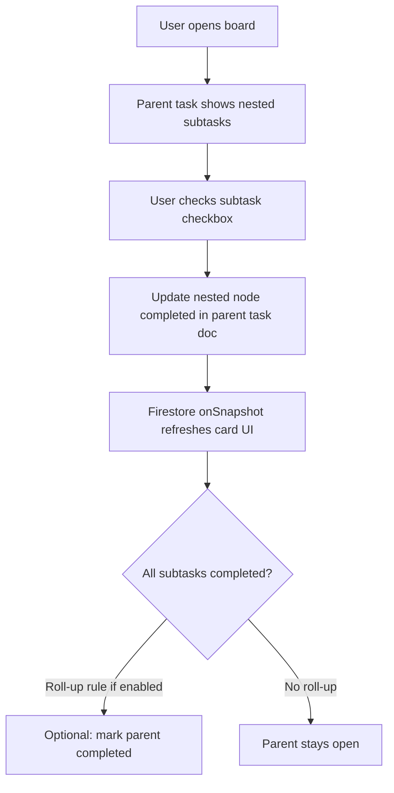
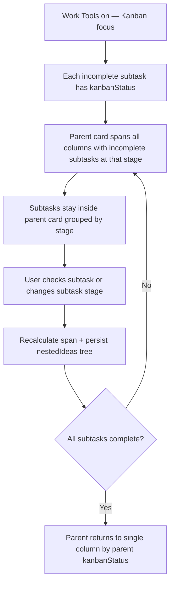
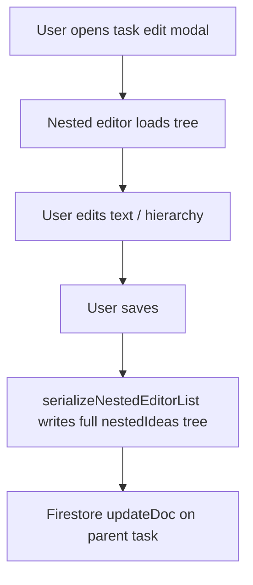
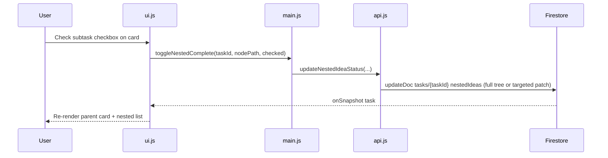

# Task Master — Subtask Management Brief

**Feature cycle:** 2026-07-15  
**Repo path:** `pages/To-Do-List/`  
**Expected live URL:** `https://xanderwiles.com/pages/To-Do-List/`  
**Status:** Decisions locked — awaiting Phase 1 approval in [`02-technical-plan.md`](./02-technical-plan.md).

---

## Summary

Today, **subtasks** (`nestedIdeas` on a parent task) are **read-only checklist notes** on the board: plain text under the parent card, editable only in the task modal. They have **no** `completed`, `archived`, `kanbanStatus`, or stable `id`. All completion, drag-reorder, list moves, and Kanban stage changes operate on **top-level task documents only**.

This feature cycle makes subtasks **actionable**: check off, reorder/move (within scope TBD), and behave coherently with **Work Tools / Kanban** — without breaking the existing board → list → task model.

---

## User problem being solved

Task Master users can break work into sub-steps, but those steps do not behave like real tasks:

| Need | Top-level task today | Subtask (`nestedIdeas`) today |
|------|---------------------|------------------------------|
| Check off a step | Yes | **No** — no checkbox, no `completed` field |
| Reorder on the board | Yes (SortableJS) | **No** — static HTML |
| Move to another list | Yes | **No** — embedded in parent doc |
| Kanban stage | Yes (`kanbanStatus`) | **No** — not in column partition logic |
| Edit text | Yes (modal) | Yes (modal editor only) |
| Multi-level hierarchy | N/A | Yes (text tree only) |

Without this feature, subtasks are **documentation inside a card**, not **trackable work**. Users who plan in nested steps must mentally track progress or duplicate items as top-level tasks.

**Kanban compounds the problem:** a parent sits in one column while its sub-steps may represent work at different pipeline stages. The product has no rule for whether the parent should stretch, roll up status, or whether subtasks get independent stages.

---

## Target audience

| Audience | Need |
|----------|------|
| **Primary (you)** | Actionable subtasks on design-doc imports and day-to-day project work |
| **Work Tools users** | Clear rules when Kanban is on — no confusing parent/subtask stage conflicts |
| **Casual list users** | Checkbox subtasks without forced Kanban complexity |
| **Story Manager skin** | Same subtask behavior via shared modules (if in scope — see Q12) |

---

## Goals

1. Subtasks can be **checked off** (and unchecked) from the board and/or expanded card UI.
2. Subtasks can be **reordered** (and possibly re-parented) within rules locked in Q3–Q6.
3. **Multi-level** nested subtasks (sub-sub-tasks) behave consistently to an agreed depth (Q4).
4. **Kanban integration** follows an explicit model (Q5–Q7) — no ambiguous parent-in-one-column vs subtask-in-another.
5. **Data survives** refresh, sync, JSON backup/restore, and task import.
6. **No regression** when Work Tools is off (subtask checkboxes still work; Kanban-specific UI hidden).

---

## Non-goals (v1 — locked)

Out of scope per locked decisions:

- Subtasks as **fully independent top-level task documents** (Q1=A embedded only)
- **Auto roll-up** of parent completion (Q8=C prompt only; Q3=A independent)
- **Blocking** parent Finished when subtasks open (Q7=A)
- Subtasks visible in **compact view** (Q11=A)
- **Cross-list drag** of individual subtasks without promoting to top-level task
- **WIP limits / swimlanes** per subtask
- **Real-time collaboration** on subtask edits
- **Cloud Functions** for rollup automation
- Subtask **images**, **glow**, or **automation** parity with parent tasks
- Automated test suite (repo has none today — manual plan only unless you add CI later)

---

## Current state (codebase snapshot)

| Area | Today |
|------|--------|
| **Subtask storage** | Embedded `nestedIdeas: [{ text, nestedIdeas }]` on `users/{uid}/tasks/{taskId}` |
| **Subtask fields** | `text` (+ optional leak: `tempId`, `aiRawInputSubtask`) — **no** `completed`, `id`, `kanbanStatus` |
| **Board render** | `ui.js` `generateNestedIdeasHtml()` — escaped text in `.nested-idea-display-item` |
| **Compact view** | `body.compact-view .nested-ideas-list { display: none }` — subtasks hidden |
| **Completion API** | `api.js` `toggleTaskComplete(taskId)` — top-level only |
| **Kanban partition** | `kanban.js` `partitionListTasksByStage()` — `list.taskIds` → task docs only |
| **Drag** | SortableJS on `.task-card` (one card = one Firestore task) |
| **Edit modal** | `serializeNestedEditorList()` / indent-outdent in editor — hierarchy only, not lifecycle |
| **Import** | `task-import.js` `normalizeNestedIdeas()` — text-only tree |
| **Search** | `performSearch()` matches parent `task.text` only — not nested text |
| **CSV export** | Reads `node.completed` on nested nodes but field is never set |

**Key modules:** `ui.js`, `api.js`, `kanban.js`, `main.js`, `store.js`, `utils.js`, `task-import.js`, `index.html`, `style.css`.

---

## Expected user flow (high level)

### Enable and use subtask checkboxes (Work Tools off)

### Subtask interaction in Kanban focus (locked: Q5=C stretch)

### Edit modal (existing + extended)

### System sequence — check off subtask (recommended embedded-node path)

---

## Product surfaces (locked)

| Surface | Behavior |
|---------|----------|
| **Board card** | Interactive subtask rows: checkbox + sibling drag handle; max 3 levels |
| **Kanban card** | Parent **spans columns** with incomplete subtasks; subtasks grouped by stage inside card |
| **Compact view** | Subtasks **hidden** (unchanged) |
| **Edit modal** | Hierarchy editor unchanged; `completed` visible on save |
| **Search** | Matches subtask text recursively |
| **Import / backup** | Round-trip `id`, `completed`, `completedAt`, `kanbanStatus` |

---

## Success criteria

- User can check off a subtask without opening the edit modal.
- Checked state persists across reload and devices (same Google account).
- Kanban mode does not show contradictory parent/subtask stages (per locked model).
- Deep nesting (3+ levels) has documented, testable behavior.
- Work Tools off: no broken Kanban UI; subtask checkboxes still work.
- JSON backup/restore preserves subtask state.
- No data loss for existing text-only `nestedIdeas` trees on upgrade.

---

## Definition of done (high level)

- [x] Data model locked in `01-questions-and-decisions.md`
- [ ] Subtask check/uncheck implemented per locked rules
- [ ] Subtask reorder/move implemented per locked scope
- [ ] Kanban behavior documented and implemented per Q5–Q7
- [ ] Multi-level nesting rules implemented and tested
- [ ] Migration/default for existing tasks without subtask `id`/`completed`
- [ ] JSON backup/restore + import updated
- [ ] Manual test checklist executed
- [ ] Rollback path documented
- [ ] Accessibility pass on new checkboxes / controls

Full engineering checklist: [`02-technical-plan.md`](./02-technical-plan.md).

---

## Next step

Approve **Phase 1** in [`02-technical-plan.md`](./02-technical-plan.md) — schema + migration only, no UI.
