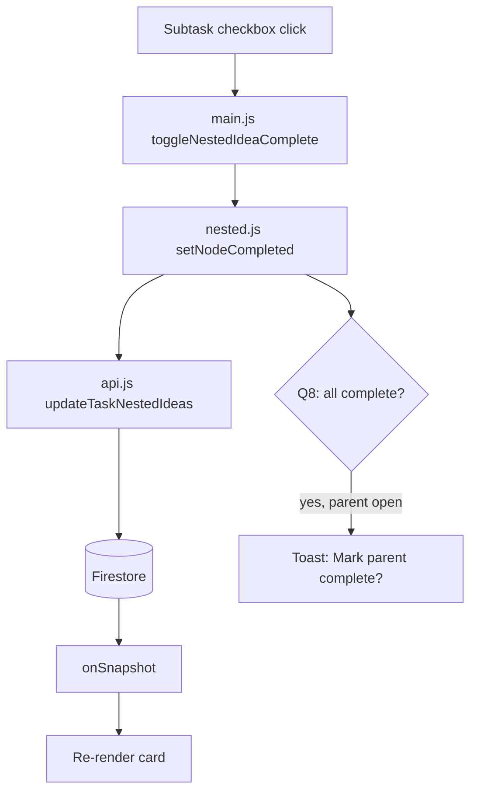
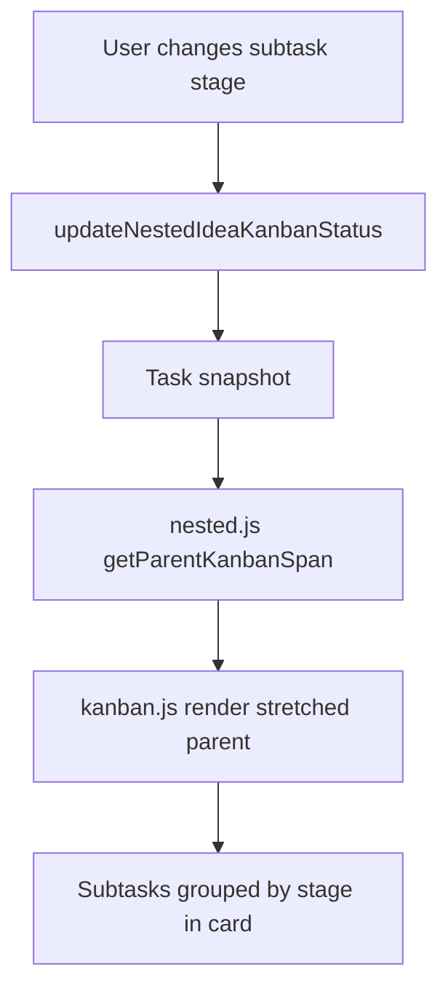

# Task Master — Subtask Management Technical Plan

**Feature cycle:** 2026-07-15  
**Status:** **Ready for implementation** — decisions locked in [`01-questions-and-decisions.md`](./01-questions-and-decisions.md). Awaiting Phase 1 approval.  
**Owner:** Signed-in Google user (existing Task Master auth model)

---

## Locked decisions (summary)

| ID | Decision | Status |
|----|----------|--------|
| Q1 | **A** — Enrich embedded `nestedIdeas` nodes (`id`, `completed`, `completedAt`, `kanbanStatus`) | `Locked` |
| Q2 | **A** — Persistent `id` on every node | `Locked` |
| Q3 | **A** — Parent and subtask completion fully independent | `Locked` |
| Q4 | **B** — Max 3 levels on board; deeper nodes modal-only | `Locked` |
| Q5 | **C** — Parent card **stretches/spans** Kanban columns with incomplete subtasks at different stages | `Locked` |
| Q6 | Parent stretches / spans columns (same as Q5) | `Locked` |
| Q7 | **A** — Parent Finished independent of subtask completion | `Locked` |
| Q8 | **C** — Prompt “Mark parent complete?” when all subtasks checked (no auto-complete) | `Locked` |
| Q9 | **A** — Reorder siblings only on normal board | `Locked` |
| Q10 | **A** — Search matches subtask text | `Locked` |
| Q11 | **A** — Subtasks stay hidden in compact view | `Locked` |
| Q12 | **A** — Task Master + Story Manager parity | `Locked` |
| Q13 | **A** — Full JSON backup/restore + import round-trip | `Locked` |
| Q14–Q15 | Auth and Firestore rules unchanged | `Locked` |

**Architecture path:** Embedded enriched nodes only (Path A). Promoted subtask documents (Path B) is **out of scope**.

---

## Problem statement (technical)

`nestedIdeas` is a recursive array of `{ text, nestedIdeas }` on the parent task document. The UI treats it as **display-only HTML** (`generateNestedIdeasHtml`). Lifecycle handlers accept **top-level `taskId`** only.

Subtasks cannot be checked, reordered, or participate in Kanban because:

1. No `completed`, `id`, or `kanbanStatus` on nested nodes.
2. No DOM controls (checkbox, drag handle) on board/Kanban.
3. Kanban partition places one parent card in one column by parent `kanbanStatus` only.

---

## Data model (locked)

```typescript
// users/{uid}/tasks/{parentTaskId}
interface TaskDocument {
  text: string;
  completed: boolean;
  archived: boolean;
  kanbanStatus: 'new' | 'under_review' | 'almost_done' | 'finished';
  nestedIdeas: NestedIdeaNode[];
  // ... existing fields unchanged
}

interface NestedIdeaNode {
  id: string;                    // NEW — stable, generateId()
  text: string;
  completed: boolean;            // NEW — default false
  completedAt: number | null;    // NEW
  kanbanStatus: KanbanStage;     // NEW — required for Q5=C; default from parent on migrate
  nestedIdeas: NestedIdeaNode[];
}
```

**Writes:** `updateDoc(tasks/{parentId}, { nestedIdeas: updatedTree, updatedAt })`  
**Reads:** Unchanged — single task snapshot includes full tree.

**Completion independence (Q3=A):** Toggling parent `completed` does not change subtask `completed`. Toggling subtasks does not change parent `completed` except via explicit user action on the Q8 prompt.

**Finished column (Q7=A):** Parent may be dragged to Finished while subtasks remain incomplete. No block, no cascade.

---

## Kanban stretch model (Q5=C, Q6)

### Behavior

When Work Tools Kanban is active:

1. Each **incomplete** nested node has its own `kanbanStatus` (stage).
2. The **parent card** is rendered **once** and **spans** every column that contains at least one incomplete subtask at that stage.
3. **Completed** subtasks do not contribute to column span (they remain visible on the parent card body, struck through).
4. Subtasks are **not** separate column cards — they stay inside the spanned parent card, grouped or labeled by stage within the card body.
5. When all subtasks are complete, the parent behaves like today: one column by parent `kanbanStatus`.

### Span calculation (proposed)

```javascript
// nested.js
getParentKanbanSpan(parentTask) → {
  columns: KanbanStage[];  // ordered stages with ≥1 incomplete subtask
  startIndex: number;      // for CSS grid-column
  endIndex: number;        // exclusive
}
```

- If no incomplete subtasks: `columns = [parent.kanbanStatus]` — single column, current behavior.
- If incomplete subtasks span stages `new` + `under_review`: parent card `grid-column: span 2` starting at `new` column index.

### Subtask stage changes

- **Drag subtask row** to a stage drop zone inside the spanned card, **or** a per-subtask stage control (dropdown / mini drag) — see assumptions below.
- Updates `nestedIdeas[nodeId].kanbanStatus` → recalculates span → re-renders Kanban row.

### Partition change

`partitionListTasksByStage()` today returns `Map<stage, taskId[]>`. For Q5=C:

- Kanban **layout** is column-based; **parent tasks** are placed in a **stretch row** above or within the column grid (one DOM node per parent, not duplicated per column).
- Alternative: parent card lives in the **leftmost spanned column** with `grid-column-end: span N`.

**Implementation detail deferred to Phase 4** — locked product intent is stretch/span, not duplicate parent per column.

---

## Architecture overview

```
┌────────────────────────────────────────────────────────────────────────────┐
│  Browser — /pages/To-Do-List/                                               │
│  ┌──────────────┐  ┌──────────────┐  ┌──────────────┐  ┌───────────────┐ │
│  │ index.html   │  │ style.css    │  │ main.js      │  │ ui.js         │ │
│  │ nested UI    │  │ .nested-*    │  │ globals:     │  │ renderNested  │ │
│  │ checkboxes   │  │ kanban-span  │  │ toggleNested*│  │ Ideas (board  │ │
│  └──────┬───────┘  └──────────────┘  │ roll-up toast│  │ + kanban)     │ │
│         │           ┌──────────────┐  │              │  └───────┬───────┘ │
│         └───────────┤ nested.js    │◄─┤ api.js       │          │         │
│                     │ (NEW)        │  │ updateNested │  ┌───────┴───────┐ │
│                     └──────────────┘  └──────┬───────┘  │ kanban.js     │ │
│                                              │         │ span layout   │ │
│                     store.js ◄── onSnapshot ─┴─────────┴───────────────┘ │
└────────────────────────────────────────────────────────────────────────────┘
                                        │
                                        ▼
┌────────────────────────────────────────────────────────────────────────────┐
│  Firestore: users/{uid}/tasks/{taskId}.nestedIdeas[] (enriched nodes)        │
└────────────────────────────────────────────────────────────────────────────┘
```

### Data flow — check subtask



### Data flow — Kanban stretch (Phase 4)



---

## Relevant existing files

| File | Relevance |
|------|-----------|
| `pages/To-Do-List/ui.js` | `generateNestedIdeasHtml`, board/Kanban render, editor serialize |
| `pages/To-Do-List/api.js` | `toggleTaskComplete`, `updateKanbanStatus` — pattern for nested helpers |
| `pages/To-Do-List/kanban.js` | Partition + stretch layout (Phase 4) |
| `pages/To-Do-List/main.js` | Handlers, migration on snapshot, backup/restore, search |
| `pages/To-Do-List/store.js` | Task state |
| `pages/To-Do-List/utils.js` | `generateId`, `parseNestedMarkdown` |
| `pages/To-Do-List/task-import.js` | `normalizeNestedIdeas` |
| `pages/To-Do-List/style.css` | Nested rows, kanban-span, compact hide |
| `pages/To-Do-List/sw.js` | Cache bump + precache `nested.js` |

---

## New files

| File | Purpose |
|------|---------|
| `pages/To-Do-List/nested.js` | Pure helpers: `migrateNestedTree`, `findNodeById`, `setNodeCompleted`, `setNodeKanbanStatus`, `reorderSiblings`, `getParentKanbanSpan`, `allSubtasksComplete`, `searchNestedText` |
| `pages/To-Do-List/docs/.../04-manual-test-checklist.md` | QA at implementation time |

---

## Existing files to change (by phase)

| File | Changes |
|------|---------|
| `nested.js` | **NEW** — Phase 1 |
| `main.js` | Migration on task merge; globals; Q8 toast; search — Phases 1, 2, 5 |
| `api.js` | `updateTaskNestedIdeas`, `toggleNestedIdeaComplete`, `updateNestedIdeaKanbanStatus` — Phases 2, 4 |
| `ui.js` | Interactive nested render; Sortable siblings; depth cap — Phases 2, 3 |
| `kanban.js` | Stretch layout + subtask stage UI — Phase 4 |
| `task-import.js` | `id`, `completed`, `kanbanStatus` on import — Phase 5 |
| `style.css` | Checkbox rows, completed styles, kanban-span — Phases 2, 4 |
| `index.html` | Roll-up toast markup if needed — Phase 2 |
| `sw.js` | Cache version bump — each deploy phase |

---

## API changes

### Firestore (client SDK)

| Operation | Path | Payload |
|-----------|------|---------|
| Toggle subtask complete | `updateDoc(tasks/{parentId})` | `{ nestedIdeas, updatedAt }` |
| Reorder subtasks | same | `{ nestedIdeas, updatedAt }` |
| Change subtask stage | same | `{ nestedIdeas, updatedAt }` |
| User accepts Q8 prompt | same | `{ completed, completedAt, kanbanStatus? }` per existing Finished sync |

**No new collections.**

### Module exports

```javascript
// nested.js
migrateNestedTree(nestedIdeas, parentKanbanStatus?)
findNodeById(tree, nodeId)
setNodeCompleted(tree, nodeId, completed)
setNodeKanbanStatus(tree, nodeId, status)
reorderSiblings(tree, parentNodeId, fromIndex, toIndex)
getParentKanbanSpan(parentTask)
allSubtasksComplete(tree)
taskMatchesNestedSearch(task, query)

// api.js
updateTaskNestedIdeas(taskId, nestedIdeas)
toggleNestedIdeaComplete(taskId, nodeId, completed)
updateNestedIdeaKanbanStatus(taskId, nodeId, kanbanStatus)
```

---

## Remaining assumptions (resolve during implementation)

| # | Assumption | Default if not overridden |
|---|------------|---------------------------|
| A1 | **Initial subtask `kanbanStatus`** on migrate/import | Inherit parent task’s `kanbanStatus` |
| A2 | **How user moves subtask between stages** | Per-subtask stage dropdown on Kanban card (v1); drag-between-columns deferred |
| A3 | **Subtask grouping inside spanned card** | Section headers per stage (`New`, `Under review`, …) for incomplete items |
| A4 | **Parent with no subtasks in Kanban** | Unchanged — single column by parent `kanbanStatus` |
| A5 | **Q8 prompt** | Non-blocking toast with “Mark complete” / “Dismiss”; no auto-complete |
| A6 | **Q8 + Q7 interaction** | Prompt offers parent complete only; does not force Finished column if user declines |
| A7 | **Depth > 3 on board** | Show levels 1–3; `+N more in editor` for deeper |
| A8 | **Concurrent modal save vs checkbox** | Last write wins; strip `tempId` on all save paths |
| A9 | **Normal board (non-Kanban)** | Subtasks show checkboxes + sibling reorder only; no per-subtask stage UI |

---

## Edge cases

| Case | Behavior |
|------|----------|
| Legacy tasks without node fields | `migrateNestedTree` on load (idempotent) |
| Parent completed, subtask open | Allowed (Q3=A, Q7=A) |
| All subtasks complete, parent open | Q8 prompt once per transition to “all complete” |
| Linked parent in two lists | Subtask state on parent doc — shared everywhere |
| Compact view | Subtasks hidden (Q11=A) — checkboxes only in expanded/normal view |
| Work Tools off | Checkboxes + reorder work; no stretch/Kanban subtask stages |
| Import text-only subtasks | Generate `id`, `completed: false`, `kanbanStatus` from parent |

---

## Phased implementation

### Phase 1 — Schema + migration (no UI) ← **proposed first step**

- Create `nested.js` with `migrateNestedTree` and core tree walkers
- Run migration when tasks merge from `onSnapshot` (assign `id`, `completed: false`, `completedAt: null`, `kanbanStatus` from parent)
- Strip `tempId` from Firestore on editor save and migrate
- Extend JSON backup/restore to round-trip new fields
- **No visible UI change** except data shape in Firestore after first load

### Phase 2 — Checkboxes on board

- Interactive nested HTML with checkboxes (depth cap Q4)
- `toggleNestedIdeaComplete` + completed styles (D1–D4)
- Q8 toast when `allSubtasksComplete` and parent still open

### Phase 3 — Sibling reorder (normal board)

- SortableJS on nested lists per expanded card
- `reorderSiblings` via API

### Phase 4 — Kanban stretch (Q5=C)

- `getParentKanbanSpan` + CSS grid span layout in `kanban.js`
- Subtask stage controls + `updateNestedIdeaKanbanStatus`
- Subtasks grouped by stage inside spanned parent card

### Phase 5 — Search, import, CSV polish

- `performSearch` includes nested text (Q10)
- `task-import.js` normalization (Q13)
- CSV export `completed` values (D7)

---

## Manual tests (high level)

- [ ] Phase 1: Reload assigns `id`/`completed`/`kanbanStatus`; backup/restore round-trips
- [ ] Phase 2: Check/uncheck persists; Q8 prompt appears; no modal on checkbox click
- [ ] Phase 3: Sibling reorder persists; ids stable
- [ ] Phase 4: Parent spans correct columns; subtask stage change updates span
- [ ] Phase 5: Search finds subtask text; import preserves fields
- [ ] Regression: Work Tools off, compact view hides subtasks, Story Manager skin

Full checklist: create `04-manual-test-checklist.md` at Phase 2 start.

---

## Rollback plan

1. Git revert feature commits
2. Redeploy previous Vercel build
3. Extra fields harmless to old clients if revert mid-rollout
4. Bump `sw.js` cache name

---

## Definition of done

- [x] Q1–Q13 locked
- [ ] `nested.js` + idempotent migration
- [ ] Board checkboxes + Q8 prompt
- [ ] Sibling reorder (Q9)
- [ ] Kanban stretch (Q5=C)
- [ ] Search + import + backup round-trip
- [ ] Manual test checklist executed
- [ ] `sw.js` cache bump

---

## Next step

**Awaiting approval of Phase 1** (schema + migration only). See summary in implementation handoff message.
