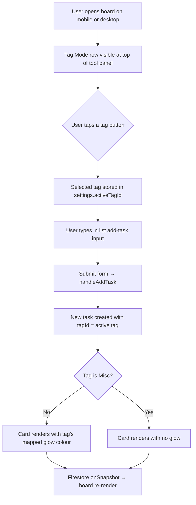
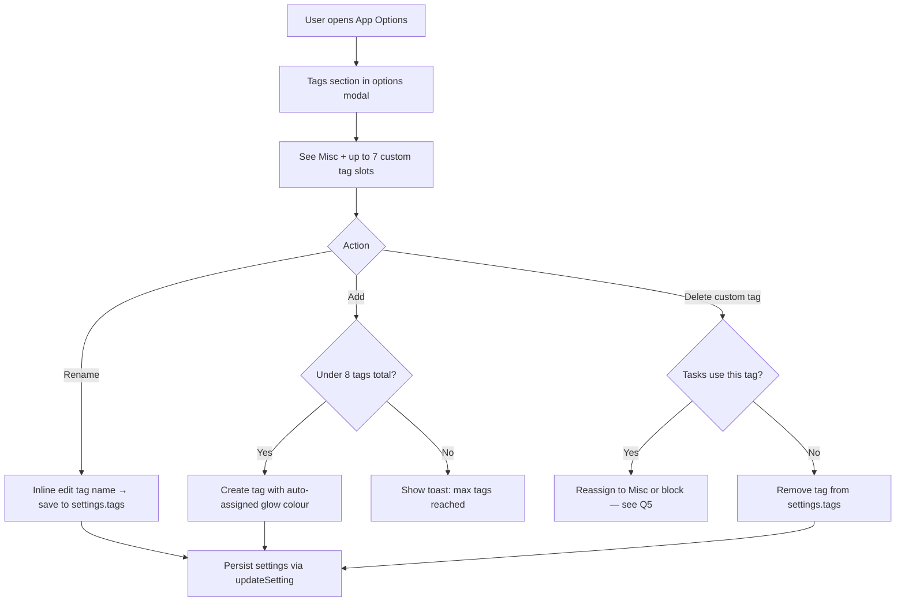
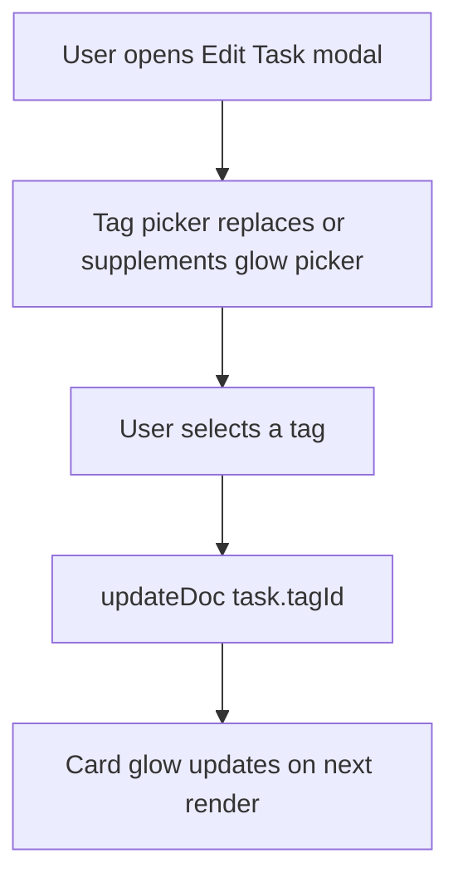
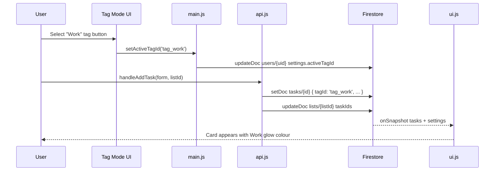
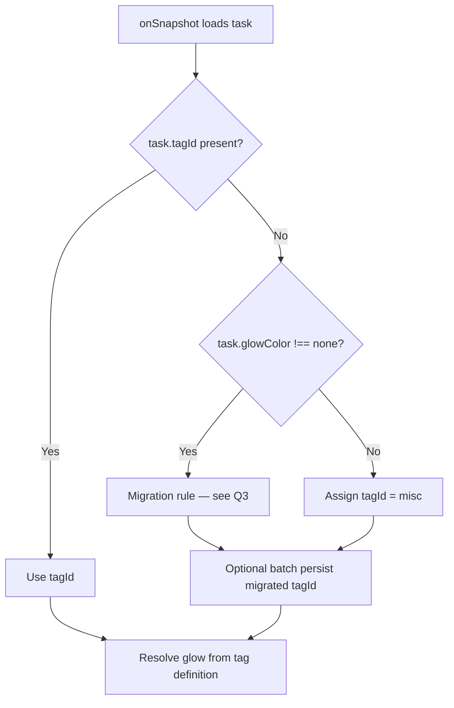

# Task Master — Task Tags Brief

**Feature cycle:** 2026-07-21  
**Repo path:** `pages/To-Do-List/`  
**Expected live URL:** `https://xanderwiles.com/pages/To-Do-List/`  
**Status:** Decisions locked — awaiting Phase 1 approval in [`02-technical-plan.md`](./02-technical-plan.md).

---

## Summary

Task Master already supports a **card glow effect** (`glowColor` on each task) with six preset colours plus “none.” In practice, users rarely open the edit modal to set glow manually — the feature is underused.

This cycle introduces a **tag system** that replaces glow as the primary mental model:

- Every task belongs to **exactly one tag** (`tagId`) — **locked Q1**.
- Tags are **user-managed** in settings, with a hard cap of **8 total** (1 built-in **Misc** + up to **7 custom**). User creates custom tags via **+ Add tag** with a required name — **locked Q10**.
- **Misc** is the default tag: no glow. All other tags map to one of **7 glow colours** (6 existing + new pink `#ec4899`) — **locked Q4**.
- A compact **Tag Mode** row in the bottom tool panel lets the user pick which tag new tasks receive. One tag is always selected; selection **persists in Firestore** — **locked Q11**.
- All existing tasks migrate to **Misc**; legacy `glowColor` is **ignored** — **locked Q3**.

The glow visual on cards becomes a **derived presentation** of the task’s tag, not a separate concept users must discover in a modal.

---

## User problem being solved

| Pain today | Impact |
|------------|--------|
| Glow is buried in the **Edit Task** modal | Users forget it exists; cards stay visually uniform |
| No quick “what kind of task am I adding?” affordance | Capture flow is untyped — everything lands as generic work |
| Glow has no label or meaning | Colour alone does not encode project/category intent |
| No board-level “mode” for intake | User must retag each task after creation |

Users who want visual grouping (urgent, client, personal, etc.) need a **fast, always-visible** control — not a hidden colour picker.

---

## Target audience

| Audience | Need |
|----------|------|
| **Primary (you)** | One-tap categorisation while adding tasks on mobile |
| **Power users** | Named tags with consistent glow colours across lists and boards |
| **Work Tools / Kanban users** | Tags orthogonal to pipeline stage — colour meaning without changing `kanbanStatus` |
| **Story Manager skin** | Same shared modules — behaviour should be deliberate (see Q12) |

---

## Goals

1. **Tag Mode bar** — slim row of coloured tag buttons at the top of `.app-header`, above existing tool rows; one tag always selected; minimal height on ≤500px mobile dock.
2. **Default Misc** — all existing tasks and new tasks (until user picks another tag) use Misc (no glow).
3. **Managed tags** — user can create, rename, and reorder up to 7 custom tags; Misc is permanent and non-deletable.
4. **Glow mapping** — each non-Misc tag owns exactly one glow colour; card border/box-shadow derived from tag at render time.
5. **New task intake** — `handleAddTask` assigns the currently selected tag from Tag Mode.
6. **Persistence** — tag definitions in user settings; `tagId` on each task; survives sync, backup/restore, and import.
7. **No regression** — Kanban, multi-edit, search, compact view, and linked tasks continue to work.

---

## Non-goals (v1 — locked)

- **Multiple tags per task** (Q1=A)
- **Tag-based board filtering** (Q7=A — intake only)
- **Subtask-level tags** (`nestedIdeas` stay unchanged)
- **Per-board tag palettes** (tags are account-global)
- **Legacy glow migration** — existing `glowColor` not preserved (Q3=A)
- **On-card tag labels** — glow only (Q9=B)
- **Cloud Functions** or server-side validation
- **Automated test suite** (manual checklist only)
- **AI → user tag assignment** — `aiTags` stays separate (Q13=A)

---

## Current state (codebase snapshot)

| Area | Today |
|------|--------|
| **Task glow field** | `glowColor: 'none' \| '#ef4444' \| '#f97316' \| '#eab308' \| '#22c55e' \| '#3b82f6' \| '#a855f7'` on `users/{uid}/tasks/{taskId}` |
| **Card render** | `ui.js` `createTaskElement()` — inline `boxShadow` + `borderColor` when `glowColor !== 'none'` |
| **Single edit** | Edit modal `#glow-color-options` — immediate `updateDoc` on click |
| **Multi edit** | `#multi-glow-color-options` — batch `writeBatch` in `main.js` |
| **Add task** | `api.js` `handleAddTask()` — always `glowColor: 'none'` |
| **Import** | `task-import.js` `normalizeGlowColor()` + `VALID_GLOW_COLORS` |
| **Backup** | `main.js` `triggerBackupDownload()` — includes `glowColor` per task |
| **CSV export** | Columns “Glow Effect” / “Glow Color” |
| **Tool panel** | `.app-header` — multi-select bar, then `header-row-1/2/3`; fixed bottom dock on ≤500px |
| **Slim chrome** | `ui.js` `layoutSlimChrome()` — measures header height → `--slim-bottom-clearance` |
| **User settings** | `users/{uid}.settings` — merged into `store.js` `appData.settings` |
| **AI tags** | `aiTags` on task from `summariseTask()` — not shown in UI |

**Key modules:** `index.html`, `ui.js`, `api.js`, `main.js`, `store.js`, `task-import.js`, `style.css`, `sw.js`.

**Glow colours (7 + none):** red, orange, yellow, green, blue, purple, **pink `#ec4899`** — plus `none` for Misc.  
**Tag cap:** 8 tags = 1 Misc + 7 custom (Q4=C).

---

## Expected user flow

### Tag Mode — add a new task

### Manage tags (settings)

### Change tag on existing task

### System sequence — new task with active tag

### Legacy migration (existing users)

---

## Product surfaces (proposed)

| Surface | Behavior |
|---------|----------|
| **Tag Mode row** | Top of `.app-header`; horizontal scroll on narrow screens; one selected; Misc button neutral/grey |
| **Task card** | Glow derived from tag (Misc = no glow); no on-card label (Q9=B) |
| **Edit modal** | Tag picker replaces glow picker (Q6=A) |
| **Multi-edit modal** | Batch tag assignment (Q8=A) |
| **Options modal** | Tag management: rename, add, delete (within limits) |
| **Import / backup** | Round-trip `tagId` + `settings.tags` |
| **Kanban** | Tags unchanged by stage moves; glow still visible on cards |

---

## Success criteria

- User can select a tag in Tag Mode without opening settings or a modal.
- New tasks inherit the selected tag on first save.
- Misc tasks show no glow; coloured tags show the correct mapped glow.
- All existing tasks become Misc after upgrade; legacy glow is not preserved (Q3=A).
- Tag Mode row adds ≤1 compact row to mobile dock; `layoutSlimChrome()` still clears list content.
- JSON backup/restore preserves tags and task `tagId`.
- No data loss for existing `glowColor` values during migration.

---

## Definition of done (high level)

- [x] Decisions locked in `01-questions-and-decisions.md`
- [ ] Tag schema + migration implemented
- [ ] Tag Mode UI in tool panel
- [ ] Tag management in options modal
- [ ] Edit + multi-edit tag assignment
- [ ] Card glow derived from tag
- [ ] Backup/restore/import/export updated
- [ ] Manual test checklist executed
- [ ] Rollback path documented
- [ ] Accessibility pass on Tag Mode controls

Full engineering checklist: [`02-technical-plan.md`](./02-technical-plan.md).

---

## Next step

Approve **Phase 1** (schema + migration + card glow resolver, no Tag Mode UI yet) in [`02-technical-plan.md`](./02-technical-plan.md).
