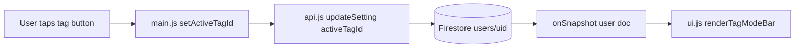
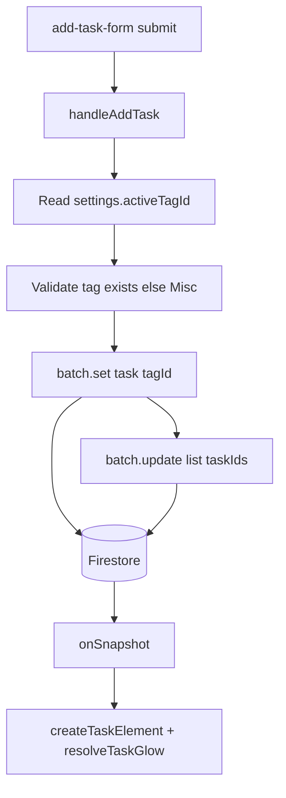
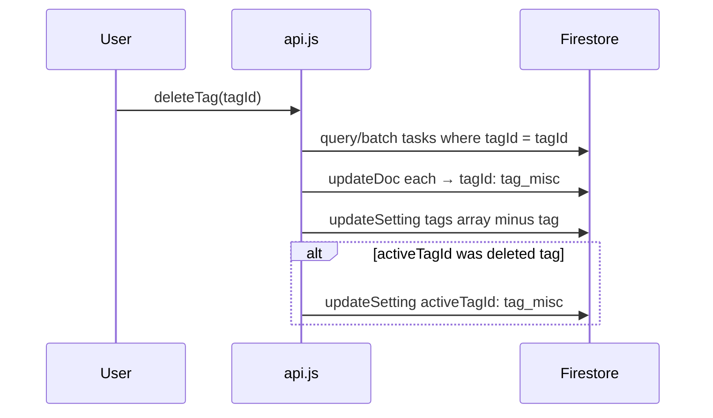
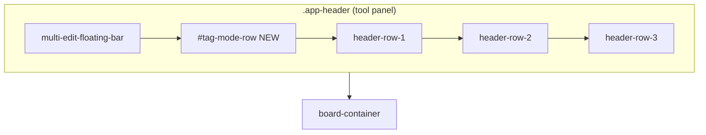
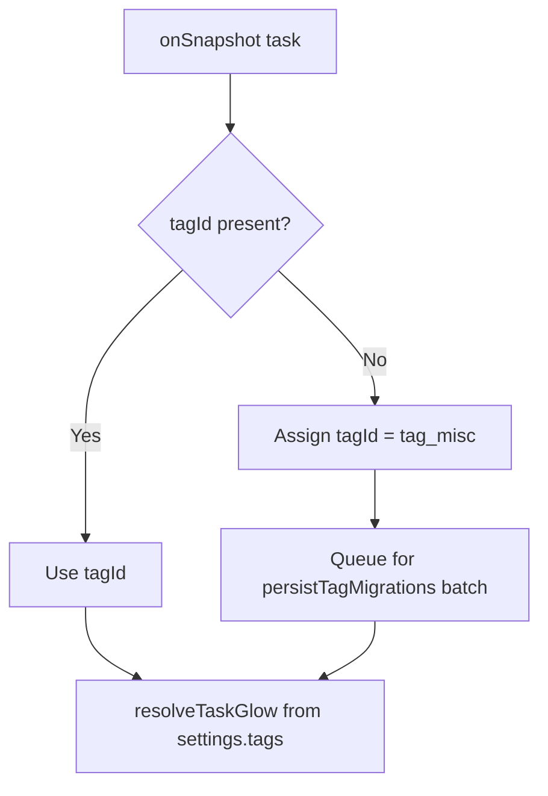
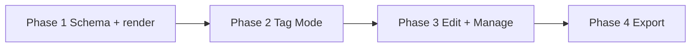

# Task Master — Task Tags Technical Plan

**Feature cycle:** 2026-07-21  
**Status:** **Ready for implementation** — decisions locked in [`01-questions-and-decisions.md`](./01-questions-and-decisions.md). Awaiting Phase 1 approval.  
**Owner:** Signed-in Google user (existing Task Master auth model)

---

## Locked decisions (summary)

| ID | Decision | Status |
|----|----------|--------|
| Q1 | **A** — One `tagId` per task; glow derived at render | `Locked` |
| Q2 | **A** — `tagId` canonical; stop writing `glowColor` after cutover | `Locked` |
| Q3 | **A** — All existing tasks → Misc; **ignore** legacy `glowColor` | `Locked` |
| Q4 | **C** — Add **7th glow colour** `#ec4899` (pink) to palette | `Locked` |
| Q5 | **A** — Delete tag → batch-reassign tasks to Misc | `Locked` |
| Q6 | **A** — Replace Edit Task glow picker with tag picker | `Locked` |
| Q7 | **A** — Tag Mode = **intake only**; no board filter | `Locked` |
| Q8 | **A** — Multi-edit batch `tagId` assignment | `Locked` |
| Q9 | **B** — Glow only on cards; no on-card label | `Locked` |
| Q10 | **A** — No placeholder tags; user names on **+ Add tag** | `Locked` |
| Q11 | **A** — Persist `settings.activeTagId` in Firestore (synced) | `Locked` |
| Q12 | **A** — Task Master + Story Manager parity | `Locked` |
| Q13 | **A** — `aiTags` independent | `Locked` |
| Q14 | **A** — Search matches tag display name | `Locked` |
| D1–D10 | Constants, limits, auth, cache bump — see questions doc | `Locked` |

**Architecture path:** `tagId` on tasks + `settings.tags` / `settings.activeTagId` on user doc. Glow is a **derived visual** from tag definition. Legacy `glowColor` field retained on documents but not written after cutover.

---

## Problem statement (technical)

`glowColor` is a per-task Firestore field with seven valid values (`none` + 6 hex colours). It is:

1. Set only from the **Edit Task** modal or **Multi-Edit** modal — not at capture time.
2. Applied in `createTaskElement()` via inline styles — no shared resolver.
3. Always `'none'` on `handleAddTask()` — new tasks never get glow at creation.
4. Unknown to search, backup semantics, and user mental model as a **category**.

The product goal is to promote glow to a **tag-driven** system: named, managed tags in user settings; `tagId` on tasks; an always-visible **Tag Mode** bar for intake.

---

## Data model (locked)

### Tag definition (user settings)

```typescript
// users/{uid}.settings
interface TagDefinition {
  id: string;                  // e.g. 'tag_misc', 'tag_abc123'
  name: string;                // display name, max 24 chars (D4); required on create (Q10)
  glowColor: string | null;    // null = Misc (no glow); else hex from GLOW_PALETTE
  order: number;               // stable sort for Tag Mode bar
}

interface TagsSettings {
  tags: TagDefinition[];       // starts [Misc]; max 8 (1 Misc + 7 custom)
  activeTagId: string;         // Tag Mode selection; default 'tag_misc' (Q11)
}
```

**Built-in Misc tag (D1):**

```javascript
export const MISC_TAG_ID = 'tag_misc';

export const DEFAULT_MISC_TAG = {
  id: MISC_TAG_ID,
  name: 'Misc',
  glowColor: null,
  order: 0
};
```

### Task document

```typescript
// users/{uid}/tasks/{taskId}
interface TaskDocument {
  // ... existing fields
  tagId: string;               // required on new writes; default 'tag_misc' on read if missing
  glowColor?: string;          // LEGACY — not written after cutover (Q2); ignored on read (Q3)
}
```

### Glow colour palette (Q4=C — 7 colours + none)

```javascript
// tags.js
export const GLOW_PALETTE = [
  '#ef4444', // red
  '#f97316', // orange
  '#eab308', // yellow
  '#22c55e', // green
  '#3b82f6', // blue
  '#a855f7', // purple
  '#ec4899'  // pink — NEW 7th colour (A1; confirm or override before Phase 1)
];

export const VALID_GLOW_COLORS = new Set(['none', ...GLOW_PALETTE]);
```

Each custom tag is assigned **one palette colour** at creation. Colours already used by another tag are unavailable until that tag is deleted. Misc uses `glowColor: null`.

### Glow resolution (render time)

```javascript
// tags.js
export function resolveTaskGlow(task, tagsById) {
  const tag = tagsById[task.tagId] ?? tagsById[MISC_TAG_ID];
  const color = tag?.glowColor;
  if (!color) return null;
  return color; // same boxShadow/borderColor as today in createTaskElement()
}
```

| Rule | Behavior |
|------|----------|
| Missing `tagId` on read | Treat as Misc; lazy-write `tagId: 'tag_misc'` (Q3) |
| Legacy `glowColor` on read | **Ignored** — not migrated (Q3=A) |
| Unknown `tagId` | Fall back to Misc + `console.warn` |
| Linked tasks | One `tagId` per task doc — shared across all lists |
| Subtasks | No `tagId` on nested nodes — inherit parent card glow only |

### Tag creation flow (Q10=A)

- Fresh account: `settings.tags = [DEFAULT_MISC_TAG]` only.
- User opens **App Options → Tags** → **+ Add tag**.
- Modal/inline form requires non-empty name (≤24 chars).
- New tag gets next unused `GLOW_PALETTE` colour and `generateId()`-based id.
- Block at 8 tags total (toast).

---

## Architecture overview

```
┌─────────────────────────────────────────────────────────────────────────────┐
│  Browser — /pages/To-Do-List/  (+ Story Manager via shared assets)           │
│  ┌──────────────┐  ┌──────────────┐  ┌──────────────┐  ┌─────────────────┐ │
│  │ index.html   │  │ tags.js NEW  │  │ store.js     │  │ ui.js           │ │
│  │ #tag-mode-   │  │ resolveGlow  │  │ settings.    │  │ renderTagMode   │ │
│  │ row          │  │ GLOW_PALETTE │  │ tags         │  │ createTaskElement│ │
│  └──────┬───────┘  └──────┬───────┘  └──────┬───────┘  └────────┬────────┘ │
│         └─────────────────┴─────────────────┴────────────────────┘          │
│                                    │                                         │
│                          ┌─────────┴─────────┐                             │
│                          │ main.js           │                             │
│                          │ tag listeners     │                             │
│                          │ backup/restore    │                             │
│                          └─────────┬─────────┘                             │
│                          ┌─────────┴─────────┐                             │
│                          │ api.js            │                             │
│                          │ handleAddTask     │                             │
│                          │ tag CRUD          │                             │
│                          └─────────┬─────────┘                             │
└────────────────────────────────────┼─────────────────────────────────────────┘
                                     ▼
┌─────────────────────────────────────────────────────────────────────────────┐
│  Firestore                                                                   │
│  users/{uid}.settings.tags[]                                                 │
│  users/{uid}.settings.activeTagId                                            │
│  users/{uid}/tasks/{taskId}.tagId                                            │
└─────────────────────────────────────────────────────────────────────────────┘
```

### Data flow — Tag Mode selection (Q11=A)



### Data flow — add task with tag



### Data flow — delete tag (Q5=A)



### Component placement — tool panel



**Mobile (≤500px):** Tag Mode row sits below multi-select bar when visible, above `header-row-1`. `layoutSlimChrome()` measures full `.app-header` — no structural change needed.

---

## Existing files relevant to this feature

| File | Relevance |
|------|-----------|
| `index.html` | `.app-header`; glow sections to replace; options modal for tag management |
| `ui.js` | `createTaskElement()`, `openEditModal()`, `layoutSlimChrome()`, `renderBoard()`, search |
| `api.js` | `handleAddTask()`, `updateSetting()` |
| `main.js` | Settings hydration, multi-edit batch, backup/restore, CSV export |
| `store.js` | `appData.settings` defaults |
| `task-import.js` | `VALID_GLOW_COLORS` → move/share from `tags.js`; add `tagId` normalisation |
| `style.css` | `.app-header`, mobile dock, new `.tag-mode-*` classes |
| `sw.js` | Cache bust on deploy |
| `utils.js` | `showToast`, `generateId` |
| `kanban.js` | Uses `createTaskElement()` — tags apply automatically |
| `nested.js` | Unchanged in v1 |
| `local-ai.js` | `aiTags` unchanged (Q13) |
| `firebase-config.js` | Auth + Firestore |
| `pages/Story-Manager/index.html` | Shared app (Q12) |

### Firestore paths (no new collections)

| Path | Change |
|------|--------|
| `users/{uid}` | `settings.tags`, `settings.activeTagId` |
| `users/{uid}/tasks/{taskId}` | `tagId` field |
| `users/{uid}/lists/*` | Unchanged |
| `users/{uid}/boards/*` | Unchanged |

### APIs

**No REST API.** Client Firestore SDK only.

---

## New files

| File | Purpose |
|------|---------|
| `tags.js` | `MISC_TAG_ID`, `GLOW_PALETTE`, `VALID_GLOW_COLORS`, `resolveTaskGlow()`, `getTagsById()`, `ensureDefaultTags()`, `getNextAvailableGlowColor()`, `validateTagName()`, tag count helpers |

---

## Existing files to change

| File | Changes |
|------|---------|
| `tags.js` | **Create first** — shared constants and pure helpers |
| `store.js` | Default `settings.tags: [DEFAULT_MISC_TAG]`, `settings.activeTagId: MISC_TAG_ID` |
| `api.js` | `handleAddTask` sets `tagId`; `createTag`, `renameTag`, `deleteTag`, `setTaskTag`, `setActiveTagId` |
| `main.js` | Tag Mode listeners; settings hydration; delete-tag task batch; multi-edit tag batch; backup/restore; CSV |
| `ui.js` | `renderTagModeBar()`; `resolveTaskGlow` in `createTaskElement()`; edit/multi-edit tag pickers; options tag UI; search by tag name |
| `index.html` | `#tag-mode-row`; options Tags section; remove glow pickers |
| `task-import.js` | Import `VALID_GLOW_COLORS` from `tags.js`; accept `tagId` / `tag`; new tasks default Misc |
| `style.css` | `.tag-mode-row`, `.tag-mode-btn`, management UI |
| `sw.js` | Bump `CACHE_NAME` |

---

## API / client operations (Firestore)

| Operation | Function | Write |
|-----------|----------|-------|
| Select Tag Mode | `setActiveTagId(id)` | `updateSetting('activeTagId', id)` — **immediate Firestore write** (Q11) |
| Add tag | `createTag(name)` | `updateSetting('tags', [...])`; assign next free glow colour |
| Rename tag | `renameTag(id, name)` | Update array entry (Misc name locked) |
| Delete tag | `deleteTag(id)` | Reassign all tasks → Misc (Q5); remove from array; reset `activeTagId` if needed |
| Add task | `handleAddTask` | `tagId: activeTagId \|\| MISC_TAG_ID`; no `glowColor` write |
| Change task tag | `setTaskTag(taskId, tagId)` | `updateDoc { tagId, updatedAt }` |
| Multi-edit tag | `main.js` batch | `writeBatch` per selected id |
| Lazy migration | task `onSnapshot` | Missing `tagId` → `tag_misc`; optional `persistTagMigrations()` |

---

## Migration strategy (Q3=A)

**No glow-to-tag mapping.** All tasks without `tagId` receive `tag_misc` on read.



- `glowColor` on existing documents is **left in place** but never read for rendering.
- New writes omit `glowColor` (Q2).
- `persistTagMigrations()` follows `nested.js` pattern — batch `updateDoc` in chunks ≤500.

### Implementation phases

| Phase | Scope | UI? |
|-------|-------|-----|
| **1** | `tags.js`, `store.js` defaults, settings init, task `tagId` migration, `resolveTaskGlow` in `createTaskElement` | No Tag Mode bar yet |
| **2** | Tag Mode row, `handleAddTask` wiring, `setActiveTagId` | Yes — intake |
| **3** | Options tag management, edit modal tag picker, multi-edit batch | Yes — management |
| **4** | Backup/restore/import/CSV; remove glow UI; `sw.js` bump | Export parity |



---

## Authentication and authorization

| Concern | Approach |
|---------|----------|
| Identity | Existing Google OAuth via Firebase Auth |
| Data isolation | All reads/writes under `users/{uid}/` |
| Tag definitions | User-scoped settings |
| Firestore rules | **No change** (D8) |

---

## Security and privacy risks

| Risk | Severity | Mitigation |
|------|----------|------------|
| XSS via tag names | Medium | `escapeHtml()` on all tag labels |
| Oversized `settings.tags` | Low | Cap 8; name max 24 chars |
| Malicious import JSON | Low | Unknown `tagId` → Misc |
| Delete tag with many tasks | Medium | Batched writes; progress toast if >100 tasks |

---

## Performance risks

| Risk | Impact | Mitigation |
|------|--------|------------|
| Extra header row on mobile | Medium UX | Single compact row; horizontal scroll (D5) |
| `activeTagId` Firestore write on every tap | Low | Debounce not needed — user intent is explicit; single field write |
| Delete tag batch on large libraries | Medium | Chunk batches of 500 |
| Tag bar re-render on settings snapshot | Low | Only re-render `#tag-mode-row`, not full board when possible |

---

## Edge cases

| Case | Expected behavior |
|------|-------------------|
| `activeTagId` points to deleted tag | Reset to Misc on delete (Q5) |
| User at 8 tags tries to add | Block + toast |
| Rename/delete Misc | Disallowed |
| All 7 glow colours in use | Block new tag + toast “No colours available” |
| Task linked across lists | Single `tagId` |
| Kanban focus mode | Tag Mode row remains in dock |
| Multi-edit mixed tags | No pre-selected tag until user picks |
| Restore without `settings.tags` | Seed `[DEFAULT_MISC_TAG]` |
| Import with `glowColor` only | Assign Misc (Q3); do not auto-create tags |
| Import with `tagId` | Validate against `settings.tags`; else Misc |
| Work Tools off | Tags unaffected |
| Compact view | Tag row visible; no on-card label (Q9) |
| Offline Tag Mode select | `activeTagId` queued via IndexedDB persistence |
| Empty name on create | Block save + toast |
| Story Manager | Same tag UI (Q12) |

---

## Accessibility considerations

| Item | Approach |
|------|----------|
| Tag Mode | `role="radiogroup"`; buttons `role="radio"` `aria-checked` |
| Selected state | Visible ring + `aria-checked="true"` — not colour alone |
| Misc button | Text label always visible |
| Touch targets | Min ~28px height (D5) |
| Edit modal | Tag radiogroup or `<select>` with visible labels |
| Glow-only cards (Q9) | Tag name available in edit modal + search |

---

## Manual tests

### Tag Mode & intake

- [ ] Tag Mode row visible desktop + mobile (≤500px)
- [ ] One tag always selected
- [ ] `activeTagId` persists across reload **and second device** (Q11)
- [ ] New task gets selected `tagId`
- [ ] Misc → no glow; coloured tag → correct glow including 7th pink
- [ ] Selecting tag does **not** filter board (Q7)
- [ ] Slim chrome clearance correct

### Tag management (Q10)

- [ ] Fresh account: Misc only in settings
- [ ] + Add tag requires name
- [ ] Add up to 7 custom tags
- [ ] Block 9th tag
- [ ] Rename custom tag; block Misc rename
- [ ] Delete tag reassigns tasks to Misc (Q5)

### Edit & multi-edit

- [ ] Edit modal tag picker; glow picker removed (Q6)
- [ ] Multi-edit batch tag (Q8)
- [ ] No on-card label (Q9)

### Migration (Q3)

- [ ] Task with legacy `glowColor` → Misc (no glow preserved)
- [ ] Task without `tagId` → Misc after load

### Integration

- [ ] Search by tag name (Q14)
- [ ] JSON backup/restore round-trip
- [ ] CSV Tag Name column (D10)
- [ ] Kanban cards show glow
- [ ] Story Manager regression (Q12)

---

## Automated tests

| Type | Status |
|------|--------|
| Unit | None in repo; optional later for `tags.js` pure functions |
| E2E | None |
| Manual | Checklist above |

---

## Rollback plan

1. **Soft:** Hide tag UI; `tagId` data harmless in Firestore.
2. **Hard:** Revert git + bump `sw.js`.
3. **Data:** `tagId` / `settings.tags` ignored by old code — no deletion.
4. **Note:** Q2 stopped `glowColor` writes — rollback build won't restore glow from tags; acceptable given Q3 ignored legacy glow anyway.

---

## Definition of done

### Planning

- [x] `00-brief.md`
- [x] `01-questions-and-decisions.md` — locked
- [x] `02-technical-plan.md` — updated
- [ ] Phase 1 approved by you

### Implementation

- [ ] `tags.js` with 7-colour palette
- [ ] Settings `tags` + `activeTagId`
- [ ] Task `tagId` migration (→ Misc)
- [ ] `resolveTaskGlow` in card render
- [ ] Tag Mode row + Firestore-persisted selection
- [ ] Tag CRUD in options (+ Add tag with required name)
- [ ] Edit + multi-edit tag pickers; glow UI removed
- [ ] Search, backup, restore, import, CSV
- [ ] `sw.js` cache bump
- [ ] Manual tests + Story Manager check
- [ ] A11y spot-check on Tag Mode radiogroup

---

## Remaining assumptions (minor — safe to decide in Phase 1)

| ID | Assumption | Notes |
|----|------------|-------|
| A1 | 7th glow colour = `#ec4899` (pink) | Q4=C but no hex specified — **confirm or override before coding** |
| A2 | Glow colours assigned in palette order on tag create | First tag → red, second → orange, etc. |
| A3 | Tag colour not user-reassignable in v1 | Colour tied to creation order; delete + recreate to change |
| A4 | `activeTagId` write is immediate (no debounce) | Matches importance noted in Q11 |
| A5 | Delete-tag task batch uses in-memory `state.appData.tasks` scan | No new Firestore index |
| A6 | Options Tags UI: list + inline rename + delete confirm | Exact layout TBD in Phase 3 |

---

## Next step

**Awaiting your approval** to begin **Phase 1** (`tags.js` → `store.js` → migration + `createTaskElement` glow resolver). No UI until Phase 2.
