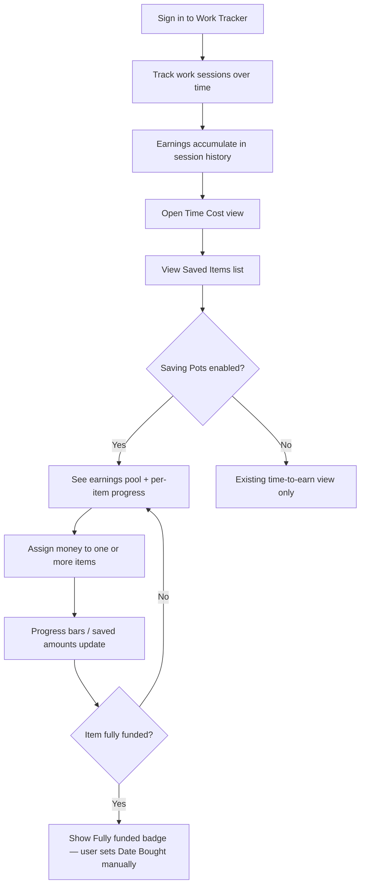
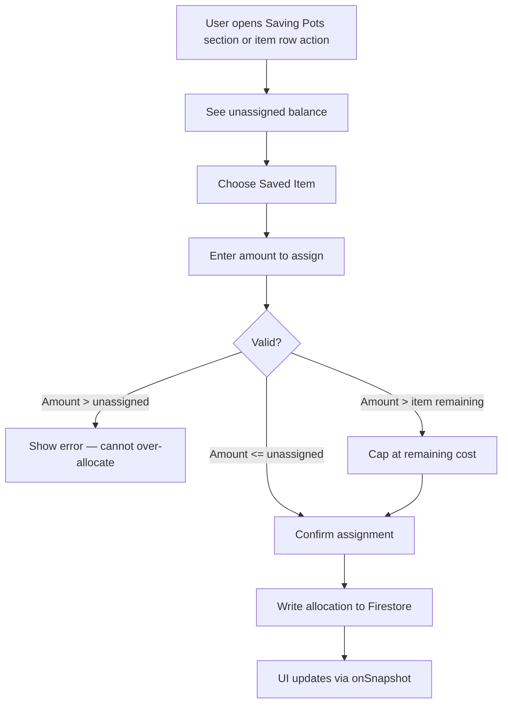
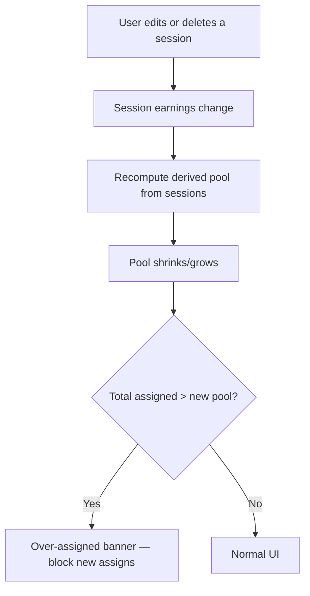
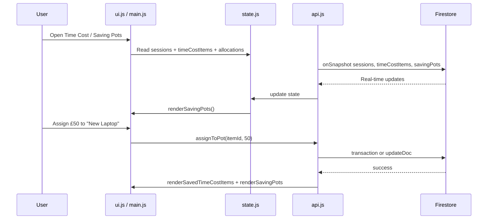

# Work Tracker — Saving Pots Brief

**Feature cycle:** 2026-07-13  
**Repo path:** `pages/Work-Tracker/`  
**Expected live URL:** `https://xanderwiles.com/pages/Work-Tracker/`  
**Status:** Decisions locked — awaiting Phase 1 implementation approval. See [`02-technical-plan.md`](./02-technical-plan.md).

---

## Summary

Add **Saving Pots**: a virtual envelope system that lets a signed-in user allocate **earned money** (from tracked work sessions) toward **Saved Items** in the Time Cost view. Saved Items already store goal purchases (`name`, `cost`, optional `dateBought`); today they only show *how long you would need to work* to afford each item. Saving Pots closes the loop by tracking *how much of that cost you have virtually “saved”* from real session earnings.

This is **not real banking** — no money moves, no payment integration. It is a motivational progress layer on top of existing earnings data.

---

## User problem being solved

Work Tracker already answers:

- **“How much did I earn?”** — session history, stats widgets, percentage cuts.
- **“How long would I need to work to buy X?”** — Time Cost calculator and Saved Items list.

It does **not** answer:

- **“How much of my actual earnings am I putting toward this goal?”**
- **“Which saved items am I closest to affording with money I’ve already made?”**
- **“How much of my earned money is still unassigned?”**

Without Saving Pots, Saved Items are purely hypothetical (based on configured hourly rate and cuts). Users who want to mentally “earmark” earnings for specific purchases must track that outside the app.

---

## Target audience

| Audience | Need |
|----------|------|
| **Primary user (you)** | Turn real tracked earnings into visible progress toward Saved Items |
| **Future self** | See at a glance which goals are funded, partially funded, or not started |

---

## Goals

1. Compute an **earnings pool** from session history: break-adjusted, after percentage cuts, over a **user-selectable scope** (Settings).
2. Let the user **assign** pool money to one or more Saved Items (`timeCostItems`).
3. Show **progress** per item (saved amount, remaining, percentage of cost).
4. Show **unassigned balance** (pool minus total assigned).
5. Persist allocations in **Firestore** under the existing user-scoped model.
6. Keep UX consistent with Time Cost view patterns (tables, modals, confirm dialogs).
7. Respect existing **percentage cuts** semantics where applicable (see Q2).

---

## Non-goals (v1 unless decided otherwise)

- Real bank accounts, payment rails, or multi-currency conversion
- Automatic purchase detection or receipt scanning
- Shared pots / multi-user savings
- Investment growth, interest, or inflation modeling
- Replacing the Time Cost “hours to afford” calculator (both views coexist)
- Cloud Functions or server-side allocation logic (client + Firestore rules only, matching current architecture)
- Automated test suite infrastructure (Work Tracker has no tests today — see test section in technical plan)

---

## Current state (codebase snapshot)

| Area | Today |
|------|--------|
| **Stack** | Static HTML + CSS + vanilla JS (ES modules), Firebase Auth 12.9.0, Firestore |
| **Auth** | Google sign-in required for dashboard; `users/{uid}/…` data isolation |
| **Earnings source** | `users/{uid}/sessions` — `earnings`, `rate`, `durationMs`, breaks-adjusted stats via `getEffectiveSessionMetrics` |
| **Saved Items** | `users/{uid}/timeCostItems` — `name`, `cost`, `dateBought?`, `createdAt` |
| **Cuts** | `users/{uid}/settings/percentageCuts` + `getAmountAfterPercentageCuts()` in `ui.js` |
| **Time Cost UI** | `index.html` `#time-cost-view`, rendered by `renderSavedTimeCostItems()` in `ui.js` |
| **Tests** | None in repo for Work Tracker |

Relevant modules: `js/api.js`, `js/state.js`, `js/ui.js`, `js/main.js`, `js/utils.js`, `js/auth.js`, `firestore.rules`.

---

## Expected user flow

### High-level journey

### Assign money to a Saved Item

### Session change impact (edit / delete)

### System interaction (sequence)

---

## Product surface (locked)

- **Time Cost view** — summary strip + Saved Items table with progress, assign, and withdraw.
- **Dashboard widget** (`widget-saving-pots`) — pool, unassigned balance, closest goal.
- **Settings** — selectable pool scope (all time / last 30 days / month to date / this week).

---

## Definition of done (high level)

- [ ] User can see total assignable earnings pool and unassigned balance
- [ ] User can assign earnings to Saved Items with validation (no silent over-allocation unless Q5 says otherwise)
- [ ] Per-item progress visible on Saved Items (saved / remaining / %)
- [ ] Data persists in Firestore and syncs across devices for the same Google account
- [ ] Firestore rules updated and deployed
- [ ] Session edit/delete behavior documented and implemented per Q3/Q7
- [ ] Manual test plan executed
- [ ] Rollback path documented (feature flag or rules revert)

Full engineering checklist: [`02-technical-plan.md`](./02-technical-plan.md).

---

## Next step

Approve **Phase 1** in [`02-technical-plan.md`](./02-technical-plan.md) (core logic + data model, no UI). Implementation begins after approval.
