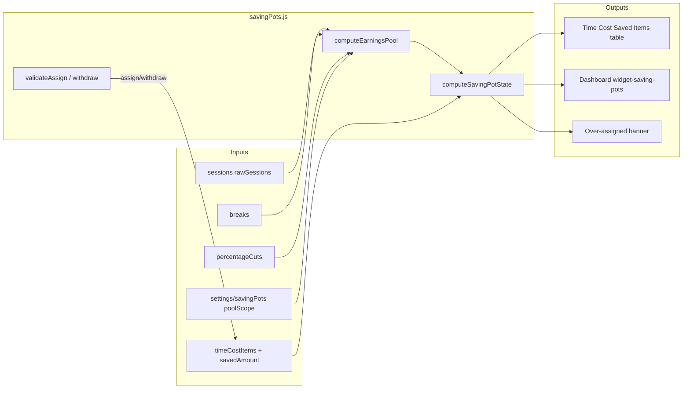
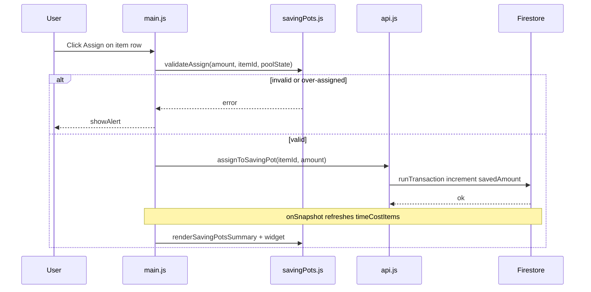

# Work Tracker — Saving Pots Technical Plan

**Feature cycle:** 2026-07-13  
**Status:** Locked — decisions recorded in [`01-questions-and-decisions.md`](./01-questions-and-decisions.md)  
**Owner:** Signed-in Google user (existing Work Tracker auth model)

---

## Locked decisions (summary)

| ID | Decision | Status |
|----|----------|--------|
| Q1 | **Net earnings after percentage cuts** + **user-selectable pool scope in Settings** (B + E) | `Locked` |
| Q2 | **Break-adjusted effective earnings** always used for pool | `Locked` |
| Q3 | **Derived pool** from sessions + **stored** `savedAmount` per item | `Locked` |
| Q4 | **Cumulative partial assignments** over time | `Locked` |
| Q5 | **Cap** assignment at item remaining cost (`savedAmount ≤ cost`) | `Locked` |
| Q6 | **“Fully funded” badge only** — user sets Date Bought manually | `Locked` |
| Q7 | **Soft warning** when over-assigned; **block new assigns** until resolved via withdraw | `Locked` |
| Q8 | **Partial and full withdraw** back to unassigned balance | `Locked` |
| Q9 | **`savedAmount` field** on each `timeCostItems` document | `Locked` |
| Q10 | **Time Cost view integration** + **dashboard widget** (`widget-saving-pots`) | `Locked` |
| D1 | Google sign-in required for all writes | `Locked` |
| D2 | Display via `state.currentCurrency`; single currency | `Locked` |
| D3 | Round to 2 decimal places; store as Firestore numbers | `Locked` |
| D4 | Firestore writes with validation; transactions acceptable — user notes values are **virtual estimates**, not bank balances | `Locked` |
| D5 | Reuse `showConfirm` / `showAlert` modal patterns | `Locked` |
| D6 | No Cloud Functions — client compute + Firestore rules | `Locked` |
| D7 | No remote feature flag; rollback via git revert + rules redeploy | `Locked` |
| D8 | Pool uses **`state.rawSessions`** (ignore dashboard company/project filter) | `Safe to decide now` |
| D9 | Pool scope preference synced to **`users/{uid}/settings/savingPots`** | `Safe to decide now` |

---

## Final agreed scope (v1)

### In scope

1. **Earnings pool** — sum of break-adjusted, after-cuts session earnings over a **user-selected time scope** (Settings).
2. **Virtual allocations** — assign / withdraw money toward Saved Items (`timeCostItems`); persist `savedAmount` per item.
3. **Balances** — show earnings pool, total assigned, unassigned balance; warn when over-assigned.
4. **Saved Items UI (Time Cost view)** — progress columns, assign/withdraw actions, fully funded badge.
5. **Dashboard widget** — compact summary (`widget-saving-pots`): pool, unassigned, closest goal progress.
6. **Settings** — pool scope selector (see below).
7. **Firestore rules** — validate `savedAmount` on `timeCostItems` writes.

### Out of scope (v1)

- Real banking, payments, multi-currency
- Assignment history subcollection / audit log
- Auto-set `dateBought` or “Mark as bought” modal (Q6 = badge only)
- Over-funding items beyond cost (Q5)
- Pro-rata auto-clawback on session delete (Q7)
- Cloud Functions
- Dedicated top-level “Saving Pots” tab

---

## Pool scope (Q1 + E)

User selects which sessions contribute to the assignable pool. Stored at:

```
users/{userId}/settings/savingPots
{
  poolScope: 'all_time' | 'rolling_30d' | 'calendar_month' | 'calendar_week',
  updatedAt: Timestamp
}
```

Default: **`all_time`**.

| `poolScope` | Sessions included | Aligns with existing app |
|-------------|-------------------|--------------------------|
| `all_time` | Every session in `rawSessions` | — |
| `rolling_30d` | Sessions with effective overlap in last 30 days | `STATS_PERIOD_MODES.ROLLING` monthly stats |
| `calendar_month` | Sessions from start of current calendar month | Calendar stats “Month to Date” |
| `calendar_week` | Sessions from start of current week (`state.startOfWeek`) | Weekly stats widget |

**Computation:** For scoped modes, include a session’s **full break-adjusted, after-cuts earnings** only if the session overlaps the scope window (same overlap pattern as `calculateRollingPeriodTotals` / `calculateCalendarPeriodTotals` in `utils.js`). For `all_time`, sum all sessions in full.

**Settings UI:** Add control in **Settings view** (alongside other Work Tracker preferences). Changing scope recalculates pool immediately; may trigger over-assigned state (Q7).

*Assumption:* Custom stats periods (`state.customStatsPeriods`) are **not** offered as pool scopes in v1 — only the four options above. Can extend later.

---

## Architecture overview

Work Tracker is a **client-rendered SPA** (single `index.html`, ES modules) with **Firebase Auth + Firestore**. Saving Pots adds a **computed earnings layer** and **persistent per-item saved amounts** without new backend services.

```
┌─────────────────────────────────────────────────────────────────────────────┐
│  Browser — /pages/Work-Tracker/                                              │
│  ┌────────────┐  ┌────────────┐  ┌────────────┐  ┌────────────────────────┐ │
│  │ index.html │  │ style.css  │  │ main.js    │  │ ui.js                  │ │
│  │ dashboard  │  │ pot styles │  │ events     │  │ savingPots.js (new)    │ │
│  │ widget +   │  │            │  │            │  │                        │ │
│  │ Time Cost  │  │            │  │            │  │                        │ │
│  └─────┬──────┘  └────────────┘  └──────┬─────┘  └───────────┬────────────┘ │
│        │         ┌──────────────────────┴────────────────────┘              │
│        │         │  state.js  api.js  utils.js  auth.js  config.js          │
│        └─────────┴──────────────────────────────────────────────────────────│
└─────────────────────────────────────────────────────────────────────────────┘
                                    │
              Google Auth           │  Firestore — work-tracker-xander
              onSnapshot            │
                                    ▼
┌─────────────────────────────────────────────────────────────────────────────┐
│  users/{uid}/sessions              ← pool source (scoped, client-computed)    │
│  users/{uid}/breaks                ← break-adjusted earnings                 │
│  users/{uid}/timeCostItems         ← Saved Items + savedAmount               │
│  users/{uid}/settings/percentageCuts                                         │
│  users/{uid}/settings/savingPots   ← poolScope preference (NEW)               │
└─────────────────────────────────────────────────────────────────────────────┘
```

### Data flow



### Assign / withdraw sequence



---

## Data model changes

### `timeCostItems` document (extended)

```javascript
{
  name: string,
  cost: number,
  dateBought: string | null,
  savedAmount: number,        // NEW — default 0, 0 <= savedAmount <= cost
  createdAt: Timestamp,
  updatedAt?: Timestamp       // NEW — set on assign/withdraw/cost clamp
}
```

### `users/{uid}/settings/savingPots` (new)

```javascript
{
  poolScope: 'all_time' | 'rolling_30d' | 'calendar_month' | 'calendar_week',
  updatedAt: Timestamp
}
```

### Computed values (client-only)

```javascript
{
  earningsPool: number,
  poolScope: string,
  poolScopeLabel: string,     // human-readable for UI
  totalAssigned: number,
  unassignedBalance: number,  // pool - totalAssigned (display only; can be negative when over-assigned)
  isOverAssigned: boolean,
  overAssignedBy: number,     // max(0, totalAssigned - pool)
  closestGoal: { item, remaining, percent } | null
}
```

### Pool computation (locked logic)

```javascript
// savingPots.js — pseudocode
function computeSessionContribution(session, breaks) {
  const metrics = getEffectiveSessionMetrics(session, breaks);
  return roundMoney(getAmountAfterPercentageCuts(metrics.effectiveEarnings));
}

function computeEarningsPool(rawSessions, breaks, poolScope, now, startOfWeek) {
  if (poolScope === 'all_time') {
    return sum(rawSessions.map(s => computeSessionContribution(s, breaks)));
  }
  const { start, end } = getPoolScopeWindow(poolScope, now, startOfWeek);
  return sum(rawSessions
    .filter(s => sessionOverlapsWindow(s, start, end))
    .map(s => {
      // Pro-rate earnings by overlap fraction within window (match stats helpers)
      return proratedContribution(s, breaks, start, end);
    }));
}
```

Migration: existing `timeCostItems` without `savedAmount` → treat as `0`. Missing `settings/savingPots` → default `all_time`, migrate on first load (same pattern as `timeCost` settings).

---

## API changes

No REST API — Firestore client SDK only.

### New module: `js/savingPots.js`

| Export | Description |
|--------|-------------|
| `POOL_SCOPES` | Constants + labels |
| `getPoolScopeWindow(scope, now, startOfWeek)` | Date range for scoped pools |
| `computeEarningsPool(...)` | Scoped, break-adjusted, after-cuts total |
| `computeSavingPotState(state, getAmountAfterPercentageCuts)` | Full derived state |
| `validateAssign(amount, item, potState)` | Caps, unassigned, over-assigned checks |
| `validateWithdraw(amount, item)` | Floor at 0 |
| `getClosestGoal(items, potState)` | For dashboard widget |

### New / modified: `js/api.js`

| Function | Change |
|----------|--------|
| `saveTimeCostItem` | Include `savedAmount: 0` on create |
| `updateTimeCostItem` | Preserve `savedAmount`; clamp when `cost` reduced below saved |
| `deleteTimeCostItem` | Unchanged — deleting item removes its assignment from totalAssigned |
| `assignToSavingPot(itemId, amount)` | **NEW** — transaction increment |
| `withdrawFromSavingPot(itemId, amount)` | **NEW** — transaction decrement |
| `loadSavingPotSettings` | **NEW** — `onSnapshot` on `settings/savingPots` |
| `saveSavingPotSettings(poolScope)` | **NEW** — `setDoc` merge |

### Modified: `js/ui.js`

| Function | Change |
|----------|--------|
| `renderSavedTimeCostItems` | Add Saved / Remaining / Progress / Assign / Withdraw columns |
| `renderSavingPotsSummary` | **NEW** — Time Cost summary strip |
| `renderSavingPotsWidget` | **NEW** — dashboard `widget-saving-pots` |
| `renderDashboardData` | Call `renderSavingPotsWidget` when widget enabled |

### Modified: `js/state.js`

| Change |
|--------|
| `savingPotPoolScope: 'all_time'` |
| `DEFAULT_WIDGET_ORDER` includes `'widget-saving-pots'` (after `widget-money-counter` or `widget-stats`) |
| `updateSavingPotPoolScope(scope)` + optional localStorage cache for instant UI |

### Modified: `js/auth.js`

| Change |
|--------|
| Call `loadSavingPotSettings()` on sign-in |

### Firestore rules

Replace permissive `timeCostItems` write with validation:

```
function isValidTimeCostItem() {
  return request.resource.data.name is string
    && request.resource.data.cost is number
    && request.resource.data.cost >= 0
    && (!('dateBought' in request.resource.data)
        || request.resource.data.dateBought == null
        || request.resource.data.dateBought is string)
    && (!('savedAmount' in request.resource.data)
        || (request.resource.data.savedAmount is number
            && request.resource.data.savedAmount >= 0
            && request.resource.data.savedAmount <= request.resource.data.cost));
}

match /timeCostItems/{itemId} {
  allow read: if isOwner(userId);
  allow create, update: if isOwner(userId) && isValidTimeCostItem();
  allow delete: if isOwner(userId);
}

match /settings/savingPots {
  allow read, write: if isOwner(userId);
}
```

---

## UI surfaces (Q10)

### 1. Time Cost view

- **Summary strip** above Saved Items filters: pool (with scope label), assigned, unassigned, over-assigned warning.
- **Saved Items table** — new columns: Saved, Remaining, Progress bar, Actions (Assign / Withdraw).
- **Fully funded badge** on rows where `savedAmount >= cost` (Q6).

### 2. Dashboard widget (`widget-saving-pots`)

- Pool scope label + earnings pool total.
- Unassigned balance (highlight if over-assigned).
- Closest goal: item name, % progress, remaining amount.
- Link or hint: “Manage in Time Cost → Saved Items”.

### 3. Settings view

- **Saving Pot pool scope** dropdown: All time / Last 30 days / Month to date / This week.
- Helper text: virtual allocations; changing scope may affect available balance.

### 4. Modals

- **Assign** — amount input, max = min(unassigned, item remaining); disabled when over-assigned.
- **Withdraw** — amount input, max = item `savedAmount`.

Copy tone (D4): optional subtitle “Virtual balance based on tracked sessions — not a bank account.”

---

## Existing files reference

| File | Role |
|------|------|
| `index.html` | Add widget section, summary strip, modals, settings control |
| `js/savingPots.js` | **NEW** — core logic |
| `js/state.js` | Pool scope state, widget order |
| `js/api.js` | Firestore assign/withdraw, settings load/save |
| `js/ui.js` | Renderers, DOM refs |
| `js/main.js` | Event wiring |
| `js/utils.js` | Reuse overlap / period helpers (import from savingPots or shared) |
| `js/auth.js` | Load saving pot settings |
| `style.css` | Widget, progress bars, banners |
| `firestore.rules` | Validation |

---

## Authentication and authorization

Unchanged model: Google sign-in; `isOwner(userId)` on all reads/writes. Saving Pots invisible when signed out.

---

## Security and privacy

| Risk | Mitigation |
|------|------------|
| Crafted `savedAmount > cost` | Firestore rules |
| Negative `savedAmount` | Rules + transaction floor |
| XSS in item names | `escapeHtml()` |
| Concurrent tabs | Firestore transactions on assign/withdraw |

---

## Performance

- Memoize `computeSavingPotState` until sessions, breaks, cuts, scope, or items change.
- Single pass O(n) over sessions — acceptable for personal use.
- No extra Firestore listeners beyond `settings/savingPots`.

---

## Edge cases (locked behavior)

| Case | Behavior |
|------|----------|
| No sessions in scope | Pool = 0; assign blocked |
| Over-assigned (Q7) | Banner; block new assigns; allow withdraw |
| Item cost reduced below saved | Clamp `savedAmount` to new cost on save (confirm) |
| Delete item with savings | Confirm funds return to unassigned |
| Pool scope changed | Recompute pool; may trigger over-assigned |
| Percentage cuts changed | Pool recalculates (derived model) |
| Dashboard filter active | Pool still uses **all** `rawSessions` (D8) |
| `cost = 0` | Hide assign; show N/A progress |

---

## Accessibility

- Progress: `role="progressbar"`, `aria-valuenow/min/max`, item name in accessible label.
- Summary + widget: `aria-live="polite"` on balance changes.
- Assign/withdraw modals: labelled inputs, keyboard support, match existing modal patterns.
- Fully funded: text badge, not color-only.

---

## Manual tests

Add to existing checklist:

- [ ] Each pool scope (`all_time`, `rolling_30d`, `calendar_month`, `calendar_week`) produces expected pool vs manual calc
- [ ] Settings scope change persists across reload / second device
- [ ] Dashboard widget shows pool, unassigned, closest goal
- [ ] Widget hide/disable via existing widget order settings works
- [ ] Over-assigned banner on dashboard widget and Time Cost strip

(Full list retained from prior draft — assign, withdraw, session edit/delete, rules, regression.)

---

## Automated tests

**P0** (recommended for Phase 1):

- `computeEarningsPool` — all scopes, break adjustment, after-cuts
- `validateAssign` / `validateWithdraw` / over-assigned gate
- `clampSavedAmountOnCostChange`

Tooling: `node --test` on pure exports from `savingPots.js`.

---

## Rollback plan

1. Revert application code; redeploy.
2. Redeploy prior `firestore.rules` (extra fields harmless).
3. `savedAmount` and `settings/savingPots` remain in Firestore until cleaned up optionally.

---

## Definition of done

### Product

- [ ] Pool scope selectable in Settings (4 options)
- [ ] Pool = break-adjusted, after-cuts earnings for selected scope
- [ ] Assign / withdraw on Saved Items with validation
- [ ] Fully funded badge (Q6); no auto date bought
- [ ] Over-assigned warning + assign block (Q7)
- [ ] Dashboard widget + Time Cost integration (Q10)

### Engineering

- [ ] `savedAmount` on `timeCostItems`; rules deployed
- [ ] `settings/savingPots` synced
- [ ] P0 unit tests OR manual checklist signed off
- [ ] No regressions in Time Cost charts, calculator, session tracking

### Documentation

- [x] Questions locked in `01-questions-and-decisions.md`
- [x] This plan updated

---

## Implementation phases

### Phase 1 — Core logic & data (recommended first step)

1. Create `js/savingPots.js` (pool computation, state, validation).
2. Extend `js/state.js` (pool scope default).
3. Extend `js/api.js` (`savedAmount` on create; assign/withdraw stubs; settings load/save).
4. Update `firestore.rules`.
5. P0 unit tests for `savingPots.js`.

*No UI in Phase 1 — verifiable via tests and console.*

### Phase 2 — Time Cost UI

1. Summary strip + table columns + modals in `index.html` / `ui.js` / `main.js`.
2. Wire assign/withdraw to API.

### Phase 3 — Dashboard widget & Settings

1. `widget-saving-pots` in `index.html`, `state.js` widget order, `ui.js` renderer.
2. Pool scope control in Settings view.

### Phase 4 — Polish & release

1. Over-assigned banners, delete/cost-edit confirmations.
2. Deploy rules with client release.
3. Manual test pass.

---

## Remaining assumptions (explicit)

| # | Assumption | Confirm? |
|---|------------|----------|
| A1 | Pool scope options are the **four listed** (not custom stats periods) | Default unless you want more |
| A2 | Scoped pools **pro-rate** session earnings by overlap with window (consistent with stats) | Engineering default |
| A3 | **`rawSessions`** used for pool (dashboard filter ignored) | Locked as D8 |
| A4 | **`settings/savingPots`** in Firestore for cross-device scope sync | Locked as D9 |
| A5 | Dashboard widget **enabled by default** in widget order (can disable in Settings) | Default |
| A6 | No assignment history audit trail in v1 | Per Q9 = A only |
| A7 | Virtual-money disclaimer in UI is **subtle** (helper text), not a modal gate | Per D4 “estimate” note |

If any assumption is wrong, say so before Phase 1 merge.
