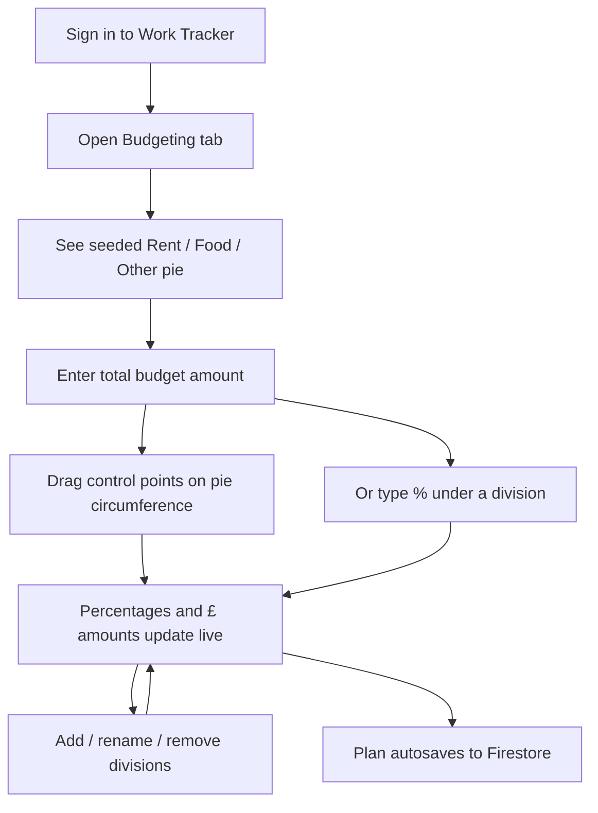
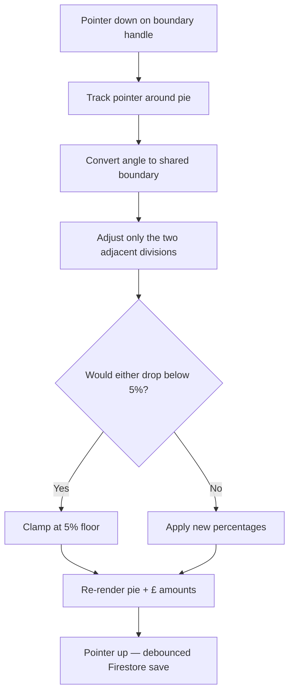
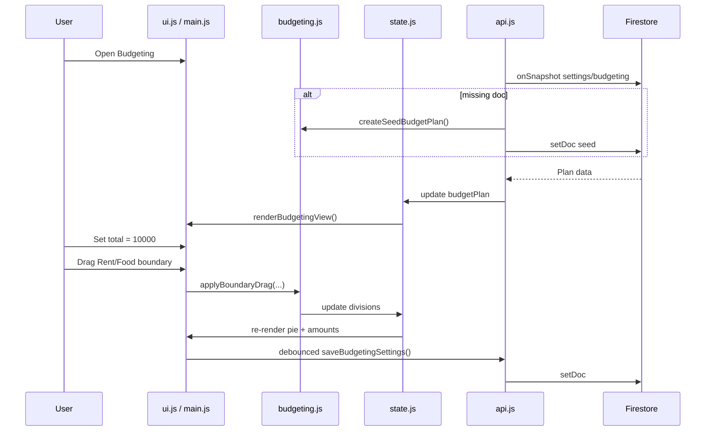

# Work Tracker — Budget View Brief

**Feature cycle:** 2026-07-31  
**Repo path:** `pages/Work-Tracker/`  
**Expected live URL:** `https://xanderwiles.com/pages/Work-Tracker/`  
**Status:** Implemented — pending Firestore rules deploy and manual QA. See [`02-technical-plan.md`](./02-technical-plan.md).

---

## Summary

Add a **Budgeting** view where a signed-in user plans how to split a total money amount across named **divisions** (e.g. Rent, Food, Other). The centrepiece is a large **solid pie chart**. The user enters a total (e.g. £10,000), adjusts divisions, and controls each slice’s share primarily by **dragging control points around the pie circumference**. Under each division breakdown they can also type a percentage. The UI shows the absolute amount assigned to each division from the total.

This is a **planning / allocation UI**, not a bank account and not real payment rails. It is **independent** of earnings, Saving Pots, and percentage cuts in v1 — the user types the total.

---

## User problem being solved

Work Tracker already answers:

- **“How much did I earn?”** — sessions, stats, percentage cuts.
- **“How long to afford X?”** — Time Cost calculator and Saved Items.
- **“How much of my earnings am I putting toward goals?”** — Saving Pots.

It does **not** answer:

- **“If I have £N, how do I want to split it?”**
- **“What absolute amount does 30% rent mean on my budget total?”**
- **“Can I visually sculpt my budget shares by dragging slice boundaries?”**

Without Budgeting, users who want envelope-style planning must use spreadsheets or external apps. Percentage Cuts are sequential deductions from earnings (and need not sum to 100%); they are not a pie-based budget planner.

---

## Target audience

| Audience | Need |
|----------|------|
| **Primary user (you)** | Quickly plan how a lump sum should be split across life categories, with live £ amounts |
| **Future self** | Revisit and adjust the same plan; see percentages and absolute amounts together |

---

## Goals

1. Provide a dedicated **Budgeting** top-level tab with:
   - Total budget amount input at the top.
   - Large centred **solid** pie chart of divisions.
   - Circumference **control points** as the primary way to set percentages.
   - Per-division breakdown: name, percentage (editable), computed money amount.
2. Let the user **add / rename / remove** divisions (max 16; each ≥ 5%).
3. Show **absolute amounts** = `total × (percentage / 100)` using `state.currentCurrency` (default £).
4. Keep percentages summing to ≈ 100% via adjacent-boundary drag and “largest other” typed redistribution.
5. Persist the single plan in Firestore `users/{uid}/settings/budgeting`.
6. Stay within current architecture: static HTML + vanilla ES modules + Firebase; custom SVG (no chart library).

---

## Non-goals (v1)

- Real banking, payment rails, or multi-currency conversion
- Coupling to Saving Pots, percentage cuts, or live earnings
- Transaction history / spending tracking against divisions
- Multiple named budgets
- Dashboard widget
- Shared / multi-user budgets
- Cloud Functions or chart libraries (Chart.js/D3/etc.)
- Donut centre readout
- URL deep-linking / client-side router

---

## Current state (codebase snapshot)

| Area | Today |
|------|--------|
| **Stack** | Static HTML + CSS + vanilla JS (ES modules), Firebase Auth / Firestore 12.9.0 |
| **Auth** | Google sign-in; data under `users/{uid}/…` |
| **Views** | Client toggle: Dashboard / Time Cost / Settings — **no router** |
| **Charts** | Custom DOM/CSS — **no pie**, no polar drag |
| **Money helpers** | `roundMoney` / `MONEY_EPSILON` in `js/savingPots.js`; `state.currentCurrency` |
| **Persistence** | Firestore settings docs (`percentageCuts`, `savingPots`, …) |
| **Tests** | `node --test` for Saving Pots |

---

## Expected user flow

### High-level journey

### Drag a control point

### System interaction

---

## Product surface (locked)

| Surface | Role |
|---------|------|
| **Budgeting tab** | Total input, solid pie with control points, division list with % + £ |

No dashboard widget in v1.

---

## Definition of done (high level)

- [ ] Budgeting tab opens; seed divisions on first visit
- [ ] User can enter a total and see £ amounts per division
- [ ] Dragging circumference handles updates adjacent % and £
- [ ] Typing a % updates pie via largest-other redistribution
- [ ] Constraints: sum ≈ 100%, min 5%, max 16 divisions
- [ ] Plan persists in Firestore and syncs across devices
- [ ] Touch + mouse with large hit targets; rules deployed
- [ ] P0 unit tests + manual checklist

Full engineering checklist: [`02-technical-plan.md`](./02-technical-plan.md).

---

## Next step

Approve **Phase 1** in [`02-technical-plan.md`](./02-technical-plan.md) (core logic + tests, no UI). Implementation begins only after your approval.
