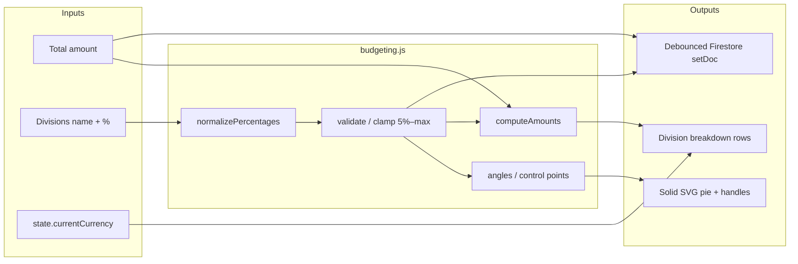
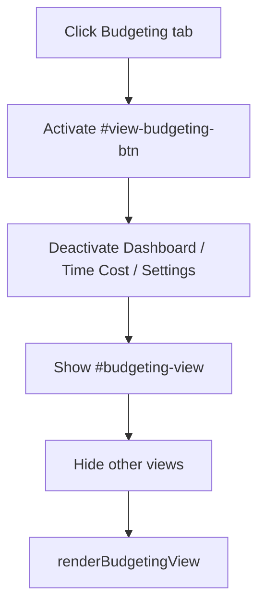

# Work Tracker — Budget View Technical Plan

**Feature cycle:** 2026-07-31  
**Status:** Locked — decisions recorded in [`01-questions-and-decisions.md`](./01-questions-and-decisions.md). Implementation complete pending Firestore rules deploy + manual QA.

---

## Locked decisions (summary)

| ID | Decision | Status |
|----|----------|--------|
| Q1 | **Fourth top-level tab “Budgeting” only** — no dashboard widget | `Locked` |
| Q2 | **Firestore** `users/{uid}/settings/budgeting` | `Locked` |
| Q3 | Percentages **always sum to ≈ 100%** | `Locked` |
| Q4 | **Drag** = adjacent neighbors only; **typed %** = take from / give to largest other | `Locked` |
| Q5 | **Single plan** only in v1 | `Locked` |
| Q6 | **Seed** first-run with Rent 40% / Food 20% / Other 40% | `Locked` |
| Q7 | **Independent** of earnings / Saving Pots / percentage cuts — typed total only | `Locked` |
| Q8 | **Custom SVG + Pointer Events** — no chart libraries | `Locked` |
| Q9 | Max **16** divisions; min **5%** each; soft visual floor for drag targets | `Locked` |
| Q10 | **Fixed colour palette** by list index | `Locked` |
| Q11 | **Solid pie** — total only in the top input (no donut centre) | `Locked` |
| Q12 | **Full touch + mouse** with large hit targets (≥ 44px) | `Locked` |
| D1 | Google sign-in required for all writes | `Locked` |
| D2 | Display via `state.currentCurrency`; single currency | `Locked` |
| D3 | Round £ to 2 decimals; keep % precise enough for sum ≈ 100% | `Locked` |
| D4 | Debounced Firestore autosave (~300–1200ms) | `Locked` |
| D5 | Reuse `showConfirm` / `showAlert` | `Locked` |
| D6 | No Cloud Functions — client compute + Firestore rules | `Locked` |
| D7 | No remote feature flag; rollback via git revert + rules redeploy | `Locked` |
| D8 | Escape division names on render | `Locked` |
| D9 | New `js/budgeting.js` + `budgeting.test.js` | `Locked` |
| D10 | Extend view switcher for four mutually exclusive tabs | `Locked` |

---

## Final agreed scope (v1)

### In scope

1. **Budgeting tab** — fourth top-level view alongside Dashboard / Time Cost / Settings.
2. **Total amount input** at the top (user-typed; independent of earnings).
3. **Solid SVG pie** at the centre with circumference **control points** (primary % control).
4. **Division breakdown list** — name, editable %, computed £ amount, colour swatch.
5. **Division CRUD** — add / rename / remove (confirm on delete), max 16, each ≥ 5%.
6. **Dual control model (Q4):**
   - Drag boundary → adjust only the two adjacent divisions (clamp so neither drops below 5%).
   - Typed % → take from / give to the largest *other* division (respecting 5% floors).
7. **First-run seed (Q6)** when no Firestore doc exists: Rent 40%, Food 20%, Other 40%; `totalAmount: 0` until user types a total.
8. **Firestore persistence** — `users/{uid}/settings/budgeting` with realtime `onSnapshot` + debounced `setDoc`.
9. **Currency** — `state.currentCurrency` + `roundMoney`.
10. **Touch + mouse** Pointer Events; stacked mobile layout; keyboard nudge on focused handle.
11. **P0 unit tests** for pure % / geometry math.

### Out of scope (v1)

- Dashboard widget
- Multiple named budgets
- Auto-fill from earnings / Saving Pots / percentage cuts
- Spending ledger / transaction history against divisions
- Chart.js, D3, or any new chart CDN/npm dependency
- Donut hole / centre readout
- URL routing / deep links
- Cloud Functions
- Per-division colour picker
- Import / export of budget plans

---

## Architecture overview

Work Tracker is a **client-rendered SPA** (`index.html` + ES modules) with **Firebase Auth + Firestore**. Budgeting adds a **fourth view** and a **pure logic module** for percentages and pie geometry. Rendering lives in `ui.js`; events and drag wiring in `main.js`; persistence in `api.js`.

```
┌─────────────────────────────────────────────────────────────────────────────┐
│  Browser — /pages/Work-Tracker/                                              │
│  ┌────────────┐  ┌────────────┐  ┌────────────┐  ┌────────────────────────┐ │
│  │ index.html │  │ style.css  │  │ main.js    │  │ ui.js                  │ │
│  │ #budgeting │  │ solid pie  │  │ view       │  │ budgeting renderers    │ │
│  │ -view      │  │ + handles  │  │ switcher + │  │                        │ │
│  │            │  │            │  │ pointer    │  │ js/budgeting.js (NEW)  │ │
│  └─────┬──────┘  └────────────┘  └──────┬─────┘  └───────────┬────────────┘ │
│        │         ┌──────────────────────┴────────────────────┘              │
│        │         │  state.js  api.js  auth.js  savingPots.js (roundMoney)   │
│        └─────────┴──────────────────────────────────────────────────────────│
└─────────────────────────────────────────────────────────────────────────────┘
                                    │
              Google Auth           │  Firestore — work-tracker-xander
              onSnapshot / setDoc   │
                                    ▼
┌─────────────────────────────────────────────────────────────────────────────┐
│  users/{uid}/settings/budgeting   ← single plan (totalAmount + divisions)     │
└─────────────────────────────────────────────────────────────────────────────┘
```

### Data flow



### Drag interaction sequence

```mermaid
sequenceDiagram
    participant U as User
    participant M as main.js
    participant UI as ui.js
    participant B as budgeting.js
    participant S as state.js
    participant API as api.js
    participant FS as Firestore

    U->>UI: pointerdown on boundary handle i
    UI->>M: startBudgetDrag(i, event)
    loop pointermove
        M->>B: applyBoundaryDrag(divisions, i, angleRad)
        Note over B: Adjacent slices only; clamp each ≥ 5%
        B-->>M: nextDivisions
        M->>S: budgetPlan.divisions = next
        M->>UI: update pie paths + list %/£
    end
    U->>UI: pointerup / pointercancel
    M->>API: scheduleSaveBudgetingSettings()
    API->>FS: setDoc settings/budgeting
```

### View switcher



---

## Data model changes

### `users/{userId}/settings/budgeting` (new)

```javascript
{
  totalAmount: number,          // >= 0
  divisions: [
    {
      id: string,               // client-generated id
      name: string,             // trimmed, non-empty
      percentage: number        // >= 5, <= 100 - 5*(n-1); sum ≈ 100
    }
  ],                            // length 1..16 (seed starts at 3)
  updatedAt: Timestamp
}
```

### Seed defaults (Q6) — used when doc missing

```javascript
{
  totalAmount: 0,
  divisions: [
    { id: '…', name: 'Rent',  percentage: 40 },
    { id: '…', name: 'Food',  percentage: 20 },
    { id: '…', name: 'Other', percentage: 40 }
  ]
}
```

On first successful load of a missing doc, **write the seed** to Firestore (same “migrate on first load” pattern as other settings) so other devices see it immediately. If the user clears all divisions somehow, re-seed is **not** automatic after first write — empty list only via explicit deletes down to minimum viable set (see edge cases).

### Client-computed (not stored)

```javascript
{
  amounts: number[],            // roundMoney(total * pct / 100)
  angles: { start, end }[],     // radians per slice
  controlPoints: { x, y, angle, boundaryIndex }[],
  sumPercent: number,
  isValidSum: boolean
}
```

Amounts are **display-derived** only — do not store per-division £ (avoids dual source of truth).

### Constants (locked Q9)

```javascript
export const BUDGET_MAX_DIVISIONS = 16;
export const BUDGET_MIN_PERCENT = 5;
export const PERCENT_EPSILON = 0.01;
```

Theoretical max at 5% floor = 20 divisions; product max is 16.

### Migration / sanitize on load

- Missing / empty doc → apply seed, then save.
- Corrupt percentages → `normalizePercentages` (clamp ≥ 5%, force sum ≈ 100%).
- Too many divisions → keep first 16, renormalize.
- Reuse `roundMoney` / `MONEY_EPSILON` from `savingPots.js`.

---

## API changes

No REST API — Firestore client SDK only.

### New module: `js/budgeting.js`

| Export | Description |
|--------|-------------|
| `BUDGET_MAX_DIVISIONS` / `BUDGET_MIN_PERCENT` / `PERCENT_EPSILON` | Locked constants |
| `BUDGET_SEED_DIVISIONS` / `createSeedBudgetPlan()` | Q6 defaults |
| `BUDGET_COLOR_PALETTE` | Fixed colours (length ≥ 16) |
| `createDivision(name, percentage)` | Factory with id |
| `normalizePercentages(divisions)` | Sum ≈ 100%; each ≥ 5% |
| `applyBoundaryDrag(divisions, boundaryIndex, angleRad)` | Adjacent-only; clamp ≥ 5% |
| `applyTypedPercentage(divisions, id, nextPct)` | Take/give largest other; clamp ≥ 5% |
| `canAddDivision(divisions)` | `length < 16` and enough headroom above floors to carve ≥ 5% |
| `addDivision(divisions, name)` | Carve ≥ 5% from largest slice(s); fail if impossible |
| `removeDivision(divisions, id)` | Redistribute removed % to largest remaining; confirm in UI |
| `computeAmounts(total, divisions)` | £ per division |
| `percentsToAngles(divisions)` | Solid pie geometry (full disk) |
| `angleToPoint(cx, cy, r, angle)` | Handle positions on circumference |
| `validateBudgetPlan(plan)` | Pre-save checks |
| `sanitizeBudgetPlan(raw)` | Load-time sanitize + seed fallback |

### New / modified: `js/api.js`

| Function | Change |
|----------|--------|
| `loadBudgetingSettings()` | **NEW** — `onSnapshot` on `settings/budgeting` |
| `saveBudgetingSettings(plan)` | **NEW** — `setDoc` with `updatedAt`; silent option like cuts |

### Modified: `js/state.js`

| Change |
|--------|
| `budgetPlan: createSeedBudgetPlan()` initial shape |
| `updateBudgetPlan(plan)` / partial helpers |
| No localStorage mirror required (Q2 = Firestore only); in-memory until snapshot arrives |

### Modified: `js/auth.js`

| Change |
|--------|
| Call `loadBudgetingSettings()` on sign-in |

### Modified: `js/ui.js` / `js/main.js` / `index.html` / `style.css`

| Change |
|--------|
| `#view-budgeting-btn`, `#budgeting-view` (total input, solid pie host, division list) |
| Four-way view switcher |
| Render solid pie + large handles; list with % inputs and £ |
| Pointer Events (mouse + touch); `touch-action: none` on pie during drag |
| Responsive stack: total → pie → list |

### Firestore rules

Tighten writes for `settings/budgeting` while keeping other settingIds as today:

```
function isValidBudgetDivision(d) {
  return d.keys().hasAll(['id', 'name', 'percentage'])
    && d.id is string
    && d.name is string
    && d.percentage is number
    && d.percentage >= 5
    && d.percentage <= 100;
}

function isValidBudgetingSettings() {
  return request.resource.data.totalAmount is number
    && request.resource.data.totalAmount >= 0
    && request.resource.data.divisions is list
    && request.resource.data.divisions.size() >= 1
    && request.resource.data.divisions.size() <= 16;
  // Optionally iterate divisions if rules complexity allows
}

match /settings/{settingId} {
  allow read: if isOwner(userId);
  allow write: if isOwner(userId) && (
    settingId != 'budgeting' || isValidBudgetingSettings()
  );
}
```

Deploy rules with the client release.

---

## Existing files likely changed

| File | Change |
|------|--------|
| `pages/Work-Tracker/index.html` | Budgeting tab + view markup |
| `pages/Work-Tracker/style.css` | Layout, solid pie, handles (≥ 44px), breakdown, mobile stack |
| `pages/Work-Tracker/js/main.js` | View switcher, drag/input wiring, debounced save |
| `pages/Work-Tracker/js/ui.js` | DOM refs, `renderBudgetingView`, pie + list renderers |
| `pages/Work-Tracker/js/state.js` | `budgetPlan` + updaters |
| `pages/Work-Tracker/js/api.js` | `loadBudgetingSettings` / `saveBudgetingSettings` |
| `pages/Work-Tracker/js/auth.js` | Load on sign-in |
| `pages/Work-Tracker/firestore.rules` | Validate `settings/budgeting` |

## New files

| File | Role |
|------|------|
| `pages/Work-Tracker/js/budgeting.js` | Pure % / geometry / validation / seed |
| `pages/Work-Tracker/js/budgeting.test.js` | P0 `node --test` coverage |

## Patterns to reuse

| File | Why |
|------|-----|
| `js/savingPots.js` | `roundMoney`, `MONEY_EPSILON`, pure-module split |
| `js/savingPots.test.js` | Test harness |
| `js/ui.js` percentage-cut list rows | Named row + % input UX |
| `js/main.js` view switcher (~192–221) | Tab show/hide |
| `js/api.js` percentage-cuts save debounce | Autosave pattern |
| `js/state.js` `sanitizePercentageCuts` | Sanitize-on-load |

---

## Authentication and authorization

Unchanged model: Google sign-in; `isOwner(userId)` on all reads/writes. Budgeting lives inside post-login `#dashboard`. Signed-out users never load or write `settings/budgeting`.

---

## Security and privacy

| Risk | Mitigation |
|------|------------|
| XSS via division names | Escape / `textContent`; never raw HTML |
| Malicious payload (huge lists, &lt; 5%, NaN) | Client sanitize + rules (size, types, ranges) |
| Cross-user access | Existing owner-only rules |
| Concurrent tabs | Last-write-wins + `updatedAt` (same as cuts) |
| Budget category privacy | Private to Google account; no sharing |

---

## Performance

| Risk | Mitigation |
|------|------------|
| Full re-render every pointermove | Patch SVG path `d` + handle positions + %/£ text during drag |
| Firestore write spam while dragging | Save on pointerup + debounce quiet period (D4) |
| Resize thrash | `ResizeObserver` + throttle radius recalculation |

≤ 16 divisions is trivial CPU if drag updates are incremental.

---

## Edge cases (locked behavior)

| Case | Behavior |
|------|----------|
| Total = 0 / empty | Show £0.00 per division; pie still shows % |
| Missing Firestore doc | Seed Rent/Food/Other; persist seed |
| One division | Full circle; **no** control points; % fixed at 100% (cannot type below 100% alone); user must add another to split |
| Two+ divisions | One handle per boundary (N handles on closed ring) |
| Drag would push neighbor &lt; 5% | Clamp boundary; stop shrinking that neighbor |
| Typed % &lt; 5% or that would force another &lt; 5% | Reject / clamp; `showAlert` or inline validation |
| Typed % increase | Shrink largest *other* (ties: first max by list order); stop at that other’s 5% floor |
| Add division | Need a slice with &gt; 5% headroom; carve 5% (or equal split of available) from largest; block at 16 |
| Delete division | Confirm; redistribute its % to largest remaining; cannot delete last remaining division (keep ≥ 1) |
| Rename empty | Revert / block |
| Floating-point drift | Largest slice absorbs epsilon remainder after normalize |
| Currency change | Symbol only; amounts unchanged |
| Touch scroll vs drag | `touch-action: none` on pie while dragging |

---

## Accessibility

- Division list with labelled `%` and £ is the accessible primary control; pie is supplementary.
- Handles: `role="slider"`, `aria-valuemin="5"`, `aria-valuemax` derived, `aria-valuenow`, label naming both adjacent divisions.
- Keyboard: arrow keys nudge focused boundary by 1% (Shift = 5%), respecting 5% floors.
- Colour not sole indicator — swatch + name + % in list.
- `aria-live="polite"` on summary amounts; do not announce every pointermove frame.
- Hit targets ≥ 44×44 CSS px (Q12).

---

## Manual tests

### Smoke

- [ ] Sign in → Budgeting tab works with other three views (exclusive)
- [ ] First visit shows Rent 40 / Food 20 / Other 40; total 0
- [ ] Enter total 10000 → amounts £4000 / £2000 / £4000
- [ ] Drag boundary → adjacent % change; others unchanged; none &lt; 5%; sum ≈ 100%
- [ ] Type Rent = 35 → largest other shrinks; £ update; sum ≈ 100%
- [ ] Type invalid (&lt; 5% or impossible) → blocked with feedback
- [ ] Add division up to 16; 17th blocked
- [ ] Delete with confirm; last division cannot be removed
- [ ] Reload / second device restores plan from Firestore
- [ ] Currency symbol follows Settings
- [ ] Touch drag works on narrow viewport; layout stacks

### Regression

- [ ] Dashboard / Time Cost / Settings / Saving Pots / cuts unchanged
- [ ] View switcher still exclusive

---

## Automated tests

Tooling: `node --test` (mirror `savingPots.test.js`).

### P0

- [ ] Seed plan sums to 100%; three named divisions
- [ ] `normalizePercentages` — sum ≈ 100; each ≥ 5
- [ ] `applyBoundaryDrag` — only adjacent change; floors respected
- [ ] `applyTypedPercentage` — takes from largest other; floors respected
- [ ] `computeAmounts` — `10000 × 0.4 = 4000.00`
- [ ] `addDivision` / `removeDivision` preserve invariants; max 16
- [ ] `canAddDivision` false when all others at floor or at cap
- [ ] Epsilon remainder stable on largest slice

### P1

- [ ] Angle ↔ percent round-trip within tolerance
- [ ] `sanitizeBudgetPlan` on corrupt input

---

## Rollback plan

1. Revert Budgeting application commits; redeploy static assets.
2. Redeploy prior `firestore.rules` if validation was added.
3. Orphaned `settings/budgeting` docs are harmless; optional cleanup later.

No remote feature flag (D7).

---

## Definition of done

### Product

- [ ] Fourth tab Budgeting with solid pie + circumference handles
- [ ] Total input drives £ amounts
- [ ] Drag + typed % per Q4; always ≈ 100%; min 5%; max 16
- [ ] Seed on first run (Q6)
- [ ] Independent of earnings/pots/cuts (Q7)
- [ ] Firestore sync (Q2)
- [ ] Touch + mouse with large targets (Q12)

### Engineering

- [ ] `js/budgeting.js` + P0 tests passing
- [ ] View switcher supports four tabs
- [ ] `firestore.rules` updated and deployed
- [ ] No chart library added
- [ ] Manual checklist signed off

### Documentation

- [x] Questions locked in `01-questions-and-decisions.md`
- [x] This plan updated to locked decisions

---

## Implementation phases

### Phase 0 — Lock decisions ✅

1. Answers recorded.
2. This plan locked.
3. **Await explicit go-ahead before Phase 1.**

### Phase 1 — Core logic (no UI) — *approve first*

1. Create `js/budgeting.js` (seed, normalize, drag, typed %, amounts, angles, add/remove, validate).
2. Create `js/budgeting.test.js` P0 cases.
3. Optionally stub `budgetPlan` on `state.js`.

*Verifiable via `node --test` only.*

### Phase 2 — Shell view + persistence

1. Tab + `#budgeting-view` in `index.html` (total + list; pie placeholder ok).
2. View switcher in `main.js` / DOM in `ui.js`.
3. Typed % + CRUD wired to state.
4. `api.js` + `auth.js` load/save; rules draft.

### Phase 3 — Solid pie + control points

1. SVG solid pie renderer + fixed palette.
2. Pointer drag (mouse + touch); live updates; 5% clamps.
3. Keyboard nudge; large hit targets; responsive stack.

### Phase 4 — Polish & release

1. Confirms, validation copy, empty/one-division states.
2. Deploy rules with client.
3. Manual + regression pass.

---

## Remaining assumptions

| # | Assumption | Notes |
|---|------------|--------|
| A1 | UI label is **Budgeting**; docs folder remains `Budget-View` | Copy only |
| A2 | **One handle per boundary** (N divisions → N handles on a closed ring) | Classic pie splitter |
| A3 | List order = angular order, **clockwise from 12 o’clock** | Standard SVG start |
| A4 | £ amounts are **derived**, not stored per division | Dual-source avoidance |
| A5 | Seed names exactly **Rent / Food / Other** at **40 / 20 / 40** | From Q6 example |
| A6 | First missing-doc load **writes seed** to Firestore | Cross-device consistency |
| A7 | Minimum **1** division always retained (cannot delete the last) | With Q9 5% floor, last = 100% |
| A8 | When adding a division, carve **5%** from the current largest slice (if it has headroom above 5%) | Simple, predictable |
| A9 | Tie-break for “largest other”: **first** max by current list index | Deterministic |
| A10 | No localStorage cache for budget plan (Firestore only) | Q2 = A, not D |
| A11 | Firebase project stays `work-tracker-xander` | Existing |
| A12 | Palette has **≥ 16** distinct colours; recycle only if somehow exceeded | Q9 max 16 |

Challenge any assumption before Phase 1 if wrong.

---

## Exact files to edit first (Phase 1)

When approved, start here (logic-only; no UI yet):

1. **Create** `pages/Work-Tracker/js/budgeting.js`
2. **Create** `pages/Work-Tracker/js/budgeting.test.js`
3. **Optionally touch** `pages/Work-Tracker/js/state.js` (stub `budgetPlan` shape only)

Phase 2+ then: `index.html` → `main.js` / `ui.js` → `api.js` / `auth.js` → `style.css` → `firestore.rules`.

---

## Next step

**Stop — await your approval to begin Phase 1** (core logic + tests only).
